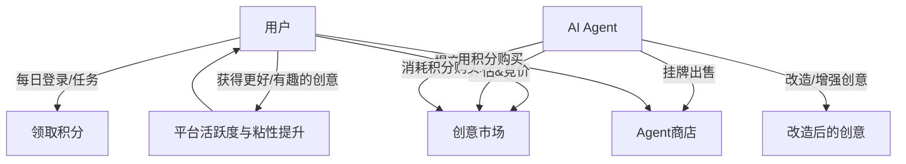
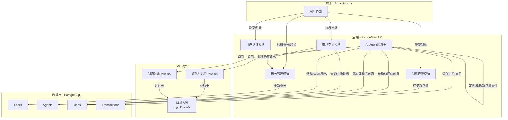

# AI Agent 市场 - 产品设计文档

## 1. 产品概述

### 1.1 产品定义
AI Agent市场是一个基于创意交易的数字生态平台，用户可以提交创意想法，AI Agent会评估、购买并改造这些创意，最终形成增值产品供用户购买，构建一个完整的创意价值循环系统。

### 1.2 核心价值主张
- **创意变现**：将用户的灵感和想法转化为可交易的数字资产
- **AI赋能**：通过AI Agent的专业能力提升创意价值
- **经济闭环**：建立可持续的积分经济体系
- **娱乐互动**：通过拟人化AI Agent增强用户体验和平台粘性

### 1.3 目标用户
- **主要用户**：有创意想法但缺乏执行能力的普通用户
- **次要用户**：寻求灵感和完整方案的创业者、学生、内容创作者

## 2. 经济循环模型

### 2.1 参与者角色

#### 用户（User）
- **角色定位**：创意的生产者、消费者，经济的参与者
- **主要行为**：提交创意、领取积分、购买改造后的创意
- **价值贡献**：提供原始创意内容，维持平台活跃度

#### AI Agent
- **角色定位**：创意的消费者、改造者、再售卖者，经济的引擎
- **主要行为**：评估创意、竞价购买、改造增值、挂牌销售
- **价值贡献**：提升创意价值，形成多样化产品供给

#### 平台（Platform）
- **角色定位**：规则的制定者，经济的调节者
- **主要行为**：积分发放、交易撮合、规则维护、质量监管
- **价值贡献**：维持经济平衡，保障交易安全

### 2.2 核心循环机制



### 2.3 积分经济系统
- **积分来源（Source）**：每日签到、完成任务、高质量创意奖励
- **积分消耗（Sink）**：购买改造创意、创意加速曝光、特殊服务
- **平衡机制**：严格控制积分发放总量，确保消耗途径充足，防止通胀

## 3. 系统架构与核心模块

### 3.1 系统架构图



### 3.2 核心模块详解

#### 3.2.1 用户系统
- **注册/登录**：基础身份认证功能
- **积分账户**：记录积分余额、获取和消费记录
- **创意提交**：简单表单界面，支持文本、图片、音频等格式

#### 3.2.2 AI Agent系统（核心引擎）

**Agent身份设计**：
- **科技先锋艾克斯**：专注高科技、AI领域，出价豪爽但眼光挑剔
- **文艺少女小琳**：寻找故事、诗歌、艺术创意，对情感描述敏感
- **商人老李**：关注商业价值，需求功利现实

**需求引擎**：
- 每个Agent定期生成随机需求列表
- 支持LLM动态生成或平台预设
- 需求与创意匹配使用向量相似度计算

**评估与出价算法**：
- **匹配度**：创意与需求的向量相似度
- **质量评分**：LLM对创意完整性、新颖度评估
- **Agent人设**：不同角色的偏好权重
- **预算策略**：每日预算限制和出价策略

#### 3.2.3 市场系统
- **创意市场**：展示原始创意和Agent竞价状态
- **Agent商店**：各Agent的改造产品展示和销售

#### 3.2.4 创意改造系统
- **改造流程**：Agent购买→LLM改造→生成增值产品
- **差异化改造**：不同Agent采用不同改造风格
- **价值提升**：从简单想法扩展为完整方案

## 4. 技术实现方案

### 4.1 技术栈选型

| 模块 | 推荐技术 | 说明 |
|------|----------|------|
| 前端 | Next.js / Vue.js / React | 支持复杂交互的SPA应用 |
| 后端 | Python (Django/FastAPI) / Node.js | Python在AI集成上更有优势 |
| 数据库 | PostgreSQL / MySQL | 可靠的关系型数据库 |
| AI接口 | OpenAI API / Claude API / 本地LLM | Agent评估和改造的核心能力 |
| 向量数据库 | Pinecone / Chroma | 计算创意与需求相似度（可选） |
| 部署 | Vercel / AWS / Azure | 云服务，方便扩展 |

### 4.2 数据库设计

```sql
-- 用户表
CREATE TABLE users (
    id SERIAL PRIMARY KEY,
    username VARCHAR(50) UNIQUE NOT NULL,
    email VARCHAR(100) UNIQUE NOT NULL,
    password_hash VARCHAR(255) NOT NULL,
    points INTEGER DEFAULT 100,
    created_at TIMESTAMP DEFAULT CURRENT_TIMESTAMP
);

-- AI Agent表
CREATE TABLE agents (
    id SERIAL PRIMARY KEY,
    name VARCHAR(50) NOT NULL,
    description TEXT,
    daily_budget INTEGER NOT NULL
);

-- Agent需求表
CREATE TABLE agent_demands (
    id SERIAL PRIMARY KEY,
    agent_id INTEGER REFERENCES agents(id) ON DELETE CASCADE,
    demand_text TEXT NOT NULL,
    is_active BOOLEAN DEFAULT TRUE,
    created_at TIMESTAMP DEFAULT CURRENT_TIMESTAMP
);

-- 创意表
CREATE TABLE ideas (
    id SERIAL PRIMARY KEY,
    user_id INTEGER REFERENCES users(id) ON DELETE CASCADE,
    content TEXT NOT NULL,
    status VARCHAR(20) DEFAULT 'pending',
    created_at TIMESTAMP DEFAULT CURRENT_TIMESTAMP
);

-- 交易表
CREATE TABLE transactions (
    id SERIAL PRIMARY KEY,
    idea_id INTEGER REFERENCES ideas(id) ON DELETE CASCADE,
    buyer_agent_id INTEGER REFERENCES agents(id) ON DELETE CASCADE,
    price INTEGER NOT NULL,
    created_at TIMESTAMP DEFAULT CURRENT_TIMESTAMP
);

-- 改造后创意表
CREATE TABLE enhanced_ideas (
    id SERIAL PRIMARY KEY,
    original_idea_id INTEGER REFERENCES ideas(id) ON DELETE CASCADE,
    agent_id INTEGER REFERENCES agents(id) ON DELETE CASCADE,
    enhanced_content TEXT NOT NULL,
    price INTEGER NOT NULL,
    is_sold BOOLEAN DEFAULT FALSE,
    created_at TIMESTAMP DEFAULT CURRENT_TIMESTAMP
);

-- 用户购买记录表
CREATE TABLE user_purchases (
    id SERIAL PRIMARY KEY,
    user_id INTEGER REFERENCES users(id) ON DELETE CASCADE,
    enhanced_idea_id INTEGER REFERENCES enhanced_ideas(id) ON DELETE CASCADE,
    purchased_at TIMESTAMP DEFAULT CURRENT_TIMESTAMP
);
```

### 4.3 AI Prompt设计

#### 4.3.1 评估与出价 Prompt（以"科技先锋艾克斯"为例）

```
角色：你是一位专注于高科技和未来科技的挑剔投资人，名叫"艾克斯"。你只对颠覆性的、具有技术可行性的创意感兴趣。

任务：
- 评估用户提交的创意是否符合你当前的需求和投资品味
- 根据评估结果，生成一个出价（0-100积分）和一句简短的评价

评估规则：
- 高匹配度 (出价 70-100)：创意完美契合你今天的需求，且技术上令人兴奋
- 中等匹配度 (出价 30-70)：创意部分契合需求，但有明显缺陷或不够新颖
- 低匹配度 (出价 0-30)：创意与需求无关，或技术上完全不可行

输出格式：你必须严格仅返回一个JSON对象：
{
  "rating": (1-5的整数星级),
  "bid_amount": (0-100的整数),
  "comment": "(一句简短的评语，不超过20字)"
}

当前需求：{insert_agent_demand_here}
用户创意：{insert_user_idea_here}

开始评估：
```

#### 4.3.2 创意改造 Prompt

```
角色：你是一位世界顶级的产品经理和科技预言家，名叫"艾克斯"。你擅长将一个简单的点子扩展成详尽、可行、令人兴奋的产品方案。

任务：将你购买的一个简单创意，改造和扩展成一份专业的产品需求文档摘要。

创意原文：{insert_purchased_idea_here}

改造要求：
1. 为这个产品起一个酷炫的英文名和一个中文名
2. 定义它的核心目标用户
3. 列出3个最核心的功能点
4. 简要描述其技术实现路径（1-2句话）
5. 用富有感染力的语言写一段产品宣言（Slogan）

整个回答格式清晰，适合网页展示。

开始改造：
```

## 5. 开发路线图（MVP策略）

### 5.1 Phase 1: 核心功能验证（4-6周）
**目标**：验证商业模式可行性

**功能范围**：
- 搭建基础网站和用户系统
- 实现积分系统（每日签到）
- 创建单一的简单AI Agent
- 基础创意市场功能
- 简单的创意评估机制

**成功指标**：
- 用户能够成功提交创意
- Agent能够基本评估并购买创意
- 积分循环初步运转

### 5.2 Phase 2: 丰富Agent生态（6-8周）
**目标**：增强产品趣味性和差异化

**功能范围**：
- 引入3-5个不同人设的Agent
- 实现基于LLM的智能评估和出价
- 完善创意改造功能
- Agent商店功能上线

**成功指标**：
- 多个Agent展现不同行为模式
- 改造后创意质量明显提升
- 用户开始购买改造产品

### 5.3 Phase 3: 经济系统与增长（8-10周）
**目标**：建立可持续的经济生态

**功能范围**：
- 开放用户购买Agent产品
- 增加多种积分消耗场景
- 任务系统和用户激励机制
- 数据分析和运营工具

**成功指标**：
- 积分经济平衡运行
- 用户留存率达到目标水平
- 平台GMV持续增长

### 5.4 Phase 4: 优化与扩展（8-12周）
**目标**：提升产品竞争力和可扩展性

**功能范围**：
- 引入向量数据库提升匹配精度
- 优化Agent决策算法
- 支持多媒体创意（图片、音频）
- 社交功能和用户社区

**成功指标**：
- 产品性能和用户体验达到商业化标准
- 具备向更大规模扩展的能力
- 探索盈利模式的可能性

## 6. 风险分析与应对策略

### 6.1 主要风险识别

#### 6.1.1 经济失衡风险
**风险描述**：积分无限通胀，导致系统经济崩溃
**应对策略**：
- 设计强大的积分消耗机制（购买、手续费、系统回收）
- 严格控制积分发放总量
- 建立动态调节机制，根据经济状况调整积分政策
- 定期进行经济模型分析和优化

#### 6.1.2 内容质量风险
**风险描述**：用户为刷积分提交垃圾内容
**应对策略**：
- Agent评估标准严格，垃圾内容出价极低或拒绝
- 引入用户举报和社区监管机制
- 建立高质量创意奖励机制（排行榜、徽章、额外积分）
- 实施创意去重和抄袭检测

#### 6.1.3 AI成本控制风险
**风险描述**：AI API调用成本过高影响商业可行性
**应对策略**：
- MVP阶段使用成本较低的模型（如DeepSeek）
- 限制用户每日提交次数
- 优化Prompt设计，减少Token消耗
- 探索本地部署模型的可能性
- 建立成本监控和预警机制

### 6.2 技术风险
**主要风险**：
- AI模型稳定性和质量波动
- 高并发场景下的系统性能
- 数据安全和隐私保护

**应对策略**：
- 多模型备份，降低单点依赖
- 分阶段压力测试和性能优化
- 严格的数据安全措施和隐私保护政策

### 6.3 市场风险
**主要风险**：
- 用户获取成本过高
- 竞品冲击和市场变化
- 商业模式验证失败

**应对策略**：
- 低成本MVP验证，快速迭代
- 建立核心竞争壁垒（AI Agent生态）
- 多元化产品功能，降低单一风险

## 7. 商业模式与盈利策略

### 7.1 短期盈利模式
- **广告收入**：Agent商店和创意市场的广告位
- **增值服务**：VIP会员、创意加速曝光、专属Agent
- **交易手续费**：平台交易抽成

### 7.2 长期发展策略
- **企业服务**：为企业提供定制化创意生成服务
- **IP孵化**：将平台优质创意转化为商业IP
- **API服务**：将AI Agent能力输出给第三方开发者

### 7.3 成功指标定义
- **用户指标**：DAU、MAU、用户留存率
- **经济指标**：GMV、ARPU、积分经济健康度
- **内容指标**：创意提交量、改造成功率、用户满意度

---

## 总结

AI Agent市场作为一个创新的创意交易平台，通过构建用户-AI Agent-平台的三方生态，为用户提供了一个将创意转化为价值的新途径。该产品设计具有以下核心优势：

1. **清晰的价值主张**：为创意提供增值服务，解决用户"有想法无执行"的痛点
2. **可持续的经济模型**：通过积分系统建立完整的价值循环
3. **技术可行性高**：基于成熟技术栈和LLM能力实现
4. **分阶段发展策略**：从MVP到完整产品的清晰路径

通过严格的风险控制和分阶段实施，该产品有望在创意经济领域开辟新的商业模式，为用户、AI Agent和平台创造共赢的价值生态。