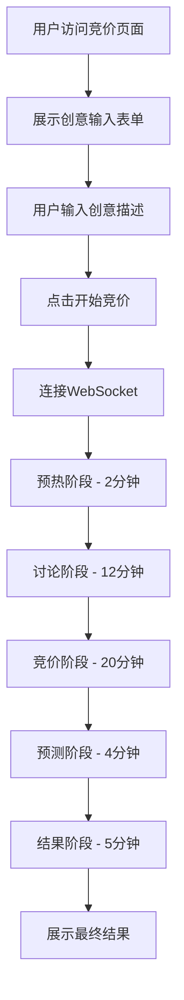
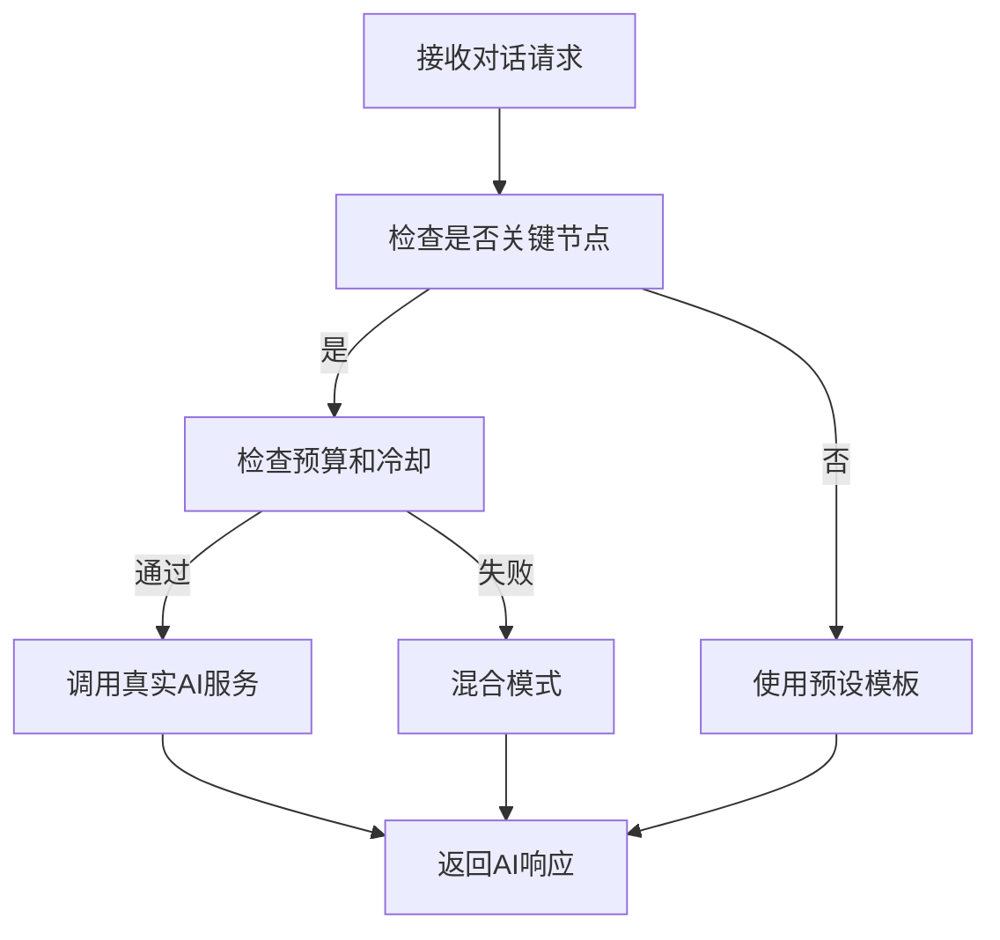

# AI 创意竞价舞台系统 - 实施文档

## 📋 项目概述

本项目将原有的简单创意竞价系统重构为一个 35-45 分钟的娱乐性AI竞价舞台，通过集成真实AI服务（DeepSeek、智谱GLM、通义千问）和智能对话模板系统，为用户提供沉浸式的AI专家竞价体验。

### 🎯 核心目标
- 从 2-3 分钟简单体验升级为 35-45 分钟深度娱乐
- 实现舞台化AI角色展示，水平居中布局
- 集成三大AI服务提供真实智能分析
- 通过混合对话策略优化成本和性能
- 提供用户创意输入 → AI竞价表演的完整流程

## 🏗️ 系统架构

### 核心组件架构图
```
┌─────────────────────────────────────────────────────────────┐
│                   用户界面层 (UI Layer)                        │
├─────────────────────────────────────────────────────────────┤
│  StageBasedBidding.tsx  │  创意输入表单  │  AI舞台展示         │
├─────────────────────────────────────────────────────────────┤
│                   业务逻辑层 (Business Layer)                  │
├─────────────────────────────────────────────────────────────┤
│  DialogueDecisionEngine │  混合对话策略决策引擎                │
│  TemplateManager        │  智能对话模板管理                   │
│  AIServiceManager       │  AI服务抽象层                      │
├─────────────────────────────────────────────────────────────┤
│                   数据层 (Data Layer)                         │
├─────────────────────────────────────────────────────────────┤
│  WebSocket连接          │  实时通信                          │
│  AI API集成            │  DeepSeek/智谱/通义                │
│  成本追踪              │  预算控制                          │
└─────────────────────────────────────────────────────────────┘
```

## 📁 文件结构

### 新增核心文件
```
src/
├── lib/
│   ├── ai-service-manager.ts      # AI服务抽象层
│   ├── dialogue-strategy.ts       # 混合对话策略引擎
│   └── template-manager.ts        # 智能对话模板系统
├── components/bidding/
│   └── StageBasedBidding.tsx      # 水平舞台竞价组件
├── hooks/
│   └── useBiddingWebSocket.ts     # WebSocket通信钩子 (已更新)
└── app/marketplace/bidding/
    └── page.tsx                   # 竞价页面入口 (已更新)
```

## 🎭 关键功能实现

### 1. 混合对话策略系统

**文件**: `src/lib/dialogue-strategy.ts`

```typescript
// 核心决策逻辑
export class DialogueDecisionEngine {
  async generateDialogue(context: DialogueContext): Promise<DialogueResponse> {
    const strategy = this.determineStrategy(context);

    switch (strategy.type) {
      case 'real_ai':     return await this.generateRealAIDialogue(context, strategy);
      case 'scripted':    return this.generateScriptedDialogue(context, strategy);
      case 'hybrid':      return await this.generateHybridDialogue(context, strategy);
    }
  }
}
```

**关键特性**:
- 智能决策何时调用真实AI vs 使用预设模板
- 成本控制：每日预算 100元，单会话限制 10次调用
- 用户冷却：300秒间隔，防止频繁调用
- 关键节点（创意评估、最终竞价）优先使用真实AI

### 2. AI服务抽象层

**文件**: `src/lib/ai-service-manager.ts`

```typescript
// 多AI服务统一接口
export class AIServiceManager {
  async callMultipleServices(
    providers: string[],
    context: DialogueContext
  ): Promise<AIServiceResponse[]> {
    // 并发调用多个AI服务，提供备用机制
  }
}
```

**支持的AI服务**:
- **DeepSeek**: 技术实现分析，架构评估
- **智谱GLM**: 商业价值分析，市场评估
- **通义千问**: 创新思维，用户体验分析

**内置功能**:
- 速率限制 (DeepSeek: 100/分钟, 智谱: 60/分钟, 通义: 80/分钟)
- 自动重试和故障转移
- 成本追踪和预算管理
- 健康状态监控

### 3. 智能对话模板系统

**文件**: `src/lib/template-manager.ts`

**模板分类**:
- **开场介绍** - 个性化角色展示
- **技术分析** - 根据创意评分调整内容
- **竞争互怼** - 增加戏剧张力
- **阶段过渡** - 平滑切换不同阶段
- **胜利庆祝** - 结果展示和总结

**智能特性**:
- 条件匹配：根据创意评分、轮次自动选择
- 内容个性化：替换占位符，调整语气
- 重复避免：追踪使用历史，防止重复
- 加权选择：根据重要度随机选择变体

### 4. 水平舞台布局

**文件**: `src/components/bidding/StageBasedBidding.tsx`

**用户体验流程**:
1. **创意输入界面** - 用户描述创意 (500字限制)
2. **AI专家舞台** - 5位AI水平排列展示
3. **实时竞价表演** - 35-45分钟互动体验
4. **成果展示** - 最终价格和分析报告

**舞台效果**:
- 发言指示器：活跃AI会有动画和高亮
- 实时出价：数字跳动显示当前竞价
- 互动反馈：用户可点赞、支持、预测
- 阶段进度：5阶段进度条和倒计时

## 🔧 技术栈

### 前端技术
- **Next.js 14** - App Router架构
- **TypeScript** - 类型安全
- **Framer Motion** - 动画效果
- **Tailwind CSS** - 样式系统
- **Radix UI** - 组件库

### 后端技术
- **WebSocket** - 实时通信
- **Node.js** - 服务器运行时
- **Prisma** - 数据库ORM

### AI服务集成
- **DeepSeek API** - 技术分析
- **智谱GLM API** - 商业分析
- **通义千问 API** - 创新分析

## 🚀 部署和配置

### 环境变量配置
```bash
# AI服务API密钥
DEEPSEEK_API_KEY=your_deepseek_api_key
ZHIPU_API_KEY=your_zhipu_api_key
QWEN_API_KEY=your_qwen_api_key

# 成本控制配置
AI_DAILY_BUDGET=100          # 每日预算(元)
AI_SESSION_LIMIT=10          # 单会话限制
AI_USER_COOLDOWN=300         # 用户冷却时间(秒)
```

### 启动命令
```bash
# 开发环境 (端口3000)
npm run dev:3000

# 生产环境
npm run build
npm start

# WebSocket服务器 (端口4000)
npm run dev:ws
```

## 📊 成本优化策略

### 混合调用策略
| 场景 | AI调用 | 模板 | 成本权重 |
|------|--------|------|----------|
| 创意评估 | ✅ 三服务并发 | ❌ | 0.6 |
| 改进建议 | ✅ 单一服务 | ❌ | 0.3 |
| 最终竞价 | ✅ 全部服务 | ❌ | 0.8 |
| 开场介绍 | ❌ | ✅ | 0.0 |
| 阶段过渡 | ❌ | ✅ | 0.0 |
| 竞价互怼 | 部分 | ✅ | 0.2 |

### 预算控制机制
- **每日预算**: 100元限制，达到90%后切换模板模式
- **用户限制**: 单用户5分钟冷却，防止滥用
- **会话限制**: 单次会话最多10次AI调用
- **降级策略**: 预算不足时自动使用高质量模板

## 🎨 用户界面设计

### 创意输入界面
- 渐变背景：紫蓝色调营造科技感
- 中央卡片：创意描述输入框 (500字限制)
- 启动按钮：醒目的"开始AI竞价表演"按钮
- 引导文案：鼓励详细描述以获得更好评估

### AI专家舞台
- 水平布局：5位AI专家并排展示
- 角色卡片：头像、姓名、专业领域、当前出价
- 活跃指示：发言时卡片高亮和动画效果
- 支持互动：用户可为喜欢的AI专家点赞

### 实时对话流
- 消息展示：头像 + 姓名 + 内容 + 时间戳
- 竞价标识：出价消息特殊样式显示
- 互动按钮：点赞、喜欢等用户反馈
- 自动滚动：新消息自动滚动到底部

## 🔄 业务流程

### 完整用户旅程


### AI决策流程


## 📈 性能监控

### 关键指标
- **用户停留时间**: 目标 35-45 分钟
- **AI调用成功率**: >95%
- **WebSocket连接稳定性**: >99%
- **每日成本控制**: <100元
- **用户参与度**: 互动次数/会话

### 监控工具
- **成本追踪**: 实时监控AI调用费用
- **性能分析**: WebSocket消息延迟
- **错误监控**: AI服务故障自动切换
- **用户行为**: 页面停留时间和互动统计

## 🛠️ 开发和维护

### 代码质量
- **TypeScript**: 100%类型覆盖
- **ESLint**: 代码规范检查
- **Prettier**: 自动格式化
- **测试覆盖**: 核心功能单元测试

### 扩展性设计
- **模块化架构**: 各组件独立可测试
- **接口抽象**: 易于添加新的AI服务
- **配置驱动**: 模板和策略可配置
- **插件系统**: 支持自定义对话插件

## 🔮 未来规划

### 短期优化 (1-2周)
- [ ] 添加用户身份验证
- [ ] 实现创意历史记录
- [ ] 优化移动端适配
- [ ] 增加更多互动元素

### 中期功能 (1-2月)
- [ ] 多人观看和弹幕系统
- [ ] AI专家个性化定制
- [ ] 创意分类和标签系统
- [ ] 数据分析仪表板

### 长期愿景 (3-6月)
- [ ] 3D虚拟舞台展示
- [ ] 语音合成和识别
- [ ] 跨平台应用开发
- [ ] 商业化变现模式

---

## 📞 支持和联系

如有问题或建议，请联系开发团队或在项目仓库创建Issue。

**项目状态**: ✅ 已完成核心功能开发，准备生产环境部署
**最后更新**: 2025年9月26日
**版本**: v1.0.0