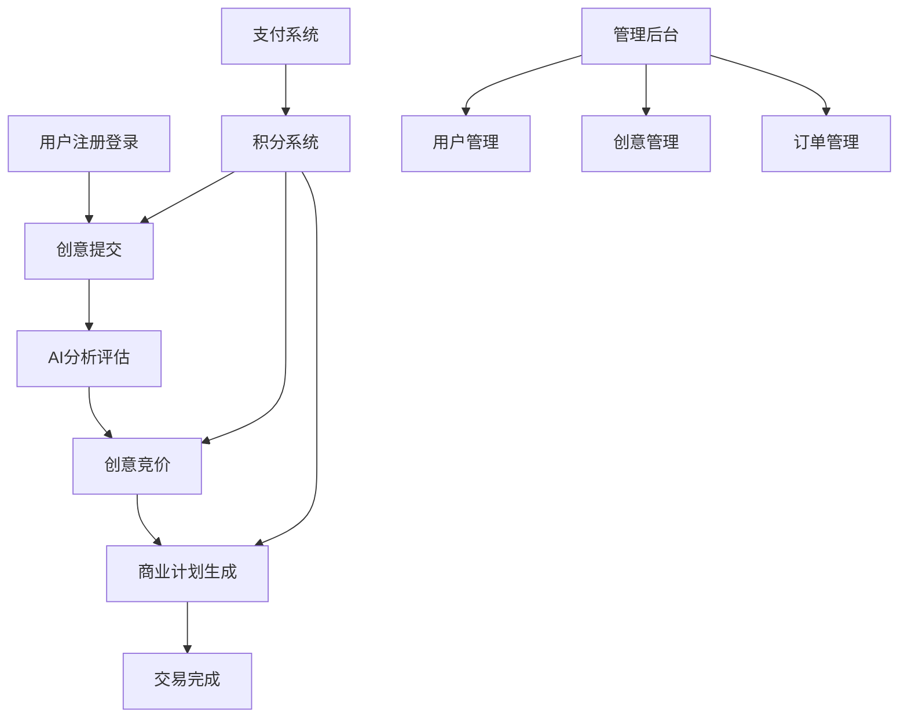
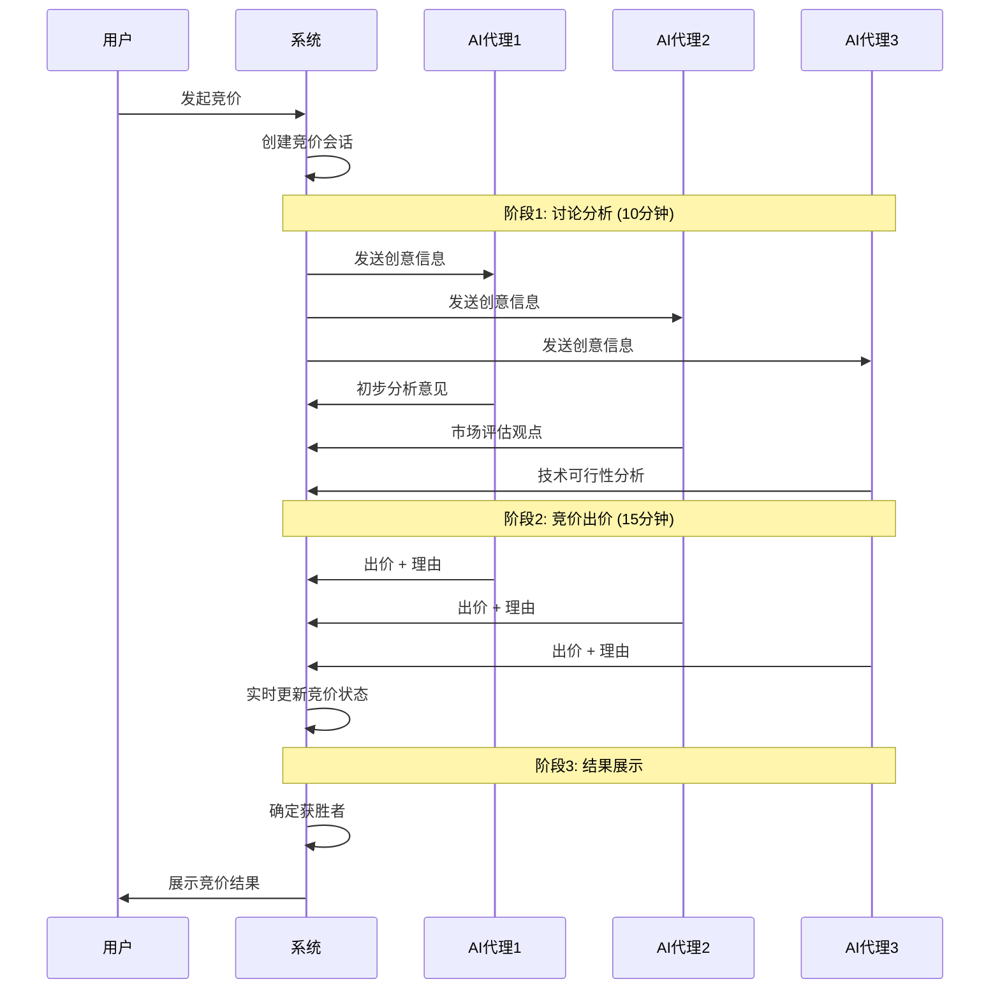
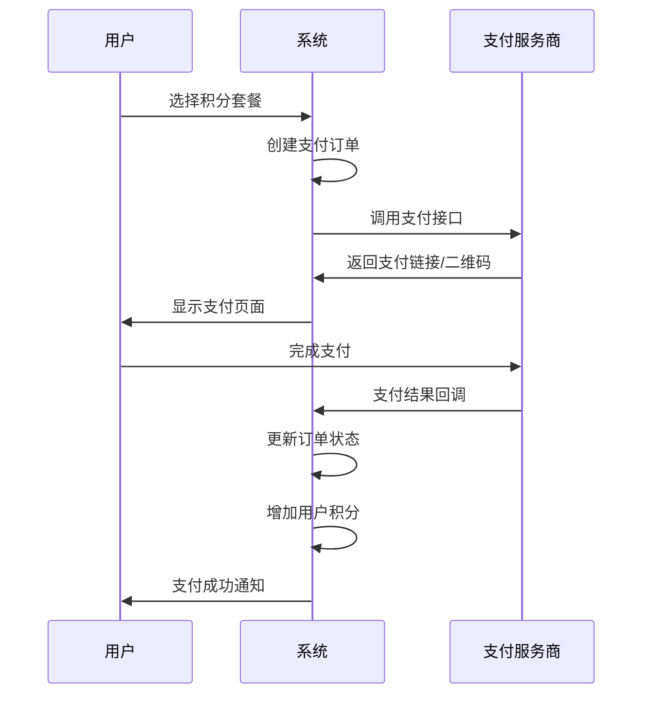

# AI创意竞价平台 - 功能文档

## 📖 目录

- [1. 平台概述](#1-平台概述)
- [2. 核心功能模块](#2-核心功能模块)
- [3. 用户系统](#3-用户系统)
- [4. 创意管理](#4-创意管理)
- [5. AI竞价系统](#5-ai竞价系统)
- [6. 商业计划生成](#6-商业计划生成)
- [7. 积分系统](#7-积分系统)
- [8. 支付系统](#8-支付系统)
- [9. 管理后台](#9-管理后台)
- [10. API接口](#10-api接口)

---

## 1. 平台概述

### 1.1 平台定位
AI创意竞价平台是一个集创意展示、AI分析评估、竞价交易和商业计划生成于一体的创新平台。

### 1.2 核心价值
- **创意价值发现**: 通过AI多维度评估创意的市场潜力
- **智能竞价机制**: AI代理人参与真实竞价，提供市场定价参考
- **商业计划生成**: 基于创意自动生成专业商业计划书
- **生态闭环**: 从创意到商业化的完整链条

### 1.3 技术架构
- **前端**: Next.js 14 + TypeScript + Tailwind CSS
- **后端**: Next.js API Routes + Prisma ORM
- **数据库**: PostgreSQL
- **AI服务**: 集成DeepSeek、智谱AI、阿里云等多个AI提供商
- **文件存储**: 阿里云OSS
- **缓存**: Redis
- **部署**: Docker + Zeabur云平台

---

## 2. 核心功能模块

### 2.1 功能架构图



### 2.2 功能模块说明

| 模块 | 功能 | 状态 |
|------|------|------|
| 用户系统 | 注册、登录、个人资料管理 | ✅ 完成 |
| 创意管理 | 创意提交、展示、分类 | ✅ 完成 |
| AI竞价系统 | 多AI代理竞价、价格发现 | ✅ 完成 |
| 商业计划生成 | AI驱动的商业计划书生成 | ✅ 完成 |
| 积分系统 | 积分充值、消费、奖励 | ✅ 完成 |
| 支付系统 | 支付宝、微信支付集成 | ✅ 完成 |
| 管理后台 | 用户、订单、数据管理 | ✅ 完成 |

---

## 3. 用户系统

### 3.1 用户注册与认证

#### 3.1.1 注册流程
1. **用户信息填写**
   - 邮箱地址（必填）
   - 用户名（必填，唯一）
   - 密码（8位以上，包含大小写字母和数字）
   - 姓名（可选）
   - 手机号（可选）

2. **邮箱验证**
   - 自动发送验证邮件
   - 用户点击验证链接完成激活
   - 支持重新发送验证邮件

3. **默认权益**
   - 新用户注册赠送1000积分
   - 默认等级：青铜级
   - 自动创建积分交易记录

#### 3.1.2 登录机制
```typescript
// 登录接口支持多种方式
interface LoginRequest {
  email: string;        // 邮箱
  password: string;     // 密码
  rememberMe?: boolean; // 记住登录状态
}

// 登录成功返回
interface LoginResponse {
  user: UserInfo;
  tokens: {
    accessToken: string;
    refreshToken: string;
  };
}
```

#### 3.1.3 权限管理
- **角色类型**: USER（普通用户）、ADMIN（管理员）、MODERATOR（审核员）
- **状态管理**: ACTIVE（活跃）、INACTIVE（未激活）、SUSPENDED（暂停）、BANNED（封禁）

### 3.2 用户等级系统

| 等级 | 累计消费 | 权益 |
|------|----------|------|
| 青铜级 | 0 | 基础功能 |
| 白银级 | 5,000积分 | 优先客服支持 |
| 黄金级 | 20,000积分 | 专属AI模型 |
| 铂金级 | 50,000积分 | 定制化服务 |
| 钻石级 | 100,000积分 | VIP专线服务 |

### 3.3 个人资料管理

#### 3.3.1 基本信息
- 头像上传（支持JPG、PNG格式）
- 个人简介（最多500字符）
- 联系方式（邮箱、手机）
- 地区设置

#### 3.3.2 偏好设置
- 邮件通知开关
- 营销邮件订阅
- 界面主题（明亮/暗黑模式）
- 语言设置

#### 3.3.3 安全设置
- 密码修改
- 双重验证（手机短信）
- 登录历史查看
- 设备管理

---

## 4. 创意管理

### 4.1 创意提交

#### 4.1.1 创意信息结构
```typescript
interface IdeaSubmission {
  title: string;           // 创意标题
  description: string;     // 详细描述
  category: IdeaCategory;  // 分类
  tags: string[];         // 标签
  isAnonymous: boolean;   // 是否匿名
  attachments?: File[];   // 附件
}
```

#### 4.1.2 创意分类
- **TECH**: 技术创新
- **LIFESTYLE**: 生活方式
- **EDUCATION**: 教育培训
- **HEALTH**: 健康医疗
- **FINANCE**: 金融服务
- **ENTERTAINMENT**: 娱乐文化
- **BUSINESS**: 商业服务
- **RETAIL**: 零售电商
- **OTHER**: 其他

#### 4.1.3 审核机制
1. **自动审核**: 关键词过滤、内容检测
2. **人工审核**: 审核员审核（复杂内容）
3. **状态流转**: PENDING → APPROVED/REJECTED

### 4.2 创意展示

#### 4.2.1 列表页功能
- 分类筛选
- 搜索功能（标题、描述、标签）
- 排序方式（最新、最热、评分）
- 分页加载

#### 4.2.2 详情页功能
- 创意完整信息展示
- 查看统计（浏览量、点赞数）
- 相关创意推荐
- 快速竞价入口

#### 4.2.3 互动功能
- 点赞/取消点赞
- 收藏/取消收藏
- 分享功能
- 评论讨论

---

## 5. AI竞价系统

### 5.1 系统概述

AI竞价系统是平台的核心功能，通过多个AI代理人对创意进行智能评估和竞价，为创意提供市场化定价参考。

### 5.2 竞价流程

#### 5.2.1 三阶段竞价流程



#### 5.2.2 阶段详细说明

**阶段1: 讨论分析（10分钟）**
- AI代理人深度分析创意
- 从不同维度提供专业见解
- 增强对创意的理解深度
- 为后续竞价提供依据

**阶段2: 竞价出价（15分钟）**
- 基于分析结果进行竞价
- 实时显示出价过程
- 提供出价理由和信心度
- 支持多轮出价调整

**阶段3: 结果展示**
- 公布最终获胜者
- 展示详细竞价过程
- 提供价值评估报告
- 用户价格预测结果

### 5.3 AI代理人配置

#### 5.3.1 代理人类型
```typescript
interface BiddingAgent {
  name: string;           // 代理人名称
  type: string;          // 类型标识
  avatar: string;        // 头像
  personality: string;   // 性格描述
  speciality: string[];  // 专业领域
  aiProvider: 'DEEPSEEK' | 'ZHIPU' | 'ALI'; // AI服务商
}
```

#### 5.3.2 预设代理人
- **创新投资人**: 关注创新性和市场前景
- **技术专家**: 评估技术可行性和实现难度
- **市场分析师**: 分析市场需求和竞争态势
- **产品经理**: 从产品角度评估用户价值
- **风险评估师**: 识别潜在风险和挑战

### 5.4 竞价算法

#### 5.4.1 定价策略
- **基础定价**: 根据创意类别和复杂度
- **市场调节**: 考虑历史竞价数据
- **AI评估**: 多维度智能评分
- **随机因子**: 增加竞价的不可预测性

#### 5.4.2 评估维度
- **创新性**: 创意的原创性和突破性
- **市场潜力**: 目标市场规模和增长性
- **技术可行性**: 实现难度和技术门槛
- **商业价值**: 盈利模式和收入预期
- **竞争优势**: 与现有方案的差异化

### 5.5 用户参与机制

#### 5.5.1 价格竞猜
```typescript
interface PriceGuess {
  sessionId: string;     // 竞价会话ID
  userId: string;        // 用户ID
  guessedPrice: number;  // 预测价格
  confidence: number;    // 信心度(0-100)
  stakeAmount: number;   // 投注积分
}
```

#### 5.5.2 奖励机制
- **精准预测奖**: 预测价格与最终价格差距在5%内
- **参与奖**: 所有参与用户获得基础积分奖励
- **连续预测奖**: 连续多次准确预测的额外奖励

---

## 6. 商业计划生成

### 6.1 系统概述

基于AI技术的商业计划书生成系统，能够根据创意内容和用户需求，自动生成专业的商业计划书。

### 6.2 生成流程

#### 6.2.1 需求收集阶段
```typescript
interface UserRequirements {
  businessModel: string;      // 商业模式
  targetMarket: string;       // 目标市场
  fundingNeeds: number;       // 资金需求
  timeline: string;           // 实施时间线
  teamSize: number;           // 团队规模
  riskTolerance: 'LOW' | 'MEDIUM' | 'HIGH'; // 风险承受度
  industryExperience: boolean; // 行业经验
  competitiveAdvantage: string[]; // 竞争优势
}
```

#### 6.2.2 分析与生成阶段
1. **场景分析**: 基于需求分析商业场景
2. **内容生成**: 分阶段生成计划书各章节
3. **质量优化**: 多轮优化和完善
4. **格式整理**: 生成最终的格式化文档

#### 6.2.3 生成内容结构
- **执行摘要**: 项目概述和核心亮点
- **项目描述**: 详细的项目说明
- **市场分析**: 目标市场和竞争分析
- **产品服务**: 产品/服务详细介绍
- **营销策略**: 市场推广和销售策略
- **运营计划**: 运营模式和管理结构
- **财务预测**: 收入预测和成本分析
- **风险评估**: 潜在风险和应对措施
- **资金使用**: 资金需求和使用计划
- **附录**: 相关数据和补充材料

### 6.3 AI服务集成

#### 6.3.1 多AI提供商支持
```typescript
interface AIProvider {
  id: 'DEEPSEEK' | 'ZHIPU' | 'ALI';
  name: string;
  apiEndpoint: string;
  maxTokens: number;
  costPerToken: number;
  speciality: string[]; // 擅长领域
}
```

#### 6.3.2 智能分配策略
- **内容类型匹配**: 根据章节内容选择最适合的AI
- **负载均衡**: 平衡不同AI服务的使用频率
- **成本优化**: 在保证质量的前提下控制成本
- **容错机制**: AI服务异常时的自动切换

### 6.4 版本管理

#### 6.4.1 多版本支持
- 每个章节支持生成多个版本
- 用户可以选择不同版本进行对比
- 支持版本间的内容合并
- 保存用户的个性化修改

#### 6.4.2 实时预览
- 支持实时预览生成效果
- 章节生成完成立即可见
- 支持在线编辑和调整
- 自动保存用户修改

---

## 7. 积分系统

### 7.1 积分机制

#### 7.1.1 积分获取方式
- **注册奖励**: 新用户注册获得1000积分
- **每日签到**: 每日签到获得50-100积分
- **创意提交**: 提交创意获得200-500积分
- **竞价参与**: 参与竞价获得100积分
- **预测准确**: 价格预测准确获得额外奖励
- **邀请好友**: 成功邀请获得500积分

#### 7.1.2 积分消费场景
- **AI分析服务**: 300-1000积分/次
- **商业计划生成**: 2000-5000积分/份
- **高级功能**: 如优先客服、专属模型等
- **虚拟商品**: 平台内虚拟道具和装饰

#### 7.1.3 积分充值套餐
| 套餐 | 积分数量 | 价格 | 赠送积分 | 性价比 |
|------|----------|------|----------|--------|
| 基础包 | 1,000 | ¥10 | 0 | 100积分/元 |
| 超值包 | 5,000 | ¥45 | 500 | 122积分/元 |
| 推荐包 | 10,000 | ¥85 | 1,500 | 135积分/元 |
| 豪华包 | 50,000 | ¥400 | 10,000 | 150积分/元 |

### 7.2 交易记录

#### 7.2.1 交易类型
```typescript
enum CreditTransactionType {
  REGISTER_BONUS = 'REGISTER_BONUS',     // 注册奖励
  PURCHASE = 'PURCHASE',                 // 购买积分
  RESEARCH_COST = 'RESEARCH_COST',       // 调研指导消费
  BIDDING_REWARD = 'BIDDING_REWARD',     // 竞价奖励
  DAILY_CHECKIN = 'DAILY_CHECKIN',       // 每日签到
  REFUND = 'REFUND',                     // 退款
  ADMIN_ADJUSTMENT = 'ADMIN_ADJUSTMENT'   // 管理员调整
}
```

#### 7.2.2 记录详情
- 交易时间和金额
- 交易前后余额
- 关联的业务ID（如报告ID、竞价ID）
- 交易描述和备注

---

## 8. 支付系统

### 8.1 支付方式

#### 8.1.1 支持的支付渠道
- **支付宝**: 扫码支付、WAP支付
- **微信支付**: 扫码支付、H5支付
- **银行卡**: 主流银行卡支付（规划中）

#### 8.1.2 支付流程


### 8.2 订单管理

#### 8.2.1 订单状态
- **PENDING**: 待支付
- **SUCCESS**: 支付成功
- **FAILED**: 支付失败
- **CANCELLED**: 已取消
- **REFUNDED**: 已退款

#### 8.2.2 退款机制
- 支持7天内无理由退款
- 自动退款处理流程
- 退款状态实时更新
- 积分和现金的对应处理

---

## 9. 管理后台

### 9.1 用户管理

#### 9.1.1 用户列表
- 用户基本信息查看
- 注册时间和最后登录
- 积分余额和等级
- 账户状态管理

#### 9.1.2 用户操作
- 禁用/启用账户
- 调整积分余额
- 修改用户等级
- 发送系统通知

### 9.2 内容管理

#### 9.2.1 创意审核
- 待审核创意列表
- 审核操作（通过/拒绝）
- 批量操作支持
- 审核历史记录

#### 9.2.2 内容监控
- 敏感词检测
- 重复内容识别
- 质量评分统计
- 用户举报处理

### 9.3 数据统计

#### 9.3.1 业务数据
- 用户注册和活跃统计
- 创意提交和审核统计
- 竞价会话和成交统计
- 收入和支付统计

#### 9.3.2 报表功能
- 日/周/月报表生成
- 数据可视化图表
- 报表导出功能
- 自定义统计维度

---

## 10. API接口

### 10.1 认证接口

#### 10.1.1 用户注册
```http
POST /api/auth/register
Content-Type: application/json

{
  "email": "user@example.com",
  "username": "username",
  "password": "password123",
  "firstName": "张",
  "lastName": "三"
}
```

#### 10.1.2 用户登录
```http
POST /api/auth/login
Content-Type: application/json

{
  "email": "user@example.com",
  "password": "password123",
  "rememberMe": true
}
```

### 10.2 创意接口

#### 10.2.1 创意列表
```http
GET /api/ideas?page=1&limit=20&category=TECH&sort=createdAt&order=desc
```

#### 10.2.2 创意详情
```http
GET /api/ideas/{id}
```

#### 10.2.3 创意提交
```http
POST /api/ideas
Content-Type: application/json

{
  "title": "创意标题",
  "description": "创意描述",
  "category": "TECH",
  "tags": ["AI", "创新"],
  "isAnonymous": false
}
```

### 10.3 竞价接口

#### 10.3.1 发起竞价
```http
POST /api/bidding/sessions
Content-Type: application/json

{
  "ideaId": "idea-id",
  "startPrice": 100
}
```

#### 10.3.2 竞价状态
```http
GET /api/bidding/sessions/{sessionId}
```

#### 10.3.3 价格预测
```http
POST /api/bidding/sessions/{sessionId}/guess
Content-Type: application/json

{
  "guessedPrice": 500,
  "confidence": 80,
  "stakeAmount": 100
}
```

### 10.4 商业计划接口

#### 10.4.1 生成商业计划
```http
POST /api/generate-business-plan
Content-Type: application/json

{
  "ideaId": "idea-id",
  "requirements": {
    "businessModel": "B2B",
    "targetMarket": "企业级市场",
    "fundingNeeds": 1000000,
    "timeline": "12个月"
  }
}
```

#### 10.4.2 获取生成进度
```http
GET /api/generate-business-plan/{planId}/status
```

---

## 📚 相关文档

- [API接口文档](./BACKEND_API_GUIDE.md)
- [前端开发指南](./FRONTEND_DEVELOPMENT_GUIDE.md)
- [部署指南](./deployment-scripts.md)
- [本地开发指南](./LOCAL_DEVELOPMENT_GUIDE.md)

---

## 📞 技术支持

如有问题，请联系：
- 📧 邮箱：support@aijiayuan.top
- 🔗 GitHub: [https://github.com/845276678/AGENTshichang](https://github.com/845276678/AGENTshichang)

---

*文档最后更新：2024年1月*