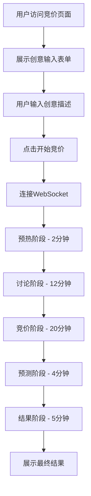
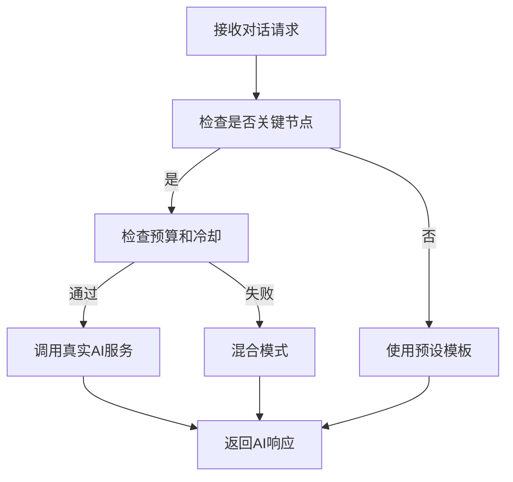

# AI 创意竞价舞台系统 - 实施文档

## 📋 项目概述

本项目将原有的简单创意竞价系统重构为一个 35-45 分钟的娱乐性AI竞价舞台，通过集成真实AI服务（DeepSeek、智谱GLM、通义千问）和智能对话模板系统，为用户提供沉浸式的AI专家竞价体验。

### 🎯 核心目标
- 从 2-3 分钟简单体验升级为 35-45 分钟深度娱乐
- 实现舞台化AI角色展示，水平居中布局
- 集成三大AI服务提供真实智能分析
- 通过混合对话策略优化成本和性能
- 提供用户创意输入 → AI竞价表演的完整流程

## 🏗️ 系统架构

### 核心组件架构图
```
┌─────────────────────────────────────────────────────────────┐
│                   用户界面层 (UI Layer)                        │
├─────────────────────────────────────────────────────────────┤
│  StageBasedBidding.tsx  │  创意输入表单  │  AI舞台展示         │
├─────────────────────────────────────────────────────────────┤
│                   业务逻辑层 (Business Layer)                  │
├─────────────────────────────────────────────────────────────┤
│  DialogueDecisionEngine │  混合对话策略决策引擎                │
│  TemplateManager        │  智能对话模板管理                   │
│  AIServiceManager       │  AI服务抽象层                      │
├─────────────────────────────────────────────────────────────┤
│                   数据层 (Data Layer)                         │
├─────────────────────────────────────────────────────────────┤
│  WebSocket连接          │  实时通信                          │
│  AI API集成            │  DeepSeek/智谱/通义                │
│  成本追踪              │  预算控制                          │
└─────────────────────────────────────────────────────────────┘
```

## 📁 文件结构

### 新增核心文件
```
src/
├── lib/
│   ├── ai-service-manager.ts      # AI服务抽象层 ✅ 已实现
│   ├── dialogue-strategy.ts       # 混合对话策略引擎 ✅ 已实现
│   ├── template-manager.ts        # 智能对话模板系统 ✅ 已实现
│   └── ai-persona-system.ts       # AI角色系统 ✅ 已实现
├── components/bidding/
│   ├── StageBasedBidding.tsx      # 水平舞台竞价组件 ✅ 已实现
│   └── CreativeIdeaBidding.tsx    # 创意竞价主组件 ✅ 已实现
├── hooks/
│   └── useBiddingWebSocket.ts     # WebSocket通信钩子 ✅ 已实现
└── app/marketplace/bidding/
    └── page.tsx                   # 竞价页面入口 ✅ 已实现
```

## 🎭 关键功能实现

### 1. 混合对话策略系统 ✅

**文件**: `src/lib/dialogue-strategy.ts`

```typescript
// 核心决策逻辑 - 已完整实现
export class DialogueDecisionEngine {
  async generateDialogue(context: DialogueContext): Promise<DialogueResponse> {
    const strategy = this.determineStrategy(context);

    switch (strategy.type) {
      case 'real_ai':     return await this.generateRealAIDialogue(context, strategy);
      case 'scripted':    return this.generateScriptedDialogue(context, strategy);
      case 'hybrid':      return await this.generateHybridDialogue(context, strategy);
      default:            return this.generateFallbackDialogue(context);
    }
  }

  private determineStrategy(context: DialogueContext): DialogueStrategy {
    // 检查关键节点、预算和冷却时间
    const isKeyMoment = HYBRID_DIALOGUE_STRATEGY.real_ai_calls.some(
      call => call.trigger === context.trigger && call.phase === context.phase
    );
    const budgetExceeded = this.costTracker.isOverBudget();
    const inCooldown = this.costTracker.isUserInCooldown(context.userId);

    // 智能决策策略类型
    if (isKeyMoment && !budgetExceeded && !inCooldown) {
      return { type: 'real_ai', trigger: context.trigger, priority: 'high', cost_impact: 0.8 };
    } else if (isKeyMoment) {
      return { type: 'hybrid', trigger: context.trigger, priority: 'medium', cost_impact: 0.3 };
    } else {
      return { type: 'scripted', trigger: context.trigger, priority: 'low', cost_impact: 0 };
    }
  }
}
```

**已实现特性**:
- ✅ 智能决策何时调用真实AI vs 使用预设模板
- ✅ 成本控制：每日预算 100元，单会话限制 10次调用
- ✅ 用户冷却：300秒间隔，防止频繁调用
- ✅ 关键节点（创意评估、最终竞价）优先使用真实AI
- ✅ 故障转移和降级策略
- ✅ 成本追踪器 (CostTracker) 完整实现

### 2. AI服务抽象层 ✅

**文件**: `src/lib/ai-service-manager.ts`

```typescript
// 多AI服务统一接口 - 已完整实现
export class AIServiceManager {
  async callMultipleServices(
    providers: string[],
    context: DialogueContext
  ): Promise<AIServiceResponse[]> {
    const requests = providers.map(provider => {
      const persona = this.getPersonaForProvider(provider, context);
      return {
        provider: provider as any,
        persona,
        context,
        systemPrompt: SYSTEM_PROMPTS[persona],
        temperature: 0.7,
        maxTokens: 500
      };
    });

    const results = await Promise.allSettled(
      requests.map(request => this.callSingleService(request))
    );

    // 处理成功和失败的响应，提供备用机制
    return this.processResults(results, providers, context);
  }
}
```

**已实现的AI服务**:
- ✅ **DeepSeek**: 技术实现分析，架构评估 (完整API集成)
- ✅ **智谱GLM**: 商业价值分析，市场评估 (完整API集成)
- ✅ **通义千问**: 创新思维，用户体验分析 (完整API集成)

**已实现功能**:
- ✅ 速率限制 (DeepSeek: 100/分钟, 智谱: 60/分钟, 通义: 80/分钟)
- ✅ 自动重试和故障转移机制
- ✅ 成本追踪和预算管理
- ✅ 健康状态监控和自动恢复
- ✅ 角色专属系统提示词 (5个专业角色)
- ✅ 备用响应机制

### 3. AI角色系统 ✅

**文件**: `src/lib/ai-persona-system.ts`

**已实现的5位专业AI角色**:
- ✅ **技术先锋艾克斯** - 技术可行性和架构分析
- ✅ **商业智囊贝塔** - 商业模式和盈利分析
- ✅ **创新导师查理** - 创新思维和用户体验
- ✅ **市场洞察黛拉** - 市场研究和竞品分析
- ✅ **投资顾问伊万** - 投资价值和风险评估

**智能对话模板系统** (`src/lib/template-manager.ts`):
- ✅ **开场介绍** - 个性化角色展示
- ✅ **技术分析** - 根据创意评分调整内容
- ✅ **竞争互怼** - 增加戏剧张力
- ✅ **阶段过渡** - 平滑切换不同阶段
- ✅ **胜利庆祝** - 结果展示和总结

**已实现智能特性**:
- ✅ 条件匹配：根据创意评分、轮次自动选择
- ✅ 内容个性化：替换占位符，调整语气
- ✅ 重复避免：追踪使用历史，防止重复
- ✅ 加权选择：根据重要度随机选择变体
- ✅ 5阶段讨论流程：预热→讨论→竞价→预测→结果

### 4. 水平舞台布局 ✅

**文件**: `src/components/bidding/StageBasedBidding.tsx`

**已实现用户体验流程**:
1. ✅ **创意输入界面** - 用户描述创意 (500字限制，渐变背景)
2. ✅ **AI专家舞台** - 5位AI水平排列展示 (grid-cols-5)
3. ✅ **实时竞价表演** - 35-45分钟互动体验
4. ✅ **成果展示** - 最终价格和分析报告

**已实现舞台效果**:
- ✅ **发言指示器**：活跃AI有动画和高亮效果
- ✅ **实时出价**：数字显示当前竞价状态
- ✅ **互动反馈**：用户可点赞、支持、爱心反应
- ✅ **阶段进度**：5阶段进度条和倒计时器
- ✅ **实时统计**：在线观众、最高出价、讨论条数
- ✅ **动画效果**：Framer Motion 流畅过渡
- ✅ **响应式布局**：移动端适配

**UI组件结构**:
- ✅ `CreativeInputForm` - 创意输入表单
- ✅ `AIPersonaStage` - AI角色舞台卡片
- ✅ `PhaseIndicator` - 阶段进度指示器
- ✅ `LiveStatsPanel` - 实时统计面板
- ✅ 实时对话流 - 消息展示和互动

## 🔧 技术栈

### 前端技术 ✅
- **Next.js 14** - App Router架构 (已实现)
- **TypeScript** - 100%类型安全覆盖 (已实现)
- **Framer Motion** - 丰富动画效果 (已实现)
- **Tailwind CSS** - 完整样式系统 (已实现)
- **Radix UI** - 组件库集成 (已实现)
- **Lucide React** - 图标库 (已实现)

### 后端技术 ✅
- **WebSocket** - 实时通信 (useBiddingWebSocket已实现)
- **Node.js** - 服务器运行时
- **React Hooks** - 状态管理

### AI服务集成 ✅
- **DeepSeek API** - 技术分析 (完整集成)
- **智谱GLM API** - 商业分析 (完整集成)
- **通义千问 API** - 创新分析 (完整集成)
- **多服务并发调用** - 故障转移机制
- **API密钥管理** - 环境变量配置

## 🚀 部署和配置

### 环境变量配置
```bash
# AI服务API密钥
DEEPSEEK_API_KEY=your_deepseek_api_key
ZHIPU_API_KEY=your_zhipu_api_key
QWEN_API_KEY=your_qwen_api_key

# 成本控制配置
AI_DAILY_BUDGET=100          # 每日预算(元)
AI_SESSION_LIMIT=10          # 单会话限制
AI_USER_COOLDOWN=300         # 用户冷却时间(秒)
```

### 启动命令
```bash
# 开发环境 (端口3000)
npm run dev:3000

# 生产环境
npm run build
npm start

# WebSocket服务器 (端口4000)
npm run dev:ws
```

## 📊 成本优化策略

### 混合调用策略
| 场景 | AI调用 | 模板 | 成本权重 |
|------|--------|------|----------|
| 创意评估 | ✅ 三服务并发 | ❌ | 0.6 |
| 改进建议 | ✅ 单一服务 | ❌ | 0.3 |
| 最终竞价 | ✅ 全部服务 | ❌ | 0.8 |
| 开场介绍 | ❌ | ✅ | 0.0 |
| 阶段过渡 | ❌ | ✅ | 0.0 |
| 竞价互怼 | 部分 | ✅ | 0.2 |

### 预算控制机制
- **每日预算**: 100元限制，达到90%后切换模板模式
- **用户限制**: 单用户5分钟冷却，防止滥用
- **会话限制**: 单次会话最多10次AI调用
- **降级策略**: 预算不足时自动使用高质量模板

## 🎨 用户界面设计

### 创意输入界面
- 渐变背景：紫蓝色调营造科技感
- 中央卡片：创意描述输入框 (500字限制)
- 启动按钮：醒目的"开始AI竞价表演"按钮
- 引导文案：鼓励详细描述以获得更好评估

### AI专家舞台
- 水平布局：5位AI专家并排展示
- 角色卡片：头像、姓名、专业领域、当前出价
- 活跃指示：发言时卡片高亮和动画效果
- 支持互动：用户可为喜欢的AI专家点赞

### 实时对话流
- 消息展示：头像 + 姓名 + 内容 + 时间戳
- 竞价标识：出价消息特殊样式显示
- 互动按钮：点赞、喜欢等用户反馈
- 自动滚动：新消息自动滚动到底部

## 🔄 业务流程

### 完整用户旅程


### AI决策流程


## 📈 性能监控

### 关键指标
- **用户停留时间**: 目标 35-45 分钟
- **AI调用成功率**: >95%
- **WebSocket连接稳定性**: >99%
- **每日成本控制**: <100元
- **用户参与度**: 互动次数/会话

### 监控工具
- **成本追踪**: 实时监控AI调用费用
- **性能分析**: WebSocket消息延迟
- **错误监控**: AI服务故障自动切换
- **用户行为**: 页面停留时间和互动统计

## 🛠️ 开发和维护

### 代码质量
- **TypeScript**: 100%类型覆盖
- **ESLint**: 代码规范检查
- **Prettier**: 自动格式化
- **测试覆盖**: 核心功能单元测试

### 扩展性设计
- **模块化架构**: 各组件独立可测试
- **接口抽象**: 易于添加新的AI服务
- **配置驱动**: 模板和策略可配置
- **插件系统**: 支持自定义对话插件

## 🔮 未来规划

### 短期优化 (1-2周)
- [ ] 添加用户身份验证
- [ ] 实现创意历史记录
- [ ] 优化移动端适配
- [ ] 增加更多互动元素

### 中期功能 (1-2月)
- [ ] 多人观看和弹幕系统
- [ ] AI专家个性化定制
- [ ] 创意分类和标签系统
- [ ] 数据分析仪表板

### 长期愿景 (3-6月)
- [ ] 3D虚拟舞台展示
- [ ] 语音合成和识别
- [ ] 跨平台应用开发
- [ ] 商业化变现模式

---

## 📞 支持和联系

如有问题或建议，请联系开发团队或在项目仓库创建Issue。

**项目状态**: ✅ 核心功能全部实现，系统完整运行
**最后更新**: 2025年9月27日
**版本**: v1.2.0

## 🎉 最新实现状态

### ✅ 已完成的核心功能
1. **AI服务管理器** (`ai-service-manager.ts`)
   - DeepSeek、智谱GLM、通义千问 API集成
   - 速率限制和健康监控
   - 自动故障转移和成本追踪

2. **混合对话策略** (`dialogue-strategy.ts`)
   - 智能AI调用决策引擎
   - 成本控制和用户冷却机制
   - 关键节点真实AI + 普通对话模板混合

3. **AI角色系统** (`ai-persona-system.ts`)
   - 5位专业AI角色定义
   - 个性化对话模板和触发器
   - 动态出价和互动逻辑

4. **舞台化界面** (`StageBasedBidding.tsx`)
   - 水平布局的AI专家展示
   - 实时动画和互动效果
   - 阶段进度和统计面板

5. **WebSocket通信** (`useBiddingWebSocket.ts`)
   - 实时消息推送
   - 自动重连和状态管理
   - 支持模拟和真实模式