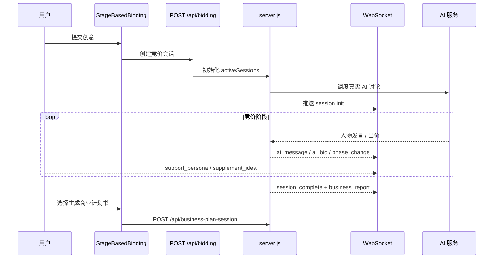
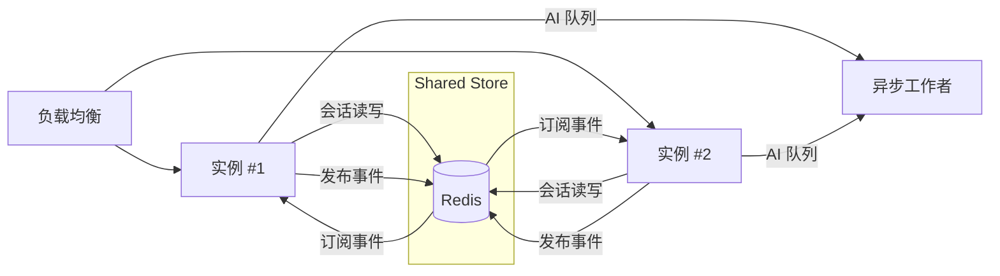

# 竞价页面架构

## UI 布局概览
- **StageBasedBidding (`src/components/bidding/StageBasedBidding.tsx`)**：在创意输入与实时竞价之间切换，维护当前阶段、创意文本、竞价阶段与会话 ID。
- **CreativeInputForm**：通过 `useAuth` 校验积分余额，收集创意正文并触发 `handleIdeaSubmit` 进入竞价流程。
- **BiddingProgressIndicator**：展示暖场 → 深度讨论 → 竞价 → 用户补充 → 结果公布的时间线。
- **UnifiedBiddingStage (`src/components/bidding/UnifiedBiddingStage.tsx`)**：承载五位 AI 人物面板、阶段状态、观众统计、支持按钮以及生成商业计划书的入口。
- **AgentDialogPanel`*` 组件**：渲染人物头像、消息列表、情绪徽标与支持数量，并提供紧凑模式与音效开关。

### 前端状态与 Hook
- `useBiddingWebSocket`：管理实时 WebSocket 通道，将服务端推送映射为本地状态（`aiMessages`、`currentPhase`、`currentBids`、`supportedPersona` 等）。
- `useAgentStates`：保持人物发言权限、支持情况、补充次数等信息与 WebSocket 消息同步。
- `useBusinessPlanGeneration`：在用户触发商业计划书生成时使用，负责跨页面状态共享。
- `DialogueDecisionEngine` / `AIServiceManager`：作为真实 AI 调用失败时的降级方案。

## 端到端时序
```
用户 -> StageBasedBidding -> POST /api/bidding
POST /api/bidding -> server.js（创建会话并调度 AI 流程）
server.js -> WebSocket（session.init）
AI 流程 -> activeSessions -> WebSocket（ai_message / ai_bid / phase_change）
前端 -> WebSocket（support_persona / supplement_idea / submit_prediction）
流程完成 -> WebSocket（session_complete + business_report）
用户 -> POST /api/business-plan-session（可选）
```



## 前后端集成

### WebSocket 流程
- 连接端点：`ws://<host>:8080/api/bidding/{ideaId}`（由 `server.js` 托管）。
- 典型推送：`bidding_started` / `session_update` / `phase_change` 更新阶段提示；`ai_message` 追加人物发言；`ai_bid`、`session_complete`、`business_report` 刷新竞价数据；`viewer_count_update`、`user_interaction_prompt` 更新观众与补充提示。
- 客户端指令：`start_bidding`、`support_persona`、`supplement_idea`、`submit_prediction`、`ping`/`pong`。

### REST 接口
- `POST /api/bidding`：创建会话、写入 `activeSessions` 并异步启动真实 AI。
- `GET /api/bidding?sessionId=...`：供重连/刷新读取最新状态。
- “生成商业计划书”按钮：整理竞价快照后调用 `POST /api/business-plan-session`。

### 多实例部署策略

- 使用 Redis 等共享存储替代本地 Map；键值包含 `sessionId` 与 `ideaId`。
- 借助 Pub/Sub 或消息队列同步广播，确保所有实例均可向本地 WebSocket 转发。
- 结合粘性会话或共享注册表，避免同一会话在不同实例重复执行。
- 将长耗时 AI 调用放入独立队列消费者，降低重复触发风险。

## 数据库落点
- `BiddingSession`：记录创意 ID、阶段、胜出人物、参与指标、时长与时间戳。
- 其他模型（`BiddingRound`、`BiddingEvent`、`UserBiddingBehavior` 等）可用于持久化细粒度对话与互动数据。
- 建议在 AI 流程或定时任务中将关键阶段写入数据库，以提升容错与审计能力。

## 异常处理与降级
- **AI 调用超时**：`startRealAIDiscussion*` / `startRealAIBiddingPhase` 捕获异常并回退到脚本化对话。
- **WebSocket 断开**：`useBiddingWebSocket` 具备指数退避重连能力；必要时调用 `GET /api/bidding` 恢复状态。
- **广播失败**：`global.broadcastToSession` 记录日志并移除异常连接；迁移 Redis 后需补充重试与死信队列机制。
- **会话不存在/过期**：REST 返回 404/410，前端需跳转回创意详情并提示错误。

## 生产环境配置矩阵
| 变量 | 作用 | 建议值 / 说明 |
|------|------|----------------|
| `NODE_ENV` | 启用生产优化 | `production` |
| `PORT` / `WEB_PORT` | 自定义服务器端口 | 与平台端口一致，默认 8080 |
| `DATABASE_URL` | Prisma 连接串 | 托管 Postgres + SSL + IP 白名单 |
| `JWT_SECRET` | 鉴权签名密钥 | ≥32 位随机字符串，建议季度轮换 |
| `DEEPSEEK_API_KEY` | DeepSeek 接口密钥 | 存放于密钥管理服务，最小权限 |
| `ZHIPU_API_KEY` | 智谱 GLM 接口密钥 | 同上 |
| `DASHSCOPE_API_KEY` | 通义千问接口密钥 | 同上 |
| `REDIS_URL`（可选） | 共享会话/广播存储 | 多实例部署必需 |
| `AI_SERVICE_TIMEOUT_MS`（可选） | AI 调用超时 | 默认 30000，可按供应商调整 |
| `LOG_LEVEL` | 日志级别 | 推荐 `info`

## 监控与告警
- 关键指标：WebSocket 在线数与重连次数；AI 调用时延/成功率/超时率；`activeSessions` 数量；广播队列延迟；`/api/bidding` 4xx/5xx 与 WebSocket 关闭码。
- 告警建议：AI 失败率 >5%（5 分钟平均）报警；WebSocket 重连失败次数上升需排查；`activeSessions` 异常增长提示清理故障；`/api/bidding` 5xx >2% 触发事故。
- 日志与追踪：集中收集 `console.*` 输出（包含 sessionId、ideaId、personaId，注意脱敏）；可接入 OpenTelemetry 追踪 AI 调用与广播链路。

## 端到端步骤回顾
1. 用户在 `StageBasedBidding` 提交创意，调用 `POST /api/bidding`。
2. 前端切换至 `UnifiedBiddingStage`，连接 WebSocket。
3. 服务端按暖场 → 讨论 → 竞价顺序推送发言、出价、观众统计。
4. 竞价结束时推送 `session_complete` 与 `business_report`，前端展示总结卡。
5. 若用户生成商业计划书，提交竞价快照至 `/api/business-plan-session`，写入数据库并跳转查看。

## 运维补充
- 未配置 AI 密钥时会降级为脚本回复，需提前验证。
- 多实例部署务必引入 Redis/消息总线，并考虑粘性会话。
- 健康检查需覆盖 HTTP (`/api/health`) 与 WebSocket 启动日志。
- 信用扣减与成本统计可基于 Prisma 字段（`participantCount`、`aiServiceCost` 等）扩展。