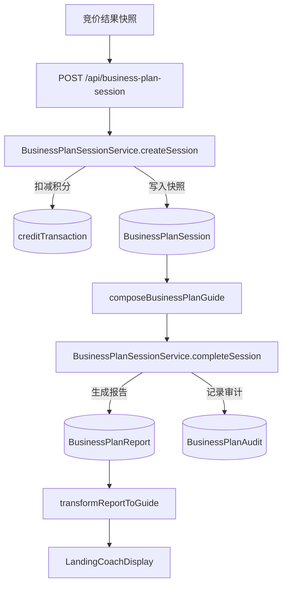
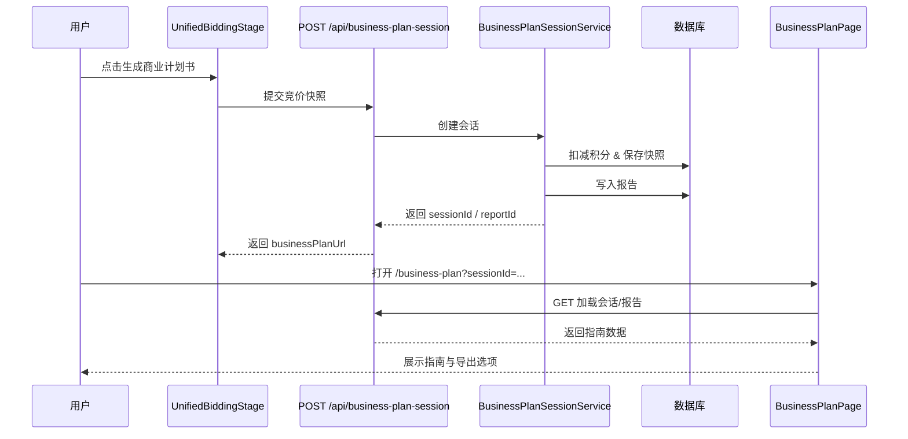

# 商业计划书页面架构

## UI 布局概览
- **BusinessPlanPage (`src/app/business-plan/page.tsx`)**：解析 `sessionId`、`reportId`、`source`、`winner`、`winningBid` 等参数，决定展示加载态/错误态或最终指南，并渲染顶部操作栏。
- **LandingCoachDisplay (`src/components/business-plan/LandingCoachDisplay.tsx`)**：呈现章节导航、洞察卡片、执行计划与导出功能。
- **BusinessPlanWorkflow / BusinessPlanGenerationWorkspace**：驱动需求采集、草稿预览、审批确认等流程，按 `source` 决定是否走完整工作流。
- **辅助组件**：`BusinessPlanProgressTracker`、`ConciseBusinessPlanIntegration`、`ModernBusinessPlan` 等提供进度、模版切换与多样化展示。
- **状态管理**：`useBusinessPlanGeneration`（Zustand）维护 `isGenerating`、`progress`、`currentStage`、`error` 等跨组件共享状态。

## 数据流示意
```
竞价快照（ideaId, bids, winner, aiMessages）
        |
        v
POST /api/business-plan-session
        |
        v
BusinessPlanSessionService.createSession
        |
        +-- 扣减积分（creditTransaction）
        +-- 保存快照（BusinessPlanSession）
        |
        v
composeBusinessPlanGuide
        |
        v
BusinessPlanSessionService.completeSession
        |
        +-- 写入 BusinessPlanReport（guide, metadata）
        +-- 记录审计日志（GUIDE_GENERATED）
        |
        v
BusinessPlanPage 通过 GET 加载（sessionId/reportId）
        |
        v
transformReportToGuide -> LandingCoachDisplay
```



## 前后端集成

### 会话 API
- `POST /api/business-plan-session`：接收竞价快照或手动输入，校验身份与积分，创建会话并生成指南。
- `GET /api/business-plan-session?sessionId=...`：返回会话与最新报告，若过期返回 410。
- `GET /api/business-plan-session?reportId=...`：按报告 ID 加载历史成果。
- `DELETE /api/business-plan-session?sessionId=...`：标记会话失败并记录审计。

### 页面加载流程
1. `BusinessPlanPage` 读取 URL 参数，决定调用 `loadSessionData` 或 `loadReportData`。
2. 更新 `loadingState`（进度、阶段提示），遇到异常填充 `error` 并展示兜底卡片。
3. 成功获取指南后写入状态，由 `LandingCoachDisplay` 呈现内容并提供导出/分享。
4. 顶部操作栏显示来源、赢家人物、竞价价格等上下文。

### 与竞价流程的衔接


## 数据库落点
- `BusinessPlanSession`：保存用户/创意引用、来源、状态、竞价快照与过期时间。
- `BusinessPlanReport`：存储最终指南（Json）与元数据，关联会话与用户。
- `BusinessPlanAudit`：记录创建、生成、删除等操作轨迹。
- 事务流程：创建时扣减积分并写入审计；完成时生成报告与审计；删除时标记失败并登记。

## 异常与边界
- 积分不足：API 返回 400，前端提示充值或任务中心。
- 指南生成失败：返回 500，前端允许重试并保留快照。
- 会话过期：返回 410，页面跳转回创意或市场入口。
- 快照字段缺失：`buildCoreGuide` 使用默认值兜底，并在审计中记录。

## 生产环境配置矩阵
| 变量 | 作用 | 建议值 / 说明 |
|------|------|----------------|
| `NODE_ENV` | 启用生产优化 | `production` |
| `PORT` / `WEB_PORT` | 自定义服务器端口 | 与竞价服务一致，默认 8080 |
| `DATABASE_URL` | Prisma 连接串 | 托管 Postgres + SSL |
| `JWT_SECRET` | 鉴权签名密钥 | ≥32 位随机字符串，季度轮换 |
| `BUSINESS_PLAN_SESSION_TTL_HOURS` | 会话有效期 | 默认 24 小时，可按需求调整 |
| `BUSINESS_PLAN_CREDIT_COST` | 每次生成消耗积分 | 默认 500，可配置 |
| `REPORT_STORAGE_BUCKET`（可选） | 外部存储 | 扩展 PDF/Slides 时必需 |
| `LLM_PROVIDER_KEY`（可选） | 外部大模型密钥 | 仅在扩展指南生成时需要 |
| `LOG_LEVEL` | 日志级别 | 推荐 `info` |
| `METRICS_ENDPOINT`（可选） | 指标采集端点 | 如启用 Prometheus，可设置 `/metrics` |

## 监控与告警
- 关键指标：会话创建/成功/失败比例；积分扣减失败次数；指南生成时延与错误；`/api/business-plan-session` 查询延迟/5xx；导出次数。
- 告警建议：会话失败率 >5% 警报；积分扣减失败 >10 次/小时需核查；平均生成时延 >10 秒需检查 LLM；报告查询 5xx >2% 需排查数据库或快照。
- 日志与追踪：日志需包含 `sessionId`、`reportId`、脱敏后 `userId`；建议对 Prisma 调用与 `composeBusinessPlanGuide` 链路进行追踪。

## 导出与分享
- **导出形态**：前端 `LandingCoachDisplay` 默认提供 Markdown 导出能力；若集成 `GET /api/business-plan-report/:id/export` 接口，可扩展 PDF（@react-pdf/renderer / Puppeteer）等格式。
- **下载流程**：用户点击导出 → 前端调用导出 API → 后端读取 `BusinessPlanReport.guide` 结构化数据 → 按所选模板生成目标格式 → 记录 `BusinessPlanAudit` 中的下载事件。
- **转发/分享**：页面顶部提供分享链接或复制链接，支持携带 `sessionId`/`reportId` 参数进行查看；若启用外部分享需结合鉴权与过期策略。
- **权限控制**：仅会话创建者或被授权用户可导出；API 校验用户身份与积分状态，避免非法下载。
- **格式适配**：Markdown 适合快速查看编辑；PDF 便于正式交付；后续可拓展 Word/Slides 以满足多样化输出需求。
## 生成流水线
1. 客户端调用 `POST /api/business-plan-session` 提交竞价快照。
2. `composeBusinessPlanGuide` 生成章节、执行计划与关键指标。
3. 将结果写入 `BusinessPlanReport.guide`，返回 `reportId`。
4. 页面加载时通过 `transformReportToGuide` 渲染并提供导出/分享。

## 部署提示
- 部署前确保数据库迁移（含 `creditTransaction`、`BusinessPlan*` 表）已执行。
- 若引入外部 LLM，需要考虑费用、超时、重试与缓存策略。
- 默认仅支持 Markdown 导出，如需 PDF/Slides 需集成额外渲染服务。
