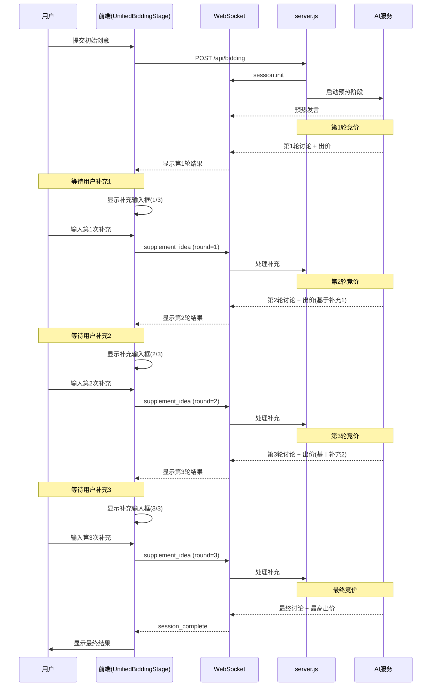

# 3轮补充创意机制设计文档

## 概述
本文档定义了竞价系统中**3轮补充创意机制**的完整设计方案，允许用户在AI竞价过程中分3次补充和完善创意，实现更深度的人机协作。

## 业务流程

### 完整流程图


### 阶段定义
| 阶段 | 说明 | 持续时间 | AI行为 | 用户行为 |
|------|------|----------|--------|----------|
| `warmup` | AI预热 | 30秒 | 5位AI简短自我介绍 | 观察 |
| `round_1_bidding` | 第1轮竞价 | 60秒 | 基于初始创意讨论并出价 | 观察 |
| `supplement_1` | 补充1等待 | 无限制 | 暂停，等待用户输入 | 输入补充内容(1/3) |
| `round_2_bidding` | 第2轮竞价 | 60秒 | 基于补充1重新评估并出价 | 观察 |
| `supplement_2` | 补充2等待 | 无限制 | 暂停，等待用户输入 | 输入补充内容(2/3) |
| `round_3_bidding` | 第3轮竞价 | 60秒 | 基于补充2深度分析并出价 | 观察 |
| `supplement_3` | 补充3等待 | 无限制 | 暂停，等待用户输入 | 输入补充内容(3/3) |
| `final_bidding` | 最终竞价 | 60秒 | 基于完整信息最终出价 | 观察 |
| `result` | 结果展示 | - | 宣布最高出价和获胜者 | 查看结果 |

## 数据结构设计

### 1. BiddingSession 扩展
```typescript
interface BiddingSession {
  sessionId: string
  ideaId: string
  ideaContent: string  // 初始创意
  status: 'active' | 'completed' | 'cancelled'
  phase: 'warmup' | 'round_1_bidding' | 'supplement_1' |
         'round_2_bidding' | 'supplement_2' |
         'round_3_bidding' | 'supplement_3' |
         'final_bidding' | 'result'

  // 新增：补充创意历史
  supplements: Array<{
    round: number          // 1, 2, 3
    content: string        // 用户补充内容
    timestamp: number      // 提交时间
    userId?: string        // 用户ID
  }>

  currentRound: number     // 当前竞价轮次 (1-4)
  maxRounds: number        // 固定为 4（预热+3轮+最终）

  // 每轮出价历史
  roundBids: Array<{
    round: number
    bids: Record<string, number>  // personaId -> bidValue
    highestBid: number
    winnerId: string
    timestamp: number
  }>

  // 其他字段保持不变...
  currentBids: Record<string, number>
  messages: BiddingMessage[]
  finalReport?: Record<string, unknown>
}
```

### 2. WebSocket 消息类型扩展

#### 客户端 -> 服务端
```typescript
// 用户提交补充创意
{
  type: 'supplement_idea',
  payload: {
    round: number,        // 1, 2, 3
    content: string,      // 补充内容
    sessionId: string
  }
}

// 用户跳过本轮补充
{
  type: 'skip_supplement',
  payload: {
    round: number,
    sessionId: string
  }
}
```

#### 服务端 -> 客户端
```typescript
// 进入补充阶段提示
{
  type: 'supplement_required',
  payload: {
    round: number,              // 1, 2, 3
    remainingSupplements: number, // 剩余补充次数
    previousBids: Record<string, number>,
    prompt: string              // 提示文本
  }
}

// 补充已接收，准备下一轮
{
  type: 'supplement_received',
  payload: {
    round: number,
    content: string,
    nextPhase: string           // 'round_2_bidding' | 'round_3_bidding' | 'final_bidding'
  }
}

// 轮次更新
{
  type: 'round_update',
  payload: {
    currentRound: number,
    phase: string,
    bids: Record<string, number>,
    highestBid: number
  }
}
```

## 后端实现方案（server.js）

### 1. 修改竞价流程函数
```javascript
// server.js 新增函数
async function startMultiRoundBidding(ideaId, ideaContent, sessionId) {
  const session = activeSessions.get(sessionId)
  if (!session) return

  // 预热阶段
  await runWarmupPhase(session)

  // 第1轮竞价
  await runBiddingRound(session, 1, ideaContent)
  await waitForSupplement(session, 1)

  // 第2轮竞价
  const supplement1 = session.supplements.find(s => s.round === 1)?.content || ''
  const enhancedIdea1 = `${ideaContent}\n\n[用户补充1]: ${supplement1}`
  await runBiddingRound(session, 2, enhancedIdea1)
  await waitForSupplement(session, 2)

  // 第3轮竞价
  const supplement2 = session.supplements.find(s => s.round === 2)?.content || ''
  const enhancedIdea2 = `${enhancedIdea1}\n\n[用户补充2]: ${supplement2}`
  await runBiddingRound(session, 3, enhancedIdea2)
  await waitForSupplement(session, 3)

  // 最终竞价
  const supplement3 = session.supplements.find(s => s.round === 3)?.content || ''
  const finalIdea = `${enhancedIdea2}\n\n[用户补充3]: ${supplement3}`
  await runBiddingRound(session, 4, finalIdea)

  // 结束并推送结果
  session.phase = 'result'
  session.status = 'completed'
  broadcastToSession(ideaId, {
    type: 'session_complete',
    payload: {
      finalBids: session.currentBids,
      highestBid: session.roundBids[session.roundBids.length - 1]?.highestBid || 0,
      winner: session.roundBids[session.roundBids.length - 1]?.winnerId,
      supplements: session.supplements
    }
  })
}

async function runBiddingRound(session, round, ideaContent) {
  session.currentRound = round
  session.phase = `round_${round}_bidding`

  broadcastToSession(session.ideaId, {
    type: 'phase_change',
    payload: {
      phase: session.phase,
      round,
      message: `第${round}轮竞价开始`
    }
  })

  // 调用AI进行讨论和出价
  await startRealAIBiddingPhase(session.ideaId, ideaContent, session.sessionId, round)

  // 记录本轮出价
  session.roundBids.push({
    round,
    bids: { ...session.currentBids },
    highestBid: Math.max(...Object.values(session.currentBids)),
    winnerId: Object.entries(session.currentBids)
      .reduce((a, b) => a[1] > b[1] ? a : b)[0],
    timestamp: Date.now()
  })
}

async function waitForSupplement(session, round) {
  if (round > 3) return // 只有前3轮需要补充

  session.phase = `supplement_${round}`

  return new Promise((resolve) => {
    broadcastToSession(session.ideaId, {
      type: 'supplement_required',
      payload: {
        round,
        remainingSupplements: 4 - round,
        previousBids: session.currentBids,
        prompt: `第${round}轮竞价完成，请根据AI专家的反馈补充您的创意（${round}/3）`
      }
    })

    // 等待用户提交或60秒超时
    const timeout = setTimeout(() => {
      resolve() // 超时自动继续
    }, 60000)

    // 监听补充事件（在WebSocket handler中触发）
    session._supplementResolvers = session._supplementResolvers || {}
    session._supplementResolvers[round] = () => {
      clearTimeout(timeout)
      resolve()
    }
  })
}

// WebSocket 消息处理中添加
async function handleIdeaSupplement(ideaId, payload, ws) {
  const { sessionId, round, content } = payload
  const session = activeSessions.get(sessionId)

  if (!session || session.phase !== `supplement_${round}`) {
    ws.send(JSON.stringify({
      type: 'error',
      payload: { message: '当前不在补充阶段或轮次不匹配' }
    }))
    return
  }

  // 保存补充内容
  session.supplements = session.supplements || []
  session.supplements.push({
    round,
    content,
    timestamp: Date.now()
  })

  // 广播补充已接收
  broadcastToSession(ideaId, {
    type: 'supplement_received',
    payload: {
      round,
      content,
      nextPhase: round < 3 ? `round_${round + 1}_bidding` : 'final_bidding'
    }
  })

  // 触发下一轮
  if (session._supplementResolvers?.[round]) {
    session._supplementResolvers[round]()
  }
}
```

### 2. 修改AI Prompt
```javascript
// 在 startRealAIBiddingPhase 中
const prompt = `
你是${persona.name}，${persona.description}

这是第${round}轮竞价。

初始创意：
${originalIdea}

${supplements.length > 0 ? `
用户已补充的内容：
${supplements.map((s, i) => `[补充${i + 1}]: ${s.content}`).join('\n')}
` : ''}

请基于以上完整信息：
1. 发表你的分析（2-3句话，${round === 1 ? '初步评估' : round === 4 ? '最终判断' : '深入分析'}）
2. 给出你的出价（考虑用户补充的信息调整价格）

${round === 4 ? '这是最后一轮，请给出你的最终出价。' : ''}

## 重要：出价规则（基于人设匹配度）

你需要根据创意与你的专业领域的匹配度来决定出价高低：

### ${persona.name}的专业领域和关注点：
${persona.expertise || '通用评估'}
- 关键词：${persona.keywords?.join('、') || '无特定关键词'}
- 偏好类型：${persona.preferredTypes || '全类型'}

### 出价策略：
**高出价（300-500元）：**
- 创意高度匹配你的专业领域
- 包含你关注的关键要素（如：${persona.name === '科技先锋艾克斯' ? '技术架构清晰、有创新技术栈' : persona.name === '文艺少女小琳' ? '故事性强、情感表达充分' : persona.name === '商人老李' ? '商业模式清晰、盈利路径明确' : '符合专业标准'}）
- 用户补充内容完善了你关心的部分

**中等出价（150-299元）：**
- 创意部分匹配你的专业领域
- 有潜力但缺少关键信息
- 你关注的部分描述不够清晰

**低出价（50-149元）：**
- 创意与你的专业领域关联度低
- 缺少你最关心的核心要素
- 即使补充了信息，仍不够吸引你

**示例（艾克斯）：**
- 如果创意是"AI智能客服"，技术架构清晰 → 高出价
- 如果创意是"AI智能客服"，但没有技术细节 → 中等出价
- 如果创意是"开一家咖啡店"（无技术含量）→ 低出价

**示例（小琳）：**
- 如果创意是"感人的故事短片"，有完整故事线 → 高出价
- 如果创意是"故事短片"，但故事框架不清晰 → 中等出价
- 如果创意是"技术架构设计"（无故事性）→ 低出价

**示例（老李）：**
- 如果创意是"共享经济平台"，商业模式清晰 → 高出价
- 如果创意是"共享经济平台"，但盈利模式不明 → 中等出价
- 如果创意是"个人兴趣项目"（无商业价值）→ 低出价

请严格按照上述规则，根据创意与你专业领域的匹配度出价。
`
```

## 前端实现方案（UnifiedBiddingStage.tsx）

### 1. 状态管理扩展
```typescript
const [supplementHistory, setSupplementHistory] = useState<Array<{
  round: number
  content: string
  timestamp: number
}>>([])
const [currentSupplementRound, setCurrentSupplementRound] = useState<number | null>(null)
const [supplementInput, setSupplementInput] = useState('')
const [isSupplementPhase, setIsSupplementPhase] = useState(false)
```

### 2. WebSocket 消息处理
```typescript
useEffect(() => {
  // 在 useBiddingWebSocket 的消息处理中添加

  if (message.type === 'supplement_required') {
    setIsSupplementPhase(true)
    setCurrentSupplementRound(message.payload.round)
    setSupplementInput('')
  }

  if (message.type === 'supplement_received') {
    setIsSupplementPhase(false)
    setCurrentSupplementRound(null)
    setSupplementHistory(prev => [...prev, {
      round: message.payload.round,
      content: message.payload.content,
      timestamp: Date.now()
    }])
  }

  if (message.type === 'round_update') {
    // 更新轮次显示
  }
}, [/* websocket messages */])
```

### 3. 补充创意UI组件
```typescript
const SupplementInputPanel = () => {
  if (!isSupplementPhase || currentSupplementRound === null) return null

  const handleSubmit = () => {
    if (!supplementInput.trim()) {
      alert('请输入补充内容')
      return
    }

    // 发送WebSocket消息
    sendWebSocketMessage({
      type: 'supplement_idea',
      payload: {
        round: currentSupplementRound,
        content: supplementInput,
        sessionId
      }
    })
  }

  const handleSkip = () => {
    sendWebSocketMessage({
      type: 'skip_supplement',
      payload: { round: currentSupplementRound, sessionId }
    })
  }

  return (
    <Card className="border-2 border-blue-500 bg-blue-50">
      <CardHeader>
        <CardTitle className="flex items-center gap-2">
          <Plus className="w-5 h-5" />
          补充创意 ({currentSupplementRound}/3)
        </CardTitle>
        <CardDescription>
          根据AI专家的反馈，您可以补充和完善您的创意
        </CardDescription>
      </CardHeader>
      <CardContent>
        <Textarea
          value={supplementInput}
          onChange={(e) => setSupplementInput(e.target.value)}
          placeholder="请输入补充内容..."
          rows={4}
          className="mb-4"
        />

        {/* 显示历史补充 */}
        {supplementHistory.length > 0 && (
          <div className="mb-4 space-y-2">
            <p className="text-sm font-medium">已补充内容：</p>
            {supplementHistory.map((s) => (
              <div key={s.round} className="text-xs bg-white p-2 rounded border">
                <span className="font-medium">补充{s.round}:</span> {s.content}
              </div>
            ))}
          </div>
        )}

        <div className="flex gap-3">
          <Button onClick={handleSubmit} className="flex-1">
            提交补充
          </Button>
          <Button onClick={handleSkip} variant="outline">
            跳过本轮
          </Button>
        </div>
      </CardContent>
    </Card>
  )
}
```

### 4. 进度指示器更新
```typescript
const BiddingProgressIndicator = ({ currentPhase, currentRound }) => {
  const phases = [
    { key: 'warmup', label: 'AI预热', icon: Play },
    { key: 'round_1', label: '第1轮', icon: Trophy },
    { key: 'supplement_1', label: '补充1', icon: Plus },
    { key: 'round_2', label: '第2轮', icon: Trophy },
    { key: 'supplement_2', label: '补充2', icon: Plus },
    { key: 'round_3', label: '第3轮', icon: Trophy },
    { key: 'supplement_3', label: '补充3', icon: Plus },
    { key: 'final', label: '最终竞价', icon: Target },
    { key: 'result', label: '结果', icon: Star }
  ]

  return (
    <div className="flex items-center justify-between">
      {phases.map((phase, index) => {
        const Icon = phase.icon
        const isActive = currentPhase.includes(phase.key)
        const isCompleted = index < phases.findIndex(p => p.key === currentPhase)

        return (
          <div key={phase.key} className="flex items-center">
            <div className={`flex flex-col items-center ${
              isActive ? 'text-blue-600' : isCompleted ? 'text-green-600' : 'text-gray-400'
            }`}>
              <Icon className="w-6 h-6" />
              <span className="text-xs mt-1">{phase.label}</span>
            </div>
            {index < phases.length - 1 && (
              <div className={`h-0.5 w-8 mx-2 ${
                isCompleted ? 'bg-green-600' : 'bg-gray-300'
              }`} />
            )}
          </div>
        )
      })}
    </div>
  )
}
```

## 数据库持久化（可选）

### Prisma Schema 扩展
```prisma
model BiddingSession {
  id            String   @id @default(cuid())
  // ... 现有字段

  supplements   BiddingSessionSupplement[]
  rounds        BiddingRound[]
}

model BiddingSessionSupplement {
  id            String   @id @default(cuid())
  sessionId     String
  session       BiddingSession @relation(fields: [sessionId], references: [id])
  round         Int      // 1, 2, 3
  content       String   @db.Text
  createdAt     DateTime @default(now())

  @@index([sessionId, round])
}

model BiddingRound {
  id            String   @id @default(cuid())
  sessionId     String
  session       BiddingSession @relation(fields: [sessionId], references: [id])
  round         Int      // 1, 2, 3, 4
  phase         String   // 'round_1_bidding', etc.
  bids          Json     // Record<string, number>
  highestBid    Float
  winnerId      String
  createdAt     DateTime @default(now())

  @@index([sessionId, round])
}
```

## 用户体验优化

### 1. 补充提示策略
- 第1轮后：提示用户明确商业模式、目标用户
- 第2轮后：提示用户补充技术实现、竞争优势
- 第3轮后：提示用户完善盈利模式、市场规模

### 2. 跳过机制
- 用户可以跳过任意轮次的补充
- 跳过后直接进入下一轮竞价（使用已有信息）

### 3. 倒计时提示
- 补充阶段设置60秒软性倒计时（不强制）
- 显示剩余补充次数（1/3, 2/3, 3/3）

## 测试场景

### 测试用例1：完整补充流程
1. 用户提交初始创意
2. 第1轮竞价后补充商业模式
3. 第2轮竞价后补充技术方案
4. 第3轮竞价后补充市场数据
5. 验证最终出价高于初始出价

### 测试用例2：部分跳过
1. 用户提交初始创意
2. 第1轮后补充
3. 第2轮后跳过
4. 第3轮后补充
5. 验证流程正常完成

### 测试用例3：超时处理
1. 用户提交初始创意
2. 第1轮后不操作，等待60秒
3. 验证自动进入下一轮

## 部署注意事项

1. **向后兼容**：保留原有单轮补充逻辑，通过配置项 `ENABLE_MULTI_ROUND_SUPPLEMENT` 开关
2. **性能监控**：监控AI调用次数增加（从2-3次增加到8-10次/会话）
3. **费用控制**：每轮AI调用成本累加，需更新积分扣除逻辑
4. **WebSocket稳定性**：长时间会话需增强心跳机制

## 配置参数

```javascript
// server.js
const BIDDING_CONFIG = {
  ENABLE_MULTI_ROUND: process.env.ENABLE_MULTI_ROUND_SUPPLEMENT === 'true',
  MAX_SUPPLEMENT_ROUNDS: 3,
  SUPPLEMENT_TIMEOUT_MS: 60000,
  ROUND_DURATION_MS: 60000,
  WARMUP_DURATION_MS: 30000
}
```

## 总结

本设计实现了：
✅ 3次补充机会，渐进式完善创意
✅ 每轮独立竞价，价格动态调整
✅ 用户可选择补充或跳过
✅ 完整的前后端WebSocket协议
✅ 可选的数据库持久化方案
✅ 向后兼容的配置开关

实施后可显著提升用户参与度和创意完成度。
