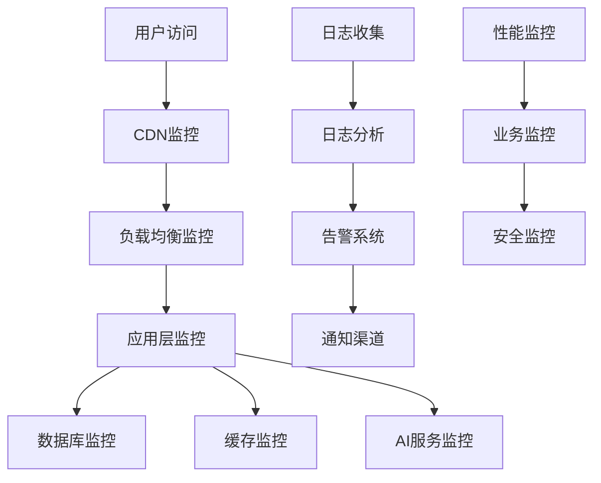

# AI创意交易市场运维监控文档

## 📊 监控体系架构

### 监控层次设计



## 🏗️ 阿里云ARMS监控配置

### 应用监控配置

```javascript
// src/lib/monitoring.ts
import { init } from '@alicloud/arms-retcode'

// ARMS前端监控初始化
export const initARMS = () => {
  const config = {
    pid: process.env.ARMS_PID, // 从阿里云ARMS获取
    region: 'cn-hangzhou',
    enableSPA: true,
    enableConsole: false,
    enableResourceTiming: true,
    enableApiDetails: true,
    enablePagePerformance: true,
    disableHook: false,
    useFmp: true
  }

  const arms = init(config)

  // 自定义业务监控
  arms.setConfig({
    sample: 1, // 采样率100%
    behavior: true, // 行为回放
    enableLinkTrace: true, // 链路追踪
    sendResource: true // 静态资源监控
  })

  return arms
}

// 自定义埋点
export const trackEvent = (eventName: string, params: any) => {
  if (typeof window !== 'undefined' && window.__bl) {
    window.__bl.sum(eventName, 1, params)
  }
}

// 业务指标监控
export const trackBusinessMetric = (metric: {
  name: string
  value: number
  tags?: Record<string, string>
}) => {
  if (typeof window !== 'undefined' && window.__bl) {
    window.__bl.avg(metric.name, metric.value, metric.tags)
  }
}
```

### 服务端监控配置

```javascript
// src/lib/server-monitoring.ts
import { Logger } from '@alicloud/sls'

class ServerMonitoring {
  private logger: Logger

  constructor() {
    this.logger = new Logger({
      endpoint: process.env.SLS_ENDPOINT,
      accessKeyId: process.env.ALIYUN_ACCESS_KEY_ID,
      accessKeySecret: process.env.ALIYUN_ACCESS_KEY_SECRET,
      project: 'aimarket-logs',
      logstore: 'application-logs'
    })
  }

  // API性能监控
  trackAPIPerformance(req: any, res: any, duration: number) {
    const log = {
      timestamp: new Date().toISOString(),
      method: req.method,
      url: req.url,
      status: res.statusCode,
      duration,
      ip: req.ip,
      userAgent: req.headers['user-agent'],
      userId: req.user?.id || null
    }

    this.logger.putLogs([log])
  }

  // 业务事件监控
  trackBusinessEvent(event: {
    action: string
    userId?: number
    details: any
    timestamp?: string
  }) {
    const log = {
      timestamp: event.timestamp || new Date().toISOString(),
      level: 'INFO',
      category: 'business',
      action: event.action,
      userId: event.userId,
      details: JSON.stringify(event.details)
    }

    this.logger.putLogs([log])
  }

  // 错误监控
  trackError(error: Error, context?: any) {
    const log = {
      timestamp: new Date().toISOString(),
      level: 'ERROR',
      category: 'application',
      message: error.message,
      stack: error.stack,
      context: JSON.stringify(context)
    }

    this.logger.putLogs([log])
  }

  // AI服务监控
  trackAIService(service: string, request: any, response: any, duration: number) {
    const log = {
      timestamp: new Date().toISOString(),
      level: 'INFO',
      category: 'ai-service',
      service,
      requestTokens: request.tokens || 0,
      responseTokens: response.usage?.total_tokens || 0,
      duration,
      success: response.success,
      cost: this.calculateCost(service, response.usage?.total_tokens || 0)
    }

    this.logger.putLogs([log])
  }

  private calculateCost(service: string, tokens: number): number {
    const prices = {
      baidu: 0.012,
      alibaba: 0.002,
      iflytek: 0.018,
      tencent: 0.01,
      zhipu: 0.005
    }

    return (tokens / 1000) * (prices[service as keyof typeof prices] || 0.01)
  }
}

export const serverMonitoring = new ServerMonitoring()
```

## 📈 性能监控指标

### 核心KPI定义

```typescript
// src/lib/kpi-metrics.ts
export interface KPIMetrics {
  // 用户相关
  dailyActiveUsers: number
  monthlyActiveUsers: number
  userRegistrations: number
  userRetention: number

  // 业务相关
  ideasSubmitted: number
  businessPlansGenerated: number
  transactionVolume: number
  revenue: number

  // 技术相关
  apiResponseTime: number
  apiSuccessRate: number
  pageLoadTime: number
  errorRate: number

  // AI服务相关
  aiServiceCalls: number
  aiServiceSuccessRate: number
  aiServiceCost: number
  aiServiceLatency: number
}

export class MetricsCollector {
  private metrics: Map<string, any[]> = new Map()

  // 收集用户行为指标
  collectUserMetric(action: string, userId: number, metadata?: any) {
    const metric = {
      timestamp: Date.now(),
      action,
      userId,
      metadata
    }

    this.addMetric('user_actions', metric)
  }

  // 收集性能指标
  collectPerformanceMetric(name: string, value: number, tags?: Record<string, string>) {
    const metric = {
      timestamp: Date.now(),
      name,
      value,
      tags
    }

    this.addMetric('performance', metric)
  }

  // 收集业务指标
  collectBusinessMetric(name: string, value: number, userId?: number) {
    const metric = {
      timestamp: Date.now(),
      name,
      value,
      userId
    }

    this.addMetric('business', metric)
  }

  private addMetric(category: string, metric: any) {
    if (!this.metrics.has(category)) {
      this.metrics.set(category, [])
    }

    this.metrics.get(category)!.push(metric)

    // 定期发送指标到监控系统
    this.scheduleMetricSend(category)
  }

  private scheduleMetricSend(category: string) {
    // 批量发送指标，避免过于频繁的网络请求
    setTimeout(() => {
      this.sendMetrics(category)
    }, 5000)
  }

  private async sendMetrics(category: string) {
    const metrics = this.metrics.get(category) || []
    if (metrics.length === 0) return

    try {
      await fetch('/api/metrics', {
        method: 'POST',
        headers: { 'Content-Type': 'application/json' },
        body: JSON.stringify({ category, metrics })
      })

      // 清空已发送的指标
      this.metrics.set(category, [])
    } catch (error) {
      console.error('Failed to send metrics:', error)
    }
  }
}

export const metricsCollector = new MetricsCollector()
```

### 实时监控面板

```typescript
// src/components/admin/MonitoringDashboard.tsx
'use client'

import { useState, useEffect } from 'react'
import { Card, CardContent, CardHeader, CardTitle } from '@/components/ui/card'
import { LineChart, Line, XAxis, YAxis, CartesianGrid, Tooltip, ResponsiveContainer } from 'recharts'

interface MetricData {
  timestamp: string
  value: number
}

export default function MonitoringDashboard() {
  const [metrics, setMetrics] = useState<{
    apiResponseTime: MetricData[]
    userCount: MetricData[]
    errorRate: MetricData[]
    aiServiceUsage: MetricData[]
  }>({
    apiResponseTime: [],
    userCount: [],
    errorRate: [],
    aiServiceUsage: []
  })

  const [systemStatus, setSystemStatus] = useState({
    api: 'healthy',
    database: 'healthy',
    redis: 'healthy',
    aiServices: 'healthy'
  })

  useEffect(() => {
    const fetchMetrics = async () => {
      try {
        const response = await fetch('/api/admin/metrics')
        const data = await response.json()
        setMetrics(data.metrics)
        setSystemStatus(data.systemStatus)
      } catch (error) {
        console.error('Failed to fetch metrics:', error)
      }
    }

    fetchMetrics()
    const interval = setInterval(fetchMetrics, 30000) // 每30秒刷新

    return () => clearInterval(interval)
  }, [])

  return (
    <div className="space-y-6">
      {/* 系统状态概览 */}
      <div className="grid grid-cols-1 md:grid-cols-4 gap-4">
        <Card>
          <CardHeader>
            <CardTitle className="text-sm">API服务</CardTitle>
          </CardHeader>
          <CardContent>
            <div className={`text-2xl font-bold ${
              systemStatus.api === 'healthy' ? 'text-green-600' : 'text-red-600'
            }`}>
              {systemStatus.api === 'healthy' ? '正常' : '异常'}
            </div>
          </CardContent>
        </Card>

        <Card>
          <CardHeader>
            <CardTitle className="text-sm">数据库</CardTitle>
          </CardHeader>
          <CardContent>
            <div className={`text-2xl font-bold ${
              systemStatus.database === 'healthy' ? 'text-green-600' : 'text-red-600'
            }`}>
              {systemStatus.database === 'healthy' ? '正常' : '异常'}
            </div>
          </CardContent>
        </Card>

        <Card>
          <CardHeader>
            <CardTitle className="text-sm">Redis缓存</CardTitle>
          </CardHeader>
          <CardContent>
            <div className={`text-2xl font-bold ${
              systemStatus.redis === 'healthy' ? 'text-green-600' : 'text-red-600'
            }`}>
              {systemStatus.redis === 'healthy' ? '正常' : '异常'}
            </div>
          </CardContent>
        </Card>

        <Card>
          <CardHeader>
            <CardTitle className="text-sm">AI服务</CardTitle>
          </CardHeader>
          <CardContent>
            <div className={`text-2xl font-bold ${
              systemStatus.aiServices === 'healthy' ? 'text-green-600' : 'text-red-600'
            }`}>
              {systemStatus.aiServices === 'healthy' ? '正常' : '异常'}
            </div>
          </CardContent>
        </Card>
      </div>

      {/* 性能指标图表 */}
      <div className="grid grid-cols-1 md:grid-cols-2 gap-6">
        <Card>
          <CardHeader>
            <CardTitle>API响应时间</CardTitle>
          </CardHeader>
          <CardContent>
            <ResponsiveContainer width="100%" height={300}>
              <LineChart data={metrics.apiResponseTime}>
                <CartesianGrid strokeDasharray="3 3" />
                <XAxis dataKey="timestamp" />
                <YAxis />
                <Tooltip />
                <Line type="monotone" dataKey="value" stroke="#8884d8" />
              </LineChart>
            </ResponsiveContainer>
          </CardContent>
        </Card>

        <Card>
          <CardHeader>
            <CardTitle>在线用户数</CardTitle>
          </CardHeader>
          <CardContent>
            <ResponsiveContainer width="100%" height={300}>
              <LineChart data={metrics.userCount}>
                <CartesianGrid strokeDasharray="3 3" />
                <XAxis dataKey="timestamp" />
                <YAxis />
                <Tooltip />
                <Line type="monotone" dataKey="value" stroke="#82ca9d" />
              </LineChart>
            </ResponsiveContainer>
          </CardContent>
        </Card>

        <Card>
          <CardHeader>
            <CardTitle>错误率</CardTitle>
          </CardHeader>
          <CardContent>
            <ResponsiveContainer width="100%" height={300}>
              <LineChart data={metrics.errorRate}>
                <CartesianGrid strokeDasharray="3 3" />
                <XAxis dataKey="timestamp" />
                <YAxis />
                <Tooltip />
                <Line type="monotone" dataKey="value" stroke="#ff7300" />
              </LineChart>
            </ResponsiveContainer>
          </CardContent>
        </Card>

        <Card>
          <CardHeader>
            <CardTitle>AI服务使用量</CardTitle>
          </CardHeader>
          <CardContent>
            <ResponsiveContainer width="100%" height={300}>
              <LineChart data={metrics.aiServiceUsage}>
                <CartesianGrid strokeDasharray="3 3" />
                <XAxis dataKey="timestamp" />
                <YAxis />
                <Tooltip />
                <Line type="monotone" dataKey="value" stroke="#8dd1e1" />
              </LineChart>
            </ResponsiveContainer>
          </CardContent>
        </Card>
      </div>
    </div>
  )
}
```

## 🚨 告警系统

### 告警规则配置

```typescript
// src/lib/alert-system.ts
export interface AlertRule {
  id: string
  name: string
  metric: string
  operator: 'gt' | 'lt' | 'eq' | 'ne'
  threshold: number
  duration: number // 持续时间(秒)
  severity: 'critical' | 'warning' | 'info'
  channels: string[] // 通知渠道
}

export class AlertSystem {
  private rules: AlertRule[] = [
    {
      id: 'high_error_rate',
      name: 'API错误率过高',
      metric: 'api_error_rate',
      operator: 'gt',
      threshold: 5, // 5%
      duration: 300, // 5分钟
      severity: 'critical',
      channels: ['email', 'sms', 'dingtalk']
    },
    {
      id: 'slow_response',
      name: 'API响应时间过慢',
      metric: 'api_response_time',
      operator: 'gt',
      threshold: 2000, // 2秒
      duration: 300,
      severity: 'warning',
      channels: ['email', 'dingtalk']
    },
    {
      id: 'high_cpu',
      name: 'CPU使用率过高',
      metric: 'cpu_usage',
      operator: 'gt',
      threshold: 80, // 80%
      duration: 600, // 10分钟
      severity: 'warning',
      channels: ['email']
    },
    {
      id: 'database_connection_error',
      name: '数据库连接异常',
      metric: 'database_connection_error',
      operator: 'gt',
      threshold: 0,
      duration: 60,
      severity: 'critical',
      channels: ['email', 'sms', 'phone']
    }
  ]

  private activeAlerts = new Map<string, Date>()

  // 检查告警规则
  async checkAlerts(metrics: Record<string, number>) {
    for (const rule of this.rules) {
      const value = metrics[rule.metric]
      if (value === undefined) continue

      const shouldAlert = this.evaluateRule(rule, value)
      const alertKey = `${rule.id}_${Math.floor(Date.now() / (rule.duration * 1000))}`

      if (shouldAlert && !this.activeAlerts.has(alertKey)) {
        this.activeAlerts.set(alertKey, new Date())
        await this.sendAlert(rule, value)
      }
    }
  }

  private evaluateRule(rule: AlertRule, value: number): boolean {
    switch (rule.operator) {
      case 'gt': return value > rule.threshold
      case 'lt': return value < rule.threshold
      case 'eq': return value === rule.threshold
      case 'ne': return value !== rule.threshold
      default: return false
    }
  }

  private async sendAlert(rule: AlertRule, value: number) {
    const alert = {
      id: `alert_${Date.now()}`,
      rule: rule.name,
      metric: rule.metric,
      value,
      threshold: rule.threshold,
      severity: rule.severity,
      timestamp: new Date().toISOString(),
      message: this.generateAlertMessage(rule, value)
    }

    // 发送到各个通知渠道
    for (const channel of rule.channels) {
      await this.sendToChannel(channel, alert)
    }

    // 记录告警日志
    console.error('ALERT TRIGGERED:', alert)
  }

  private generateAlertMessage(rule: AlertRule, value: number): string {
    return `【AI创意市场告警】${rule.name}
当前值: ${value}
阈值: ${rule.threshold}
时间: ${new Date().toLocaleString()}
严重级别: ${rule.severity}`
  }

  private async sendToChannel(channel: string, alert: any) {
    switch (channel) {
      case 'email':
        await this.sendEmail(alert)
        break
      case 'sms':
        await this.sendSMS(alert)
        break
      case 'dingtalk':
        await this.sendDingTalk(alert)
        break
      case 'phone':
        await this.makePhoneCall(alert)
        break
    }
  }

  private async sendEmail(alert: any) {
    // 发送邮件告警
    const nodemailer = require('nodemailer')
    const transporter = nodemailer.createTransporter({
      host: process.env.SMTP_HOST,
      port: 587,
      secure: false,
      auth: {
        user: process.env.SMTP_USER,
        pass: process.env.SMTP_PASS
      }
    })

    await transporter.sendMail({
      from: process.env.SMTP_USER,
      to: 'admin@yourdomain.com',
      subject: `AI创意市场告警: ${alert.rule}`,
      text: alert.message
    })
  }

  private async sendSMS(alert: any) {
    // 发送短信告警（使用阿里云短信服务）
    const Core = require('@alicloud/pop-core')

    const client = new Core({
      accessKeyId: process.env.ALIYUN_ACCESS_KEY_ID,
      accessKeySecret: process.env.ALIYUN_ACCESS_KEY_SECRET,
      endpoint: 'https://dysmsapi.aliyuncs.com',
      apiVersion: '2017-05-25'
    })

    const params = {
      PhoneNumbers: '13800138000', // 运维人员手机号
      SignName: 'AI创意市场',
      TemplateCode: 'SMS_ALERT_001',
      TemplateParam: JSON.stringify({
        rule: alert.rule,
        value: alert.value
      })
    }

    await client.request('SendSms', params, { method: 'POST' })
  }

  private async sendDingTalk(alert: any) {
    // 发送钉钉机器人告警
    const webhook = process.env.DINGTALK_WEBHOOK
    if (!webhook) return

    const message = {
      msgtype: 'text',
      text: {
        content: `【告警】${alert.message}`
      }
    }

    await fetch(webhook, {
      method: 'POST',
      headers: { 'Content-Type': 'application/json' },
      body: JSON.stringify(message)
    })
  }

  private async makePhoneCall(alert: any) {
    // 电话告警（使用阿里云语音服务）
    // 这里只是示例，实际需要配置语音服务
    console.log('电话告警:', alert.message)
  }
}

export const alertSystem = new AlertSystem()
```

## 📋 日志管理系统

### 结构化日志配置

```typescript
// src/lib/logger.ts
import winston from 'winston'
import 'winston-daily-rotate-file'

const logFormat = winston.format.combine(
  winston.format.timestamp(),
  winston.format.errors({ stack: true }),
  winston.format.json()
)

// 不同级别的日志文件
const fileTransports = [
  new winston.transports.DailyRotateFile({
    filename: 'logs/error-%DATE%.log',
    datePattern: 'YYYY-MM-DD',
    level: 'error',
    maxSize: '20m',
    maxFiles: '14d',
    format: logFormat
  }),
  new winston.transports.DailyRotateFile({
    filename: 'logs/combined-%DATE%.log',
    datePattern: 'YYYY-MM-DD',
    maxSize: '20m',
    maxFiles: '14d',
    format: logFormat
  })
]

// 控制台输出（仅开发环境）
if (process.env.NODE_ENV !== 'production') {
  fileTransports.push(
    new winston.transports.Console({
      format: winston.format.combine(
        winston.format.colorize(),
        winston.format.simple()
      )
    })
  )
}

export const logger = winston.createLogger({
  level: process.env.LOG_LEVEL || 'info',
  format: logFormat,
  transports: fileTransports
})

// 业务日志记录器
export const businessLogger = {
  userAction: (action: string, userId: number, details?: any) => {
    logger.info('User Action', {
      category: 'user_action',
      action,
      userId,
      details,
      timestamp: new Date().toISOString()
    })
  },

  apiRequest: (req: any, res: any, duration: number) => {
    logger.info('API Request', {
      category: 'api_request',
      method: req.method,
      url: req.url,
      status: res.statusCode,
      duration,
      ip: req.ip,
      userAgent: req.headers['user-agent'],
      userId: req.user?.id || null,
      timestamp: new Date().toISOString()
    })
  },

  aiService: (service: string, request: any, response: any, duration: number) => {
    logger.info('AI Service Call', {
      category: 'ai_service',
      service,
      requestTokens: request.tokens || 0,
      responseTokens: response.usage?.total_tokens || 0,
      duration,
      success: response.success,
      cost: response.cost || 0,
      timestamp: new Date().toISOString()
    })
  },

  businessEvent: (event: string, data: any) => {
    logger.info('Business Event', {
      category: 'business_event',
      event,
      data,
      timestamp: new Date().toISOString()
    })
  },

  securityEvent: (event: string, details: any) => {
    logger.warn('Security Event', {
      category: 'security',
      event,
      details,
      timestamp: new Date().toISOString()
    })
  }
}
```

### 日志分析和可视化

```typescript
// src/lib/log-analyzer.ts
export class LogAnalyzer {

  // 分析API性能
  async analyzeAPIPerformance(startTime: Date, endTime: Date) {
    const logs = await this.queryLogs({
      category: 'api_request',
      timeRange: { start: startTime, end: endTime }
    })

    const analysis = {
      totalRequests: logs.length,
      avgResponseTime: this.calculateAverage(logs.map(l => l.duration)),
      errorRate: (logs.filter(l => l.status >= 400).length / logs.length) * 100,
      slowRequests: logs.filter(l => l.duration > 2000).length,
      topEndpoints: this.getTopEndpoints(logs),
      hourlyDistribution: this.getHourlyDistribution(logs)
    }

    return analysis
  }

  // 分析用户行为
  async analyzeUserBehavior(startTime: Date, endTime: Date) {
    const logs = await this.queryLogs({
      category: 'user_action',
      timeRange: { start: startTime, end: endTime }
    })

    const analysis = {
      totalActions: logs.length,
      uniqueUsers: new Set(logs.map(l => l.userId)).size,
      topActions: this.getTopActions(logs),
      userActivity: this.getUserActivity(logs),
      conversionFunnel: this.calculateConversionFunnel(logs)
    }

    return analysis
  }

  // 分析AI服务使用
  async analyzeAIServiceUsage(startTime: Date, endTime: Date) {
    const logs = await this.queryLogs({
      category: 'ai_service',
      timeRange: { start: startTime, end: endTime }
    })

    const analysis = {
      totalCalls: logs.length,
      totalCost: logs.reduce((sum, l) => sum + (l.cost || 0), 0),
      successRate: (logs.filter(l => l.success).length / logs.length) * 100,
      avgLatency: this.calculateAverage(logs.map(l => l.duration)),
      serviceBreakdown: this.getServiceBreakdown(logs),
      costTrend: this.getCostTrend(logs)
    }

    return analysis
  }

  private async queryLogs(query: any) {
    // 实际实现中可能需要连接到日志存储系统（如ELK、阿里云SLS等）
    // 这里返回模拟数据
    return []
  }

  private calculateAverage(values: number[]): number {
    return values.length > 0 ? values.reduce((a, b) => a + b, 0) / values.length : 0
  }

  private getTopEndpoints(logs: any[]) {
    const endpoints = logs.reduce((acc, log) => {
      acc[log.url] = (acc[log.url] || 0) + 1
      return acc
    }, {})

    return Object.entries(endpoints)
      .sort(([,a], [,b]) => (b as number) - (a as number))
      .slice(0, 10)
  }

  private getHourlyDistribution(logs: any[]) {
    const hours = Array(24).fill(0)
    logs.forEach(log => {
      const hour = new Date(log.timestamp).getHours()
      hours[hour]++
    })
    return hours
  }

  private getTopActions(logs: any[]) {
    const actions = logs.reduce((acc, log) => {
      acc[log.action] = (acc[log.action] || 0) + 1
      return acc
    }, {})

    return Object.entries(actions)
      .sort(([,a], [,b]) => (b as number) - (a as number))
      .slice(0, 10)
  }

  private getUserActivity(logs: any[]) {
    const userActivity = logs.reduce((acc, log) => {
      if (!acc[log.userId]) {
        acc[log.userId] = { actions: 0, firstAction: log.timestamp, lastAction: log.timestamp }
      }
      acc[log.userId].actions++
      acc[log.userId].lastAction = log.timestamp
      return acc
    }, {})

    return Object.entries(userActivity).map(([userId, activity]) => ({
      userId: parseInt(userId),
      ...activity as any
    }))
  }

  private calculateConversionFunnel(logs: any[]) {
    const funnel = {
      registration: logs.filter(l => l.action === 'register').length,
      ideaSubmission: logs.filter(l => l.action === 'submit_idea').length,
      businessPlanGeneration: logs.filter(l => l.action === 'generate_business_plan').length,
      purchase: logs.filter(l => l.action === 'purchase').length
    }

    return funnel
  }

  private getServiceBreakdown(logs: any[]) {
    return logs.reduce((acc, log) => {
      if (!acc[log.service]) {
        acc[log.service] = { calls: 0, cost: 0, avgLatency: 0, successRate: 0 }
      }
      acc[log.service].calls++
      acc[log.service].cost += log.cost || 0
      acc[log.service].avgLatency += log.duration
      if (log.success) acc[log.service].successRate++
      return acc
    }, {})
  }

  private getCostTrend(logs: any[]) {
    // 按天分组计算成本趋势
    const dailyCosts = logs.reduce((acc, log) => {
      const date = log.timestamp.split('T')[0]
      acc[date] = (acc[date] || 0) + (log.cost || 0)
      return acc
    }, {})

    return Object.entries(dailyCosts).map(([date, cost]) => ({ date, cost }))
  }
}

export const logAnalyzer = new LogAnalyzer()
```

## 📊 业务监控指标

### 核心业务指标监控

```typescript
// src/lib/business-metrics.ts
export class BusinessMetricsMonitor {

  // 用户增长指标
  async getUserGrowthMetrics(period: 'day' | 'week' | 'month' = 'day') {
    const query = `
      SELECT
        DATE(created_at) as date,
        COUNT(*) as new_users,
        COUNT(CASE WHEN status = 'active' THEN 1 END) as active_users
      FROM users
      WHERE created_at >= DATE_SUB(NOW(), INTERVAL 30 ${period.toUpperCase()})
      GROUP BY DATE(created_at)
      ORDER BY date DESC
    `

    const result = await db.execute(query)
    return result
  }

  // 内容创作指标
  async getContentMetrics(period: 'day' | 'week' | 'month' = 'day') {
    const query = `
      SELECT
        DATE(submitted_at) as date,
        COUNT(*) as ideas_submitted,
        COUNT(CASE WHEN status = 'completed' THEN 1 END) as completed_ideas,
        AVG(ai_score) as avg_ai_score,
        COUNT(CASE WHEN ai_score >= 8.0 THEN 1 END) as high_quality_ideas
      FROM ideas
      WHERE submitted_at >= DATE_SUB(NOW(), INTERVAL 30 ${period.toUpperCase()})
      GROUP BY DATE(submitted_at)
      ORDER BY date DESC
    `

    const result = await db.execute(query)
    return result
  }

  // AI服务使用指标
  async getAIServiceMetrics(period: 'day' | 'week' | 'month' = 'day') {
    const query = `
      SELECT
        DATE(created_at) as date,
        service,
        COUNT(*) as total_calls,
        COUNT(CASE WHEN status = 'success' THEN 1 END) as successful_calls,
        SUM(total_tokens) as total_tokens,
        SUM(cost) as total_cost,
        AVG(execution_time) as avg_execution_time
      FROM ai_service_logs
      WHERE created_at >= DATE_SUB(NOW(), INTERVAL 30 ${period.toUpperCase()})
      GROUP BY DATE(created_at), service
      ORDER BY date DESC, service
    `

    const result = await db.execute(query)
    return result
  }

  // 商业计划生成指标
  async getBusinessPlanMetrics(period: 'day' | 'week' | 'month' = 'day') {
    const query = `
      SELECT
        DATE(created_at) as date,
        COUNT(*) as total_plans,
        COUNT(CASE WHEN status = 'completed' THEN 1 END) as completed_plans,
        COUNT(CASE WHEN status = 'failed' THEN 1 END) as failed_plans,
        AVG(overall_score) as avg_score,
        AVG(TIMESTAMPDIFF(MINUTE, created_at, completed_at)) as avg_generation_time
      FROM business_plans
      WHERE created_at >= DATE_SUB(NOW(), INTERVAL 30 ${period.toUpperCase()})
      GROUP BY DATE(created_at)
      ORDER BY date DESC
    `

    const result = await db.execute(query)
    return result
  }

  // 收入指标
  async getRevenueMetrics(period: 'day' | 'week' | 'month' = 'day') {
    const query = `
      SELECT
        DATE(created_at) as date,
        SUM(CASE WHEN type = 'spend' THEN amount ELSE 0 END) as total_spending,
        COUNT(DISTINCT user_id) as paying_users,
        AVG(CASE WHEN type = 'spend' THEN amount ELSE NULL END) as avg_transaction_value
      FROM credit_transactions
      WHERE created_at >= DATE_SUB(NOW(), INTERVAL 30 ${period.toUpperCase()})
      GROUP BY DATE(created_at)
      ORDER BY date DESC
    `

    const result = await db.execute(query)
    return result
  }

  // 实时指标看板
  async getRealTimeMetrics() {
    const [
      onlineUsers,
      todayIdeas,
      todayPlans,
      systemHealth
    ] = await Promise.all([
      this.getOnlineUserCount(),
      this.getTodayIdeasCount(),
      this.getTodayBusinessPlansCount(),
      this.getSystemHealthStatus()
    ])

    return {
      onlineUsers,
      todayIdeas,
      todayPlans,
      systemHealth,
      timestamp: new Date().toISOString()
    }
  }

  private async getOnlineUserCount() {
    const query = `
      SELECT COUNT(DISTINCT user_id) as count
      FROM user_sessions
      WHERE expires_at > NOW()
    `
    const result = await db.execute(query)
    return result[0]?.count || 0
  }

  private async getTodayIdeasCount() {
    const query = `
      SELECT COUNT(*) as count
      FROM ideas
      WHERE DATE(submitted_at) = CURDATE()
    `
    const result = await db.execute(query)
    return result[0]?.count || 0
  }

  private async getTodayBusinessPlansCount() {
    const query = `
      SELECT COUNT(*) as count
      FROM business_plans
      WHERE DATE(created_at) = CURDATE()
    `
    const result = await db.execute(query)
    return result[0]?.count || 0
  }

  private async getSystemHealthStatus() {
    // 检查各个系统组件的健康状态
    const checks = await Promise.allSettled([
      this.checkDatabaseHealth(),
      this.checkRedisHealth(),
      this.checkAIServicesHealth()
    ])

    return {
      database: checks[0].status === 'fulfilled' ? 'healthy' : 'unhealthy',
      redis: checks[1].status === 'fulfilled' ? 'healthy' : 'unhealthy',
      aiServices: checks[2].status === 'fulfilled' ? 'healthy' : 'unhealthy'
    }
  }

  private async checkDatabaseHealth() {
    await db.execute('SELECT 1')
  }

  private async checkRedisHealth() {
    await redis.ping()
  }

  private async checkAIServicesHealth() {
    // 检查AI服务的健康状态
    const checks = await Promise.allSettled([
      fetch('https://aip.baidubce.com/oauth/2.0/token', { method: 'HEAD' }),
      fetch('https://dashscope.aliyuncs.com', { method: 'HEAD' })
    ])

    const healthyServices = checks.filter(c => c.status === 'fulfilled').length
    if (healthyServices < checks.length * 0.8) {
      throw new Error('AI services unhealthy')
    }
  }
}

export const businessMetricsMonitor = new BusinessMetricsMonitor()
```

## 📝 运维操作手册

### 日常运维检查清单

```markdown
## 每日运维检查清单

### 系统健康检查
- [ ] 检查服务器CPU、内存、磁盘使用率
- [ ] 检查API响应时间和可用性
- [ ] 检查数据库连接和性能
- [ ] 检查Redis缓存状态
- [ ] 检查AI服务调用成功率

### 业务指标检查
- [ ] 查看新用户注册数量
- [ ] 查看创意提交数量和质量
- [ ] 查看商业计划生成成功率
- [ ] 查看用户活跃度和留存率
- [ ] 查看系统错误和异常情况

### 安全检查
- [ ] 检查异常登录和访问
- [ ] 查看安全告警和威胁
- [ ] 检查SSL证书有效期
- [ ] 检查备份完整性

### 数据备份
- [ ] 确认数据库自动备份成功
- [ ] 检查备份文件完整性
- [ ] 清理过期备份文件
```

### 故障处理流程

```markdown
## 故障处理标准流程

### 1. 故障发现
- 监控告警通知
- 用户投诉反馈
- 主动巡检发现

### 2. 故障分级
**P0 - 紧急故障**
- 服务完全不可用
- 数据丢失或泄露
- 安全漏洞被利用

**P1 - 高优先级**
- 核心功能不可用
- 大面积用户受影响
- 性能严重下降

**P2 - 中优先级**
- 部分功能异常
- 少数用户受影响
- 性能轻微下降

**P3 - 低优先级**
- 非核心功能异常
- 用户体验影响较小

### 3. 故障响应时间
- P0: 5分钟内响应，30分钟内解决
- P1: 15分钟内响应，2小时内解决
- P2: 1小时内响应，8小时内解决
- P3: 4小时内响应，24小时内解决

### 4. 处理步骤
1. 立即响应，评估影响范围
2. 启动应急预案，通知相关人员
3. 定位问题根源，制定解决方案
4. 实施修复措施，验证效果
5. 监控系统恢复情况
6. 编写故障报告，总结改进措施
```

## 🔄 容量规划

### 性能容量评估

```typescript
// src/lib/capacity-planning.ts
export class CapacityPlanner {

  // 评估当前系统容量
  async assessCurrentCapacity() {
    const [
      cpuUsage,
      memoryUsage,
      diskUsage,
      databaseConnections,
      apiThroughput
    ] = await Promise.all([
      this.getCPUUsage(),
      this.getMemoryUsage(),
      this.getDiskUsage(),
      this.getDatabaseConnections(),
      this.getAPIThroughput()
    ])

    return {
      cpu: cpuUsage,
      memory: memoryUsage,
      disk: diskUsage,
      database: databaseConnections,
      api: apiThroughput,
      timestamp: new Date().toISOString()
    }
  }

  // 预测未来容量需求
  async predictCapacityNeeds(months: number = 6) {
    const historicalData = await this.getHistoricalUsageData(90) // 90天历史数据
    const growthRate = this.calculateGrowthRate(historicalData)

    const prediction = {
      users: this.predictUserGrowth(growthRate.users, months),
      storage: this.predictStorageGrowth(growthRate.storage, months),
      bandwidth: this.predictBandwidthGrowth(growthRate.bandwidth, months),
      aiServiceUsage: this.predictAIServiceGrowth(growthRate.aiService, months)
    }

    return prediction
  }

  // 生成扩容建议
  async generateScalingRecommendations() {
    const currentCapacity = await this.assessCurrentCapacity()
    const prediction = await this.predictCapacityNeeds(6)

    const recommendations = []

    // CPU扩容建议
    if (currentCapacity.cpu.usage > 70) {
      recommendations.push({
        type: 'cpu',
        priority: 'high',
        action: '升级ECS实例规格',
        details: 'CPU使用率超过70%，建议升级到更高规格实例'
      })
    }

    // 内存扩容建议
    if (currentCapacity.memory.usage > 80) {
      recommendations.push({
        type: 'memory',
        priority: 'high',
        action: '增加内存配置',
        details: '内存使用率超过80%，建议增加内存或优化内存使用'
      })
    }

    // 存储扩容建议
    if (currentCapacity.disk.usage > 75) {
      recommendations.push({
        type: 'storage',
        priority: 'medium',
        action: '扩容磁盘空间',
        details: '磁盘使用率超过75%，建议扩容或清理无用数据'
      })
    }

    // 数据库连接数建议
    if (currentCapacity.database.usage > 80) {
      recommendations.push({
        type: 'database',
        priority: 'high',
        action: '增加数据库连接池大小',
        details: '数据库连接使用率过高，建议增加连接池或优化查询'
      })
    }

    return recommendations
  }

  private async getCPUUsage() {
    // 模拟获取CPU使用率
    return { usage: 65, threshold: 80 }
  }

  private async getMemoryUsage() {
    // 模拟获取内存使用率
    return { usage: 72, threshold: 85 }
  }

  private async getDiskUsage() {
    // 模拟获取磁盘使用率
    return { usage: 45, threshold: 80 }
  }

  private async getDatabaseConnections() {
    // 模拟获取数据库连接使用率
    return { usage: 60, threshold: 80 }
  }

  private async getAPIThroughput() {
    // 模拟获取API吞吐量
    return { current: 1200, capacity: 2000 }
  }

  private async getHistoricalUsageData(days: number) {
    // 模拟历史数据
    return {
      users: Array.from({ length: days }, (_, i) => ({ date: i, value: 100 + i * 5 })),
      storage: Array.from({ length: days }, (_, i) => ({ date: i, value: 1000 + i * 50 })),
      bandwidth: Array.from({ length: days }, (_, i) => ({ date: i, value: 500 + i * 20 })),
      aiService: Array.from({ length: days }, (_, i) => ({ date: i, value: 200 + i * 10 }))
    }
  }

  private calculateGrowthRate(data: any) {
    // 简单的增长率计算
    return {
      users: 0.15, // 15%月增长
      storage: 0.25, // 25%月增长
      bandwidth: 0.20, // 20%月增长
      aiService: 0.30 // 30%月增长
    }
  }

  private predictUserGrowth(rate: number, months: number) {
    const current = 5000 // 当前用户数
    return Math.floor(current * Math.pow(1 + rate, months))
  }

  private predictStorageGrowth(rate: number, months: number) {
    const current = 100 // 当前存储GB
    return Math.floor(current * Math.pow(1 + rate, months))
  }

  private predictBandwidthGrowth(rate: number, months: number) {
    const current = 1000 // 当前带宽GB
    return Math.floor(current * Math.pow(1 + rate, months))
  }

  private predictAIServiceGrowth(rate: number, months: number) {
    const current = 10000 // 当前AI调用次数
    return Math.floor(current * Math.pow(1 + rate, months))
  }
}

export const capacityPlanner = new CapacityPlanner()
```

---

**运维监控系统已全面构建，包含实时监控、告警系统、日志分析、业务指标监控和容量规划等核心功能，确保AI创意交易市场的稳定运行。**