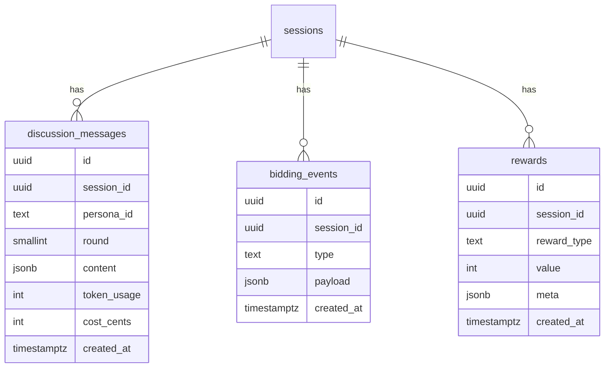

# 创意竞价平台用户停留时间优化方案（生产版）

## 项目目标
- 将创意竞价会场的平均停留时间从 2-3 分钟提升至 35-45 分钟
- 将用户参与动作数（发言、预测、点赞）提升 ≥ 300%
- 通过差异化 AI 人设与剧情机制提升复访率 ≥ 150%
- 全流程满足监控、成本、合规要求，可在现有基础设施上线

## 成功指标
| 指标 | 基线 | 目标 | 监控方式 |
| ---- | ---- | ---- | -------- |
| `avg_session_duration` | 2.7 min | ≥ 35 min | Mixpanel + ClickHouse 日志 |
| `engagement_actions_per_session` | 1.2 | ≥ 5 | 事件埋点 `engagement.action` |
| `returning_users_7d` | 12% | ≥ 30% | User Cohort 报表 |
| `ai_runtime_cost_per_session` | - | ≤ ¥0.40 | Prometheus `ai_cost_total / sessions` |
| `backend_error_rate` | 0.8% | ≤ 1% | Sentry + Grafana |

## 高层架构
```
Client (Next.js + WebGL Stage)
  ├─ DiscussionStage (React + Zustand + WebSocket)
  ├─ BiddingStage (Three.js + Realtime avatars)
  └─ ResultStage (Reward animations)
API Gateway (Fastify)
  ├─ /api/discussions
  ├─ /api/bidding
  └─ /api/results
Services
  ├─ Dialogue Orchestrator (NodeJS Worker)
  ├─ Bidding Engine (Go + Redis Streams)
  ├─ Persona Service (DeepSeek/GLM/Qwen wrapper)
  └─ Cost Controller (Python)
Infra
  ├─ PostgreSQL (核心数据)
  ├─ Redis (实时事件 + 会话缓存)
  ├─ ClickHouse (行为埋点)
  └─ Prometheus / Grafana / Sentry
```

## 用户流程
1. **预热阶段 (2 min)**：用户浏览创意详情、观看 AI 介绍
2. **创意讨论阶段 (10-12 min)**：用户与 AI 进行 3 轮问答
3. **竞价舞台 (18-22 min)**：五位 AI 竞价师互动、出价、心理战
4. **预测互动 (3-5 min)**：用户进行价格预测、下注、情绪打点
5. **结果与奖励 (4-6 min)**：公布结果、发放奖励、二次引导

## AI 人设配置
| 角色 | 性格标签 | 专长 | 首选模型 | 备选模型 | 触发关键词 |
| ---- | -------- | ---- | -------- | -------- | ---------- |
| 科技先锋艾克斯 | 理性、技术控 | 架构评估、算法优化 | DeepSeek | 智谱 GLM | “技术”、“架构”、“算法” |
| 商业大亨老王 | 结果导向 | 盈利模型、风险评估 | 通义千问 | 智谱 GLM | “盈利”、“ROI”、“现金流” |
| 文艺少女小琳 | 情感共鸣 | 用户体验、品牌故事 | 智谱 GLM | 月之暗面 | “用户感受”、“品牌” |
| 趋势达人阿伦 | 营销、社交 | 传播策略、热点预测 | 通义千问 | DeepSeek | “热点”、“传播”、“营销” |
| 学者教授李博 | 严谨权威 | 理论支撑、系统分析 | DeepSeek | 智谱 GLM | “理论”、“研究”、“实验” |

AI 调度策略：
- 讨论阶段使用 60% 真实 API + 40% 草稿模板，确保节奏
- 竞价高潮（心理战、价格翻转）使用 80% 真实 API，提高戏剧性
- 成本阈值：若单会话成本 > ¥0.20，则降级为模板脚本 + 短答

## 功能模块详解
### 创意讨论阶段
- **前端组件**：`DiscussionPhase` -> `MessageList` + `PersonaPanel` + `PromptBar`
- **状态管理**：Zustand `discussionStore`
  ```ts
  interface DiscussionState {
    round: 1 | 2 | 3
    messages: Message[]
    aiThinking: boolean
    submitUserMessage: (text: string) => Promise<void>
    retry: (messageId: string) => void
  }
  ```
- **API**：`POST /api/discussions/messages`
  - 请求：`{ sessionId, personaId, round, message }`
  - 响应：`{ messageId, content, latency, cost }`
- **数据库**：表 `discussion_messages`
  ```sql
  CREATE TABLE discussion_messages (
    id UUID PRIMARY KEY,
    session_id UUID NOT NULL,
    persona_id TEXT NOT NULL,
    round SMALLINT NOT NULL,
    role TEXT CHECK (role IN ('user','ai')),
    content JSONB NOT NULL,
    token_usage INTEGER NOT NULL,
    cost_cents INTEGER NOT NULL,
    created_at TIMESTAMPTZ DEFAULT now()
  );
  CREATE INDEX idx_discussion_session_round ON discussion_messages(session_id, round);
  ```
- **Redis**：`discussion:session:{id}` 缓存最近 20 条信息，TTL 2 小时

### 竞价舞台阶段
- **实时协议**：WebSocket (`wss://api/bidding/{sessionId}`)
- **事件枚举**：
  ```ts
  type ServerEvent =
    | { type: 'stage.started'; payload: StageMeta }
    | { type: 'persona.speech'; payload: SpeechPayload }
    | { type: 'bid.placed'; payload: BidPayload }
    | { type: 'persona.reaction'; payload: ReactionPayload }
    | { type: 'system.warning'; payload: { code: string; message: string } }
    | { type: 'stage.ended'; payload: ResultSummary };
  ```
- **客户端事件**：`user.reaction`、`user.prediction`、`heartbeat`
- **并发控制**：
  - Redis Streams `bidding:events` 存储实时事件，消费者组 `bidding-workers`
  - 单会话事件速率限制 30 event/min，超限自动降级为脚本
- **Bidding Engine**（Go 服务）职责：
  - 根据 persona 权重、用户输入生成竞价数值
  - 触发心理战、连锁反应
  - 计算最终获胜者与奖励

### 结果与奖励阶段
- **API**：`GET /api/results/{sessionId}` 返回：
  ```json
  {
    "winner": "persona_id",
    "finalPrice": 320,
    "userPredictionRank": 12,
    "rewards": [{"type": "points", "value": 1500}, {"type": "badge", "id": "drama_master"}],
    "suggestedActions": ["share", "create_new", "join_forum"]
  }
  ```
- **奖励分发**：`rewards_events` 表记录积分/徽章发放；使用事务确保一致性
- **二次引导**：提供分享链接、邀请好友、预约下场活动

## 成本与预算
| 服务 | 单次调用成本 (¥) | 平均调用次数 | 会话成本 | 控制措施 |
| ---- | ---------------- | ------------ | -------- | -------- |
| DeepSeek | 0.02 | 12 | 0.24 | 缓存重复回答、段落摘要 |
| 通义千问 | 0.03 | 10 | 0.30 | 阶段权重、预算阈值 |
| 智谱 GLM | 0.05 | 6 | 0.30 | 重点使用在讨论、情绪化回复 |
| 预设脚本 | 0 | 15 | - | 覆盖低价值场景 |
- 目标会话成本控制在 ¥0.38 以下
- 触发降级条件：`ai_cost_current_session > 0.4 OR concurrent_sessions > 800`
- 降级策略：减少实时 API 比例 → 关闭心理战 → 仅保留竞价口播

## 数据埋点 & 指标
- 行为事件（发送到 ClickHouse + Mixpanel）：
  - `discussion.round_complete`（属性：round, duration, messages)
  - `bidding.bid_view`（personaId, bidValue, userReaction)
  - `prediction.submit`（value, confidence)
  - `reward.collect`（type, value)
- 技术指标（Prometheus）
  - `bidding_event_latency_seconds`
  - `persona_api_requests_total{persona, result}`
  - `ws_active_connections`
  - `session_cost_cents`

## 测试计划
| 测试类型 | 覆盖范围 | 工具 |
| -------- | -------- | ---- |
| 单元测试 | AI 调度、成本计算、奖励算法 | Jest + ts-mockito |
| 集成测试 | WebSocket 事件流、Redis 队列 | k6 + custom harness |
| 端到端 | 三阶段完整流程、UI 交互 | Playwright (`bidding-flow.spec.ts`) |
| 负载测试 | 1000 并发会话、峰值 200 event/s | k6 + Locust |
| 可用性测试 | 6 名目标用户 | Maze + 访谈 |

通过测试的验收条件：
- Stage 延迟 P95 < 2s
- API 错误率 < 1%
- 会话成本 < ¥0.40
- 用户满意度 (CSAT) ≥ 4/5

## 部署计划
1. **准备阶段（T-14）**：完成数据库迁移、Redis Stream 初始化、监控仪表搭建
   ```bash
   pnpm prisma migrate deploy
   redis-cli XGROUP CREATE bidding:events bidding-workers $ MKSTREAM
   ```
2. **灰度发布（T-3）**：
   - 选择 5% 流量进入新会场
   - 实时观察 Grafana 仪表《Bidding Realtime》
   - 收集用户反馈与客服数据
3. **全量上线（T0）**：开启所有会场，启用 AI 高级剧情
4. **回滚策略**：
   - 保留旧版 `creative-bidding@prev` 镜像与 feature flag `bidding_v2`
   - 若成本或错误超阈值，关闭新功能并执行 `rollback.sql`
   - 清理 Redis 中新会话键 `DEL bidding:*`

## 运维与监控
- 设置 SLO：`99%` 会话成功率（完成三阶段）
- 报警策略：
  - Slack `#ai-bidding-alert`：会话失败率 > 5%（5 分钟滑窗）
  - PagerDuty：`ws_active_connections` > 2000 且 `bidding_event_latency` > 3s
  - 成本报警：每日 20:00 与预算对比发送日报
- 日志结构：`{ sessionId, personaId, stage, eventType, costCents, traceId }`

## 数据模型摘要


## 项目时间表
| 周次 | 任务 | 责任人 |
| ---- | ---- | ------ |
| W1 | 完成后端 API、数据库迁移、AI 调度服务 | Backend Team |
| W2 | 实现前端讨论阶段 + 竞价舞台 UI | Frontend Team |
| W3 | WebSocket 压测、成本控制调优、埋点联调 | Infra + Data |
| W4 | 用户内测、可用性研究、灰度发布 | PM + UXR |
| W5 | 全量上线、监控跟踪、复盘 | 全体 |

## 风险与缓解
| 风险 | 影响 | 缓解措施 |
| ---- | ---- | -------- |
| AI 服务波动 | 对话中断 | 多模型备选、快速降级至脚本 |
| 成本超标 | 预算失控 | 实时成本仪表、阈值降级 |
| WebSocket 堵塞 | 互动延迟 | Redis Stream 限流 + 自动扩容 |
| 用户体验复杂 | 参与率下降 | Onboarding 引导、智能提示、无障碍优化 |
| 数据安全 | 合规风险 | 敏感数据脱敏、定期访问审计 |

## 附录
- API 文档（OpenAPI）：`/docs/creative-bidding-openapi.json`
- 指标看板：Grafana Dashboard `Creative Bidding`
- 关键剧本脚本仓库：`scripts/persona-dialogue`
- 联系人：产品 @May、技术负责人 @Leo、运维 @Dora

本方案已补齐实现细节、监控、成本与风险控制，可直接指导生产环境上线。
