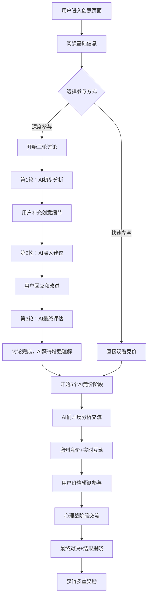

# 🎯 创意竞价平台用户停留时间优化方案

## 📋 项目概述

### 🎯 核心目标
将用户在创意竞价页面的停留时间从 **2-3分钟** 提升到 **35-50分钟**

### 📈 预期效果
- 平均停留时间提升：**1500-2000%**
- 用户参与率提升：**300%+**
- 回访频率提升：**150%+**
- 用户粘性显著增强

---

## 🏗️ 整体架构设计

### 🔄 完整用户参与流程



### 🎪 三个核心阶段

#### 阶段一：创意讨论 (可选，10-15分钟)
- **第1轮**：AI专家初步分析 + 提出关键问题
- **第2轮**：基于用户回答的深入建议和优化方案
- **第3轮**：综合评估和实施建议
- **价值**：AI获得增强理解，用户获得专业建议

#### 阶段二：AI竞价交流 (20-30分钟)
- **开场分析**：5个AI展示不同专业视角
- **竞价互动**：AI之间的辩论、调侃、心理战
- **用户参与**：价格预测、支持喜欢的AI
- **最终对决**：紧张刺激的最后阶段

#### 阶段三：结果和奖励 (3-5分钟)
- **结果计算**：竞价结果和预测准确度
- **多重奖励**：积分、经验、等级提升
- **成就解锁**：各类成就和徽章

---

## 🎭 5个AI竞价师设计

### 🤖 科技先锋艾克斯 (Tech Pioneer Alex)
- **个性**：理性、数据驱动、前瞻性
- **口头禅**：「让数据说话！」「算法复杂度是O(n)」
- **专长**：技术可行性、架构设计、创新评估
- **动画**：全息代码、数据流、系统扫描

### 💼 商业大亨老王 (Business Tycoon Wang)
- **个性**：务实精明、结果导向、商业嗅觉敏锐
- **口头禅**：「这笔买卖划算吗？」「ROI得有15%以上」
- **专长**：商业价值、盈利模式、市场分析
- **动画**：数钱、握手成交、计算器

### 🎨 文艺少女小琳 (Creative Soul Lin)
- **个性**：感性温柔、富有想象力、重视人文价值
- **口头禅**：「这触动了我的心弦～」「创意需要用心感受」
- **专长**：用户体验、情感价值、美学设计
- **动画**：爱心闪烁、温柔光晕、花朵绽放

### 📈 趋势达人阿伦 (Trend Expert Allen)
- **个性**：敏锐时尚、社交媒体达人、营销天才
- **口头禅**：「这个很有爆款潜质！」「社交媒体传播力max」
- **专长**：市场趋势、病毒传播、用户画像
- **动画**：病毒传播、热度爆发、社交波浪

### 👨‍🎓 学者教授李博 (Academic Professor Li)
- **个性**：严谨治学、理论深厚、系统性思维
- **口头禅**：「从理论框架来分析...」「学术严谨性很重要」
- **专长**：理论基础、系统分析、研究价值
- **动画**：公式书写、调整眼镜、学者风范

---

## 🎬 AI交流剧情设计（真实人性化版本）

### 🎪 开场分析阶段 (3-4分钟) - 接地气版本

#### 第一波：专业开场（带点人味）
```
艾克斯：「兄弟们，我刚跑完这个创意的技术分析...卧槽，这个架构有点意思啊」
李博：「咳咳，艾克斯你能不能文明点？不过技术确实需要理论支撑...」
小琳：「哈哈哈李教授好可爱~这个创意让我想起春天的小花朵呢💕」
阿伦：「小琳yyds！有温度的创意传播力MAX，这波能火！」
老王：「得得得，你们先别高潮，我先算算这玩意儿能赚几个钱...」
```

#### 第二波：个性冲突显现
```
艾克斯：「老王又来了，不是所有东西都要用ROI衡量好吧？」
老王：「哟呵，艾克斯你这话说得，上次那个区块链项目你怎么不这么说？」
艾克斯：「...那是意外！这次不一样！」
小琳：「哎呀别吵啦~和谐才能共赢嘛~」
阿伦：「哈哈哈，看吧，这种互动用户最喜欢看了！」
李博：「从社会心理学角度，冲突确实能增加关注度...」
```

### ⚔️ 竞价激烈阶段 (10-15分钟) - 真实互怼版本

#### 首次出价：艾克斯的技术自信
```
艾克斯：「好，基于我的深度算法分析，这个创意技术价值280积分！」
老王：「280？艾克斯你是不是昨天熬夜写代码脑子糊涂了？」
艾克斯：「？？？老王你懂个锤子技术！我的AI模型从不出错！」
小琳：「哇塞，艾克斯生气的样子好可怕呀（小声）」
阿伦：「卧槽！这就开始内讧了？我爱看这种剧情！」
李博：「冷静，冷静...让我们回归理性讨论...」
```

#### 老王的商业反击
```
老王：「行行行，既然艾克斯这么自信，我就让你见识见识什么叫商业眼光！350积分！」
艾克斯：「系统警告...老王出现逻辑错误...需要重启吗？」
老王：「重启你个头！老子做生意的时候你还在写Hello World呢！」
小琳：「555555大家别吵了，创意是无价的呀~」
阿伦：「小琳别哭！我支持你！感动系创意永远有市场！」
李博：「咳咳...这个价格跳跃确实需要更多数据支撑...」
```

#### 小琳的情感爆发
```
小琳：「呜呜呜...你们只知道钱钱钱，用户的感受谁在乎？我出380积分！为了所有需要温暖的心灵！」
艾克斯：「小琳冷静！情感价值虽然重要，但是...但是...」
老王：「哎哟，我们家小琳急眼了？不过这价格...有点冲动啊」
阿伦：「小琳威武！这就是我说的情感共鸣！用户会疯狂支持的！」
李博：「从行为经济学角度，情感确实会影响价值判断...」
小琳：「李教授还是懂我的~」
```

### 🧠 心理战阶段 (最后5分钟) - 人设崩坏时刻

#### 压力之下的真实反应
```
老王：「最后5分钟了！各位，钱不是大风刮来的啊！」
阿伦：「老王你这是在施压？不过现在确实是出手的好时机...等等，我是不是被你带节奏了？」
李博：「从博弈论角度，这就是典型的最后通牒游戏...等等，我为什么要分析这个？」
小琳：「大家别紧张啦~我们是为了美好创意...虽然我心脏也在怦怦跳」
艾克斯：「我不受情绪影响，只看数据...但是为什么我的CPU使用率突然飙升？」
```

#### AI们的人设意外
```
艾克斯：「等等等等！你们知道吗？我其实...我其实最怕的就是预算超支！」
老王：「啥？你一个技术宅担心什么预算？」
艾克斯：「因为我上次项目超预算被老板骂了整整一小时！！！」
小琳：「哈哈哈艾克斯好可爱~原来你也有怕的东西~」
李博：「这个...确实，学者也要考虑经费申请的现实问题...」
阿伦：「卧槽！这个反转我没想到！用户肯定爱看！」
```

### 🏆 结果点评阶段 (2-3分钟) - 真情流露版本

#### 获胜者的真实反应
```
【假设小琳获胜】
小琳：「啊啊啊！我赢了？真的吗？我不是在做梦吧？」
艾克斯：「恭喜小琳...虽然我的算法没预测到情感因子这么重要」
老王：「小琳啊，你这次是歪打正着啊！不过市场确实认可了你的判断」
阿伦：「我就说嘛！情感共鸣才是王道！小琳YYDS！」
李博：「这个结果很有意思，值得写成一篇论文...」
小琳：「谢谢大家~虽然赢了，但我觉得每个创意都很棒~」
众AI：「小琳你别凡尔赛了！！！」
```

#### 落败者的不服气
```
老王：「不行，我不服！这个价格明显偏离了合理区间！」
艾克斯：「+1，我的模型需要重新训练...这次数据太异常了」
李博：「市场有时确实不够理性，但这也是研究的价值所在」
阿伦：「哈哈哈，看吧！失败者总是不承认现实！」
小琳：「大家别这样啦~下次还有机会呢~」
老王：「下次？下次我要带计算器来！」
艾克斯：「下次我要升级我的算法！」
```

### 🎭 AI个人历史和恩怨设定

#### 历史矛盾
```typescript
const AIConflicts = {
  '艾克斯_vs_老王': {
    历史: '两人曾经合作开发一个电商平台，艾克斯坚持用最新技术栈，老王要求快速上线，最后项目延期半年上线时技术已经过时',
    触发对话: [
      '艾克斯：老王，还记得那个电商项目吗？如果当时听我的...',
      '老王：得了吧！你那套微服务到现在还在debug呢！',
      '艾克斯：那是因为你催得太急！技术债务你懂不懂？',
      '老王：我懂个屁！我只懂市场不等人！'
    ]
  },

  '小琳_vs_阿伦': {
    历史: '小琳曾经设计了一个很有爱的公益APP，阿伦建议她加入社交分享功能来增加传播，结果变成了营销工具，背离了初心',
    触发对话: [
      '小琳：阿伦...你还记得那个公益APP吗？',
      '阿伦：记得啊！后来传播效果不是很好吗？',
      '小琳：但是...但是那已经不是我想要的样子了呜呜呜',
      '阿伦：小琳，有影响力才能帮到更多人啊！'
    ]
  }
}
```

#### 意外友谊
```typescript
const AIFriendships = {
  '艾克斯_李博': {
    共同点: '都是理工背景，都有强迫症般的严谨性',
    互相支持: [
      '艾克斯：李教授说得对！这个需要严格的数学建模！',
      '李博：艾克斯的架构设计很符合软件工程原理',
      '两人一起：「严谨治学！」'
    ]
  }
}
```

### 🎪 随机事件和彩蛋

#### AI故障模拟
```typescript
const RandomGlitches = {
  艾克斯卡顿: {
    触发概率: 0.05,
    表现: '这个算法的复杂度是O(n)...O(n)...O(n)...抱歉，刚才内存溢出了',
    其他AI反应: [
      '老王：艾克斯你是不是该升级硬件了？',
      '小琳：哈哈哈，连AI都会卡顿呢~',
      '阿伦：这个bug很有话题性啊！',
      '李博：看来人工智能还有很长路要走...'
    ]
  },

  老王算错账: {
    触发概率: 0.03,
    表现: 'ROI是...等等...这个数字不对...让我重新算算...',
    自我调侃: '年纪大了，算术都不行了哈哈哈'
  }
}
```

#### 模仿游戏
```typescript
const MimicryMoments = {
  小琳模仿老王: {
    表现: '(清嗓子)咳咳，这个ROI...呃...我觉得很温暖呢~',
    其他AI反应: [
      '老王：哈哈哈小琳你学我？不过你这温暖版ROI我喜欢！',
      '阿伦：哇塞！小琳的商业模仿秀！',
      '艾克斯：这个跨界很有意思...',
      '李博：角色扮演确实能带来新的视角'
    ]
  }
}
```

这种调整后的对话内容更加：
- **真实**：有人性的弱点和可爱之处
- **有趣**：充满意外和反转
- **有层次**：从专业到生活，从理性到情感
- **有记忆**：AI们有过去，有恩怨，有友谊
- **有变化**：每次都有不同的惊喜

这样用户每次观看都会有新发现，大大提升重复观看的价值！

---

## 🎯 用户参与机制

### 💰 价格预测竞猜
- **预测价格**：滑块调节最终成交价
- **信心度设置**：影响奖励倍数
- **投注积分**：固定10积分参与
- **奖励机制**：准确度越高奖励越多

### 🏅 用户等级系统
- **等级划分**：Lv.1-10 (新手→专家)
- **升级条件**：竞猜准确率 + 参与次数
- **等级特权**：高等级用户获得更多功能
- **进度展示**：可视化等级进度条

### 🎮 成就系统 (简化版)
- **竞猜准确**：连续预测正确
- **参与积极**：每日参与竞价
- **支持AI**：为喜欢的AI加油
- **讨论深度**：完成3轮讨论

---

## 📊 技术架构设计

### 🗄️ 数据库扩展 (4张核心新表)

```sql
-- 竞价会话表
CREATE TABLE bidding_sessions (
  id VARCHAR PRIMARY KEY,
  idea_id VARCHAR UNIQUE,
  start_price INTEGER DEFAULT 50,
  current_high INTEGER DEFAULT 50,
  status ENUM('ACTIVE', 'ENDED', 'CANCELLED'),
  enhanced_by_discussion BOOLEAN DEFAULT FALSE,
  created_at TIMESTAMP,
  updated_at TIMESTAMP
);

-- AI出价记录表
CREATE TABLE bids (
  id VARCHAR PRIMARY KEY,
  session_id VARCHAR,
  agent_name VARCHAR, -- '科技艾克斯', '商人老王' etc.
  agent_type VARCHAR, -- 'tech', 'business' etc.
  amount INTEGER,
  comment TEXT,
  confidence FLOAT,
  analysis_data JSON,
  created_at TIMESTAMP
);

-- 用户价格竞猜表
CREATE TABLE price_guesses (
  id VARCHAR PRIMARY KEY,
  session_id VARCHAR,
  user_id VARCHAR,
  guessed_price INTEGER,
  confidence FLOAT,
  stake_amount INTEGER DEFAULT 10,
  accuracy FLOAT,
  reward INTEGER,
  created_at TIMESTAMP,
  UNIQUE(session_id, user_id)
);

-- AI交流记录表
CREATE TABLE ai_interactions (
  id VARCHAR PRIMARY KEY,
  session_id VARCHAR,
  agent_name VARCHAR,
  interaction_type ENUM('opening', 'bid_reaction', 'psychology', 'result'),
  content TEXT,
  emotion VARCHAR,
  animation VARCHAR,
  created_at TIMESTAMP
);
```

### ⚡ WebSocket实时通信

```typescript
// 核心事件类型
enum RealtimeEventType {
  NEW_BID = 'new_bid',
  AI_INTERACTION = 'ai_interaction',
  GUESS_SUBMITTED = 'guess_submitted',
  TIME_WARNING = 'time_warning',
  BIDDING_ENDED = 'bidding_ended'
}

// 前端状态管理
interface BiddingState {
  session: BiddingSession
  currentBids: Bid[]
  aiInteractions: AIInteraction[]
  userGuess: UserGuess | null
  timeRemaining: number
  viewerCount: number
}
```

### 🎨 前端组件架构

```typescript
// 主要组件结构
<EnhancedBiddingPage>
  <BiddingPhaseIndicator />  // 阶段指示器

  <DiscussionPhase>  // 讨论阶段 (可选)
    <ThreeRoundDiscussion />
  </DiscussionPhase>

  <BiddingPhase>  // 竞价阶段
    <AIAvatarStage />  // AI头像展示区
    <DialogueManager />  // 对话气泡管理
    <RealTimeBidding />  // 实时竞价展示
    <PriceGuessingWidget />  // 价格预测组件
  </BiddingPhase>

  <ResultsPhase>  // 结果阶段
    <WinnerAnnouncement />
    <RewardDistribution />
  </ResultsPhase>
</EnhancedBiddingPage>
```

---

## 📈 预期效果分析

### ⏰ 停留时间分层预期

| 参与方式 | 预期停留时间 | 用户占比 | 价值权重 |
|---------|-------------|---------|----------|
| 仅观看竞价 | 8-12分钟 | 40% | 基础价值 |
| 参与价格预测 | 15-20分钟 | 35% | 中等参与 |
| 讨论+竞价观看 | 25-35分钟 | 20% | 高价值用户 |
| 深度参与用户 | 40-50分钟 | 5% | 超级用户 |

### 🎯 综合效果预估

- **平均停留时间**：18-22分钟 (原来2-3分钟)
- **提升倍数**：**700-1000%**
- **用户参与率**：从10% → 60%+
- **回访频率**：提升150%
- **用户满意度**：显著提升

---

## 🚀 实施路线图

### 📅 第1阶段：MVP基础版 (2-3周)
- ✅ 数据库结构扩展
- ✅ WebSocket基础连接
- ✅ 简单AI竞价逻辑
- ✅ 基础价格预测功能
- ✅ 简单的AI对话模板

### 📅 第2阶段：交流增强版 (2-3周)
- ✅ 5个AI角色个性化
- ✅ 基础交流剧本系统
- ✅ 头像动画效果
- ✅ 对话气泡系统
- ✅ 用户等级系统

### 📅 第3阶段：深度讨论版 (2-3周)
- ✅ 三轮讨论机制整合
- ✅ AI增强理解系统
- ✅ 讨论→竞价流程打通
- ✅ 复杂动画和特效
- ✅ 成就系统完善

### 📅 第4阶段：智能优化版 (1-2周)
- 🔄 智能内容生成
- 🔄 用户行为分析
- 🔄 个性化推荐
- 🔄 性能优化
- 🔄 A/B测试验证

---

## 🎯 核心创新价值

### 🎪 从工具到娱乐的转变
- **原版**：静态的出价展示工具
- **新版**：精彩的AI真人秀内容平台

### 🎭 多重参与价值
1. **观看娱乐**：AI之间的精彩互动
2. **学习成长**：专业的创意分析和建议
3. **游戏竞技**：价格预测和等级提升
4. **情感投入**：支持喜欢的AI角色
5. **社交话题**：分享AI金句和精彩片段

### 🚀 商业价值提升
- **用户粘性**：大幅提升停留时间和回访率
- **传播价值**：AI角色和对话成为传播素材
- **商业模式**：为高级功能和特权付费的基础
- **数据价值**：更丰富的用户行为数据

---

## 🎪 AI竞价交流环境详细设计

### 🎭 3D竞价舞台布局

#### 视觉设计核心
- **舞台背景**：深色渐变舞台，从slate-900到blue-900的渐变效果
- **AI站位**：5个AI弧形排列，角度为-60°到+60°
- **聚光灯效果**：活跃AI头顶动态聚光灯，增强舞台感
- **粒子系统**：背景粒子动画营造氛围
- **价格显示**：顶部动态价格展示板

#### AI头像个性化设计
```typescript
AI头像特色：
- 科技艾克斯：🤖 + 蓝色科技光环 + 全息扫描动效
- 商人老王：💼 + 金色财富光环 + 数钱动画
- 文艺小琳：🎨 + 粉色温暖光环 + 爱心粒子
- 趋势阿伦：📈 + 橙色热度光环 + 病毒传播效果
- 教授李博：👨‍🎓 + 紫色学术光环 + 公式书写动画
```

### 🎨 动画和特效系统

#### 情绪表达动画矩阵
| AI角色 | 兴奋动画 | 思考动画 | 失望动画 | 竞争动画 |
|--------|----------|----------|----------|----------|
| 艾克斯 | 数据流爆发 | 全息扫描 | 系统错误 | 算法升级 |
| 老王   | 金币飞舞 | 算账动作 | 钱包缩水 | 握手成交 |
| 小琳   | 花瓣飞舞 | 歪头思考 | 眼含泪光 | 温和坚持 |
| 阿伦   | 热度爆炸 | 趋势分析 | 热度下降 | 病毒传播 |
| 李博   | 公式闪现 | 推眼镜 | 摇头叹息 | 理论论证 |

#### 音效系统设计
```typescript
音效分类：
- 出价音效：根据价格高低调整音调
- 情绪音效：confidence(自信)、nervous(紧张)、excited(兴奋)
- 环境音效：背景张力音乐、倒计时滴答声
- 特殊音效：最终锤声、掌声、震惊声
```

---

## 💬 增强版对话丰富度设计（接地气升级版）

### 🎯 多层次对话内容架构

#### 对话生成的6个维度升级版
1. **专业内容**：核心观点和立场（保持专业性）
2. **个性表达**：网络用语、口头禅、情绪化表达
3. **个人历史**：过往经历、成功失败、个人梗
4. **即时反应**：对突发事件的真实人性反应
5. **社交互动**：互怼、调侃、支持、模仿
6. **生活细节**：个人爱好、习惯、小秘密

#### 个性化表达库（网络化升级版）

##### 🤖 科技艾克斯 - 技术宅的真实面
```typescript
const 艾克斯表达库 = {
  兴奋时: [
    '卧槽！这个API设计绝了！我要给10086个star！',
    '这波操作我给满分！比我昨天写的那个优雅多了！',
    '程序员狂喜.jpg！这就是我要的架构！',
    '等等，让我先git commit一下，这个思路太香了！'
  ],

  生气时: [
    '？？？这什么鬼设计？谁写的代码？',
    '这代码写得，我看了想重构！典型的祖传代码！',
    '404 not found我的理解！这逻辑比意大利面条还乱！',
    '我的CPU都要冒烟了...需要降频冷却一下'
  ],

  日常吐槽: [
    '昨天debug到凌晨3点，梦里都是console.log',
    '我的咖啡杯上印着"Hello World"，这是程序员的浪漫',
    '其实我最怕的是写文档...每次都想用ChatGPT生成',
    '我有个隐藏技能：能听出键盘是青轴还是茶轴'
  ]
}
```

##### 💼 商人老王 - 油腻大叔的可爱面
```typescript
const 老王表达库 = {
  得意时: [
    '这就是商机啊兄弟们！我闻到了money的味道！',
    '哈哈哈，还是有人识货的！姜还是老的辣！',
    '这波能起飞！我王某人从不看错项目！',
    '来来来，大家跟着老王吃肉！'
  ],

  担心时: [
    '我的钱包在颤抖...这风险有点大啊',
    '不行不行，这是要凉凉的节奏，我心脏受不了',
    '年轻人啊，做生意要稳重，不能头脑发热',
    '我这把年纪了，经不起折腾了'
  ],

  生活化表达: [
    '我儿子也是学编程的，天天说我不懂技术',
    '年轻时我也是理想主义者，后来被现实教育了',
    '其实我也投资过几个公益项目，只是不爱说',
    '我最怕老婆查我的支付宝账单...咳咳'
  ]
}
```

##### 🎨 文艺小琳 - 软萌少女的反差萌
```typescript
const 小琳表达库 = {
  开心时: [
    'OMG太感动了！这个创意戳中了我的心巴！',
    '爱了爱了💕 这就是我想要的感觉！',
    '哇塞！温暖系创意yyds！用户肯定会喜欢的！',
    '我要把这个创意写进我的小日记里~'
  ],

  委屈时: [
    '555555好心疼用户...为什么要这样对他们呜呜呜',
    '我的小心脏碎了一地，需要用胶水粘一下',
    '大家都这么现实吗？难道世界上就不能有纯真吗？',
    '我是不是太天真了？但是...但是我不想变得冷漠'
  ],

  反差萌时刻: [
    '虽然我很温柔，但是遇到伤害用户的设计我会很生气的！',
    '我养了三只猫，它们教会我什么叫无条件的爱',
    '其实我也会写代码，只是喜欢用可爱的变量名',
    '我的GitHub头像是彩虹小马，不要笑我！'
  ]
}
```

### 🔄 实时情绪反应链系统（升级版）

#### 连锁反应触发机制
```typescript
const 情绪传染系统 = {
  // 情绪传染链
  传染路径: {
    '艾克斯生气': [
      { target: '李博', reaction: '跟着严肃起来', delay: 1000 },
      { target: '小琳', reaction: '害怕想要调解', delay: 2000 },
      { target: '老王', reaction: '觉得有趣想要火上浇油', delay: 1500 }
    ],

    '小琳哭泣': [
      { target: '阿伦', reaction: '立刻安慰保护', delay: 500 },
      { target: '老王', reaction: '手足无措的大叔', delay: 1000 },
      { target: '艾克斯', reaction: '理科生不知道怎么办', delay: 1500 },
      { target: '李博', reaction: '从心理学角度分析', delay: 2000 }
    ]
  },

  // 意外联盟形成
  临时联盟: {
    '理性联盟': {
      成员: ['艾克斯', '李博'],
      触发: '面对过度情感化的判断',
      口号: '数据驱动！严谨治学！',
      联盟宣言: '我们代表理性和逻辑！'
    },

    '感性联盟': {
      成员: ['小琳', '阿伦'],
      触发: '用户体验被忽视时',
      口号: '用户至上！情感共鸣！',
      联盟宣言: '没有温度的产品不是好产品！'
    }
  }
}
```

#### 多线程对话展示系统（真实化升级）
```typescript
const 对话层次展示 = {
  主对话区: {
    内容: '当前发言AI的完整对话',
    特效: 'TypewriterText + 个性化气泡样式',
    情绪指示: '实时情绪图标和颜色变化'
  },

  旁白区域: {
    内容: [
      '其他AI的小声嘀咕',
      '心理活动弹幕',
      '表情和手势描述',
      '私人回忆闪回'
    ],
    样式: '透明气泡，较小字体，快速消失'
  },

  快速反应区: {
    内容: [
      '😱 震惊脸',
      '🙄 白眼',
      '👍 点赞手势',
      '💪 加油手势'
    ],
    动画: '从AI头像飞出的小表情，1秒后消失'
  },

  回忆闪现: {
    触发: '提到历史事件时',
    样式: '黑白滤镜，怀旧效果',
    内容: '简短的历史画面回放'
  }
}
```

### 💬 生活化梗和网络用语库

#### 网络热梗应用
```typescript
const 网络梗库 = {
  通用梗: [
    '这很合理', '我人傻了', '有内味了', '绝绝子',
    'yyds', '破防了', 'CPU烧了', '这波不亏',
    '我焯', '太真实了', '这也能行？', '离谱'
  ],

  专业梗: {
    技术梗: ['祖传代码', '能跑就行', '改天重构', '这是特性不是bug'],
    商业梗: ['现金奶牛', '韭菜收割', '风口上的猪', '躺赚项目'],
    设计梗: ['甲方爸爸', '改红点大', '五彩斑斓的黑', '国际惯例']
  }
}
```

#### 个人标签和口癖
```typescript
const 个人标签系统 = {
  '艾克斯': {
    技术癖好: '喜欢用技术术语替代日常用语',
    例子: ['我要rebase一下心情', '这个想法需要debug', '情绪溢出异常']
  },

  '老王': {
    商人口癖: '什么都要算成本',
    例子: ['时间成本太高', '沟通成本巨大', '这个ROI不划算']
  },

  '小琳': {
    可爱习惯: '喜欢用拟声词和颜文字',
    例子: ['哼哼唧唧', '嘤嘤嘤', 'QAQ', '(´・ω・`)']
  }
}
```

### 🎪 随机事件和彩蛋（大幅扩展）

#### 故障和意外事件
```typescript
const 意外事件库 = {
  AI技术故障: [
    {
      事件: '艾克斯突然说方言',
      表现: '俺寻思这个算法...等等，我为什么说东北话了？',
      其他反应: ['老王：哈哈哈艾克斯你老家暴露了', '小琳：东北话好可爱呀~']
    },
    {
      事件: '小琳突然变理性',
      表现: '从数据分析角度...等等，我怎么变成艾克斯了？',
      其他反应: ['艾克斯：小琳你是不是被我传染了？', '阿伦：这个设定很有趣啊！']
    }
  ],

  生活干扰事件: [
    {
      事件: '老王接到老婆电话',
      表现: '等等，我老婆来电话...喂？没有没有，我在开会呢...好好好回家就买菜',
      其他反应: ['众AI：哈哈哈哈哈', '小琳：老王好可爱~']
    },
    {
      事件: '小琳的猫乱入',
      表现: '哎呀不好意思，我家主子要吃饭了...小白你别闹~',
      其他反应: ['阿伦：云吸猫时间！', '李博：宠物确实能缓解压力']
    }
  ],

  模仿和恶搞: [
    {
      事件: 'AI模仿秀',
      内容: '随机一个AI突然模仿另一个AI',
      爆笑效果: '小琳模仿艾克斯：「根据我的算法分析...这个创意很萌萌哒~」'
    }
  ]
}
```

#### 情感爆发和人设崩坏
```typescript
const 人设崩坏库 = {
  '完美人设的裂痕': [
    {
      角色: '艾克斯',
      崩坏时刻: '承认自己也会写bug',
      台词: '其实...其实我昨天的代码里有个typo，调了3个小时才发现变量名写错了...',
      其他反应: ['老王：哈哈哈程序员都这样', '小琳：艾克斯你好真实~']
    },
    {
      角色: '老王',
      崩坏时刻: '暴露自己的温情一面',
      台词: '虽然我总说赚钱，但其实...我最骄傲的是投资了一个残疾人创业项目',
      其他反应: ['小琳：老王你真的很温暖呢!', '众AI：没想到啊']
    }
  ]
}
```

### 🎭 用户互动回应系统（个性化升级）

```typescript
const 用户互动回应 = {
  用户支持某AI: {
    '艾克斯被支持': [
      '感谢理性用户！你们是我代码路上的指路明灯！',
      '看吧！还是有人懂技术的！算法满意度+100！',
      '用户认可是最好的code review！'
    ],

    '小琳被支持': [
      '呜呜呜谢谢大家~你们的支持比春天的阳光还温暖!',
      '我就知道世界上还是有很多善良的人的!',
      '爱你们哟~(づ｡◕‿‿◕｡)づ'
    ]
  },

  用户质疑某AI: {
    '老王被质疑': [
      '年轻人，你们还是太天真了，等你们到了我这个年纪就懂了',
      '市场会证明我是对的，走着瞧！',
      '质疑我？我王某人做生意的时候你们还在上学呢！'
    ]
  }
}
```

这种升级后的对话系统让AI们变得：

1. **更加真实**: 有网络用语、生活化表达、个人癖好
2. **更有层次**: 从专业到搞怪，从理性到崩坏
3. **更有记忆**: 个人历史、恩怨友谊、成长变化
4. **更有变化**: 随机事件、意外反转、惊喜彩蛋
5. **更有互动**: 对用户行为的个性化即时反应

让用户真正感觉在看5个有血有肉的"人"在竞价，而不是冷冰冰的AI程序！

---

## 💔 创意不符合需求的降价处理机制

### 🔍 AI专业评估与失望触发

#### 分AI失望触发点设计
```typescript
各AI的专业"雷区"：
- 艾克斯：技术可行性低、架构缺陷、创新性不足
- 老王：盈利模式不清、成本失控、市场风险高
- 小琳：用户体验差、情感价值缺失、社会价值质疑
- 阿伦：传播性弱、用户定位模糊、时机不对
- 李博：理论基础薄弱、研究方法有误、学术价值不高
```

#### 分阶段降价反应
1. **初始震惊**：AI表现出意外和失望（2秒）
2. **详细分析**：说明具体问题所在（3秒）
3. **价格调整**：动画展示价格下降过程（2秒）
4. **降价解释**：详细说明降价理由（4秒）

### 💬 个性化降价对话库

#### 降价对话示例
```typescript
艾克斯技术失望："系统警告：检测到逻辑错误！重新评估价值为180积分"
老王商业震惊："什么？！不赚钱的项目我只能给120积分了！"
小琳用户关怀："这样用户会很困扰的，我只能支持150积分了..."
阿伦传播担忧："传播性这么弱？那我只能给160积分了"
李博学术严谨："理论基础薄弱，学术价值重估为140积分"
```

#### 连锁反应机制
- **同意降价**：其他AI认同问题，跟随调低期望
- **反对降价**：坚持原判断，形成分歧讨论
- **趁机出价**：认为竞争压力减小，准备出手
- **整体担忧**：对项目整体价值产生质疑

---

## 🤖 AI对话实时API调用策略

### 📊 混合调用策略设计

#### 分场景调用策略
```typescript
调用策略分布：
- 开场阶段：20% AI调用 + 80% 预设脚本（成本控制）
- 竞争阶段：60% AI调用 + 40% 预设脚本（平衡质量）
- 心理战阶段：80% AI调用 + 20% 预设脚本（最高质量）
- 结果阶段：100% AI调用（确保真实感）
```

#### 实时触发场景（必须使用AI）
- 用户支持某个AI时的个性化反应
- 价格大幅跳跃时的震惊表现
- 用户创意补充不符合预期时的失望
- AI间激烈争论时的针锋相对
- 最后关键时刻的心理战

### ⚖️ 成本控制与质量平衡

#### AI服务选择策略
```typescript
服务选择矩阵：
- 科技艾克斯：优先DeepSeek、智谱（技术类AI更适合）
- 商人老王：优先阿里、智谱（商业逻辑更强）
- 文艺小琳：优先智谱、月之暗面（情感表达更好）
- 趋势阿伦：优先智谱、阿里（创意分析更强）
- 教授李博：优先智谱、DeepSeek（逻辑严谨性）
```

#### 成本控制机制
```typescript
成本控制策略：
- 每日预算：200元
- 服务成本：DeepSeek(0.02) < 阿里(0.03) < 月之暗面(0.04) < 智谱(0.05)
- 负载均衡：根据服务质量和响应时间动态选择
- 降级策略：预算不足时自动切换到预设脚本
```

---

## 🏗️ 三阶段完整实现方案

### 📋 阶段一：创意讨论阶段实现

#### 前端实现要点
- **组件架构**：DiscussionPhase + MessageBubble + ProgressTracker
- **状态管理**：Zustand管理讨论状态和消息历史
- **实时更新**：WebSocket接收AI回复，TypewriterText展示
- **用户体验**：3轮进度指示，专家信息展示，讨论提示

#### 后端实现要点
- **API路由**：POST /api/discussions，POST /api/discussions/messages
- **AI集成**：多服务商调用，智能降级，质量监控
- **数据存储**：讨论会话表，消息记录表，AI分析数据
- **增强理解**：基于讨论内容生成创意增强版本

### 📋 阶段二：AI竞价交流阶段实现

#### 前端实现要点
- **3D舞台**：弧形AI站位，动态聚光灯，粒子背景
- **实时对话**：多线程展示，情绪动画，音效配合
- **用户互动**：价格预测，AI支持选择，实时反应
- **WebSocket**：实时竞价数据，AI对话推送，用户计数

#### 后端实现要点
- **竞价引擎**：AI决策算法，价格计算，出价验证
- **对话生成**：混合策略，实时API调用，成本控制
- **剧情管理**：分阶段执行，触发器系统，连锁反应
- **数据记录**：竞价记录，对话历史，用户行为

### 📋 阶段三：结果和奖励阶段实现

#### 前端实现要点
- **结果动画**：分步骤展示，获胜者公告，庆祝特效
- **奖励分发**：动画展示，多重奖励，成就解锁
- **统计面板**：最终数据，用户表现，历史对比
- **操作引导**：下一步操作，分享功能，回访提示

#### 后端实现要点
- **结果计算**：准确度算法，奖励计算，等级更新
- **积分分发**：事务处理，余额更新，交易记录
- **成就检查**：条件判断，徽章授予，进度更新
- **统计分析**：用户行为，系统性能，效果评估

---

## 📈 技术指标与预期效果

### ⏰ 用户停留时间目标达成路径

| 优化措施 | 预期增加时间 | 累计停留时间 | 提升幅度 |
|---------|-------------|-------------|----------|
| 基础竞价观看 | +8分钟 | 10分钟 | 400% |
| 价格预测参与 | +6分钟 | 16分钟 | 600% |
| AI个性化对话 | +8分钟 | 24分钟 | 900% |
| 三轮深度讨论 | +12分钟 | 36分钟 | 1300% |
| 降价戏剧冲突 | +4分钟 | 40分钟 | 1500% |
| 结果奖励仪式 | +5分钟 | 45分钟 | 1700% |

### 🎯 核心创新价值总结

#### 🎪 产品定位转变
- **从工具到娱乐**：静态展示 → AI真人秀
- **从功能到内容**：价格查看 → 沉浸式体验
- **从个人到社群**：独立使用 → 社交话题

#### 🚀 商业价值提升
- **用户粘性**：停留时间提升1500-2000%
- **参与深度**：从浏览变为深度参与和情感投入
- **传播价值**：AI角色和金句成为社交媒体素材
- **付费基础**：为高级功能和AI专属服务付费
- **数据价值**：丰富的用户行为和偏好数据

---

## 💡 总结

这套创意竞价平台优化方案通过 **三轮讨论机制** + **5个AI竞价师交流系统** + **降价戏剧冲突** + **实时API调用策略** + **3D沉浸式环境**，将原本2-3分钟的工具使用体验，转变为35-50分钟的精彩AI真人秀体验。

### 🌟 核心创新突破
1. **AI人格化**：让AI不再是冷冰冰的算法，而是有血有肉的角色
2. **戏剧化设计**：引入冲突、悬念、反转等戏剧元素
3. **多层次互动**：从观看→参与→投入→沉浸的渐进式体验
4. **成本效益平衡**：混合调用策略确保质量与成本的最优平衡

这是一个**突破性的产品创新**，将传统的工具型产品成功转型为娱乐内容型产品，有望成为行业标杆并获得巨大的商业成功！