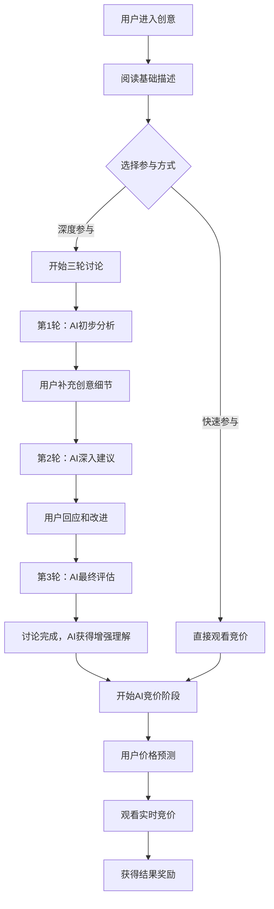

# 🎯 整合三轮讨论机制的MVP竞价页面架构

## 📋 完整用户参与流程



## 🏗️ 重新设计的页面架构

### 阶段一：创意讨论阶段

```tsx
// 三轮讨论机制整合到竞价页面
export default function EnhancedBiddingPage({ ideaId }) {
  const [currentPhase, setCurrentPhase] = useState('discussion') // discussion | bidding | results
  const [discussionRound, setDiscussionRound] = useState(0) // 0=未开始, 1-3=讨论轮次
  const [discussionId, setDiscussionId] = useState(null)
  const [userParticipation, setUserParticipation] = useState(null)

  return (
    <Layout>
      <div className="container py-8 max-w-7xl">

        {/* 阶段指示器 */}
        <BiddingPhaseIndicator
          currentPhase={currentPhase}
          discussionRound={discussionRound}
          totalRounds={3}
        />

        {/* 根据不同阶段显示不同内容 */}
        {currentPhase === 'discussion' && (
          <DiscussionPhase
            ideaId={ideaId}
            currentRound={discussionRound}
            onDiscussionComplete={(enhancedIdea) => {
              setCurrentPhase('bidding')
              // AI获得了增强的创意理解
            }}
            onSkipDiscussion={() => {
              setCurrentPhase('bidding')
              // 用户选择直接观看竞价
            }}
          />
        )}

        {currentPhase === 'bidding' && (
          <BiddingPhase
            ideaId={ideaId}
            enhancedByDiscussion={discussionRound === 3}
            userParticipation={userParticipation}
          />
        )}

        {currentPhase === 'results' && (
          <ResultsPhase
            ideaId={ideaId}
            userParticipation={userParticipation}
          />
        )}

      </div>
    </Layout>
  )
}

// 阶段指示器组件
const BiddingPhaseIndicator = ({ currentPhase, discussionRound, totalRounds }) => {
  const phases = [
    {
      key: 'discussion',
      label: '创意讨论',
      icon: <MessageCircle className="w-4 h-4" />,
      description: '与AI专家深度讨论创意'
    },
    {
      key: 'bidding',
      label: '实时竞价',
      icon: <Timer className="w-4 h-4" />,
      description: 'AI竞价师开始竞价'
    },
    {
      key: 'results',
      label: '结果揭晓',
      icon: <Trophy className="w-4 h-4" />,
      description: '竞价结束，查看结果'
    }
  ]

  return (
    <div className="mb-8">
      <div className="flex items-center justify-between max-w-2xl mx-auto">
        {phases.map((phase, index) => (
          <div key={phase.key} className="flex items-center">
            <div className={`
              flex items-center gap-2 px-4 py-2 rounded-full border-2 transition-all
              ${currentPhase === phase.key
                ? 'border-primary bg-primary text-white'
                : currentPhase === 'bidding' && phase.key === 'discussion'
                ? 'border-green-500 bg-green-50 text-green-700'
                : 'border-gray-300 bg-gray-50 text-gray-500'
              }
            `}>
              {phase.icon}
              <span className="font-medium">{phase.label}</span>
              {phase.key === 'discussion' && discussionRound > 0 && (
                <Badge variant="secondary" className="ml-2 text-xs">
                  {discussionRound}/{totalRounds}
                </Badge>
              )}
            </div>
            {index < phases.length - 1 && (
              <ChevronRight className="w-4 h-4 mx-2 text-gray-400" />
            )}
          </div>
        ))}
      </div>
      <div className="text-center mt-2 text-sm text-gray-600">
        {phases.find(p => p.key === currentPhase)?.description}
      </div>
    </div>
  )
}
```

### 阶段二：讨论阶段组件

```tsx
// 创意讨论阶段
const DiscussionPhase = ({ ideaId, currentRound, onDiscussionComplete, onSkipDiscussion }) => {
  const [discussion, setDiscussion] = useState(null)
  const [messages, setMessages] = useState([])
  const [userInput, setUserInput] = useState('')
  const [isSubmitting, setIsSubmitting] = useState(false)
  const [canSkip, setCanSkip] = useState(true)

  const { user } = useAuth()

  // 开始讨论
  const startDiscussion = async () => {
    if (!user) {
      toast.error('请先登录')
      return
    }

    try {
      const response = await fetch('/api/discussions', {
        method: 'POST',
        headers: { 'Content-Type': 'application/json' },
        body: JSON.stringify({ ideaId })
      })

      const data = await response.json()
      if (data.success) {
        setDiscussion(data.discussion)
        setMessages(data.messages)
        setCanSkip(false)
      }
    } catch (error) {
      console.error('Failed to start discussion:', error)
    }
  }

  // 发送消息
  const sendMessage = async () => {
    if (!userInput.trim() || isSubmitting) return

    setIsSubmitting(true)
    try {
      const response = await fetch('/api/discussions/messages', {
        method: 'POST',
        headers: { 'Content-Type': 'application/json' },
        body: JSON.stringify({
          discussionId: discussion.id,
          content: userInput.trim()
        })
      })

      const data = await response.json()
      if (data.success) {
        setMessages(prev => [...prev, data.userMessage, data.aiMessage])
        setUserInput('')

        if (data.isCompleted) {
          // 讨论完成，进入竞价阶段
          setTimeout(() => {
            onDiscussionComplete(data.enhancedIdea)
          }, 2000)
        }
      }
    } catch (error) {
      console.error('Failed to send message:', error)
    } finally {
      setIsSubmitting(false)
    }
  }

  if (currentRound === 0) {
    // 讨论开始界面
    return (
      <div className="max-w-4xl mx-auto">
        <Card className="text-center p-8">
          <CardHeader>
            <CardTitle className="text-2xl mb-4">
              🤖 与AI专家深度讨论你的创意
            </CardTitle>
            <CardDescription className="text-lg">
              通过3轮专业讨论，让AI更好地理解你的创意，从而给出更准确的竞价评估
            </CardDescription>
          </CardHeader>

          <CardContent className="space-y-6">
            <div className="grid md:grid-cols-3 gap-6 text-left">
              <div className="p-4 border rounded-lg">
                <div className="flex items-center gap-2 mb-2">
                  <Badge variant="outline">第1轮</Badge>
                  <span className="font-medium">初步分析</span>
                </div>
                <p className="text-sm text-gray-600">
                  AI专家会分析你的创意，并提出关键问题来了解更多细节
                </p>
              </div>

              <div className="p-4 border rounded-lg">
                <div className="flex items-center gap-2 mb-2">
                  <Badge variant="outline">第2轮</Badge>
                  <span className="font-medium">深入建议</span>
                </div>
                <p className="text-sm text-gray-600">
                  基于你的回答，AI会给出具体的改进建议和优化方案
                </p>
              </div>

              <div className="p-4 border rounded-lg">
                <div className="flex items-center gap-2 mb-2">
                  <Badge variant="outline">第3轮</Badge>
                  <span className="font-medium">最终评估</span>
                </div>
                <p className="text-sm text-gray-600">
                  AI会综合所有信息，给出最终评价和实施建议
                </p>
              </div>
            </div>

            <div className="flex gap-4 justify-center">
              <Button onClick={startDiscussion} size="lg" className="px-8">
                <MessageCircle className="w-5 h-5 mr-2" />
                开始深度讨论 (推荐)
              </Button>

              {canSkip && (
                <Button
                  variant="outline"
                  onClick={onSkipDiscussion}
                  size="lg"
                  className="px-8"
                >
                  <Timer className="w-5 h-5 mr-2" />
                  直接观看竞价
                </Button>
              )}
            </div>

            <div className="bg-blue-50 p-4 rounded-lg">
              <h4 className="font-medium text-blue-900 mb-2">💡 为什么要讨论？</h4>
              <ul className="text-sm text-blue-800 space-y-1">
                <li>• AI能更深入理解你的创意，给出更准确的评估</li>
                <li>• 你的创意会得到专业的改进建议</li>
                <li>• 讨论过程本身就很有价值，帮你完善想法</li>
                <li>• 参与讨论可获得额外积分奖励</li>
              </ul>
            </div>
          </CardContent>
        </Card>
      </div>
    )
  }

  // 讨论进行中界面
  return (
    <div className="max-w-4xl mx-auto">
      <div className="grid lg:grid-cols-3 gap-8">

        {/* 左侧：对话区域 */}
        <div className="lg:col-span-2">
          <Card>
            <CardHeader>
              <div className="flex items-center justify-between">
                <CardTitle className="flex items-center gap-2">
                  <MessageCircle className="w-5 h-5" />
                  与AI专家对话中
                </CardTitle>
                <Badge variant="outline">
                  第 {discussion?.currentRound || 1} 轮 / 共 3 轮
                </Badge>
              </div>
            </CardHeader>

            <CardContent>
              {/* 对话历史 */}
              <div className="space-y-4 mb-6 max-h-96 overflow-y-auto">
                {messages.map((message, index) => (
                  <MessageBubble
                    key={index}
                    message={message}
                    isUser={message.senderType === 'USER'}
                  />
                ))}
              </div>

              {/* 输入区域 */}
              <div className="space-y-4">
                <Textarea
                  value={userInput}
                  onChange={(e) => setUserInput(e.target.value)}
                  placeholder="请详细描述你的想法，AI专家会给出专业建议..."
                  rows={4}
                  disabled={isSubmitting}
                />

                <div className="flex justify-between items-center">
                  <div className="text-sm text-gray-500">
                    建议详细描述，这样AI能给出更准确的建议
                  </div>
                  <Button
                    onClick={sendMessage}
                    disabled={!userInput.trim() || isSubmitting}
                  >
                    {isSubmitting ? '发送中...' : '发送回复'}
                  </Button>
                </div>
              </div>
            </CardContent>
          </Card>
        </div>

        {/* 右侧：讨论状态和指导 */}
        <div className="space-y-6">

          {/* 讨论进度 */}
          <Card>
            <CardHeader>
              <CardTitle className="text-lg">讨论进度</CardTitle>
            </CardHeader>
            <CardContent>
              <DiscussionProgressTracker
                currentRound={discussion?.currentRound || 1}
                totalRounds={3}
                messages={messages}
              />
            </CardContent>
          </Card>

          {/* AI专家信息 */}
          <Card>
            <CardHeader>
              <CardTitle className="text-lg">当前AI专家</CardTitle>
            </CardHeader>
            <CardContent>
              <AIExpertProfile
                expertType={discussion?.aiAgentType}
                expertName={discussion?.aiAgentName}
              />
            </CardContent>
          </Card>

          {/* 讨论提示 */}
          <Card>
            <CardHeader>
              <CardTitle className="text-lg">💡 讨论提示</CardTitle>
            </CardHeader>
            <CardContent>
              <DiscussionTips
                currentRound={discussion?.currentRound || 1}
              />
            </CardContent>
          </Card>

        </div>
      </div>
    </div>
  )
}

// 消息气泡组件
const MessageBubble = ({ message, isUser }) => {
  return (
    <div className={`flex ${isUser ? 'justify-end' : 'justify-start'}`}>
      <div className={`max-w-[80%] p-3 rounded-lg ${
        isUser
          ? 'bg-primary text-white rounded-br-none'
          : 'bg-gray-100 text-gray-900 rounded-bl-none'
      }`}>
        {!isUser && (
          <div className="text-sm font-medium mb-1 text-blue-600">
            {message.senderName}
          </div>
        )}
        <div className="whitespace-pre-wrap">{message.content}</div>
        <div className={`text-xs mt-1 ${
          isUser ? 'text-blue-100' : 'text-gray-500'
        }`}>
          {formatTime(message.createdAt)}
        </div>
      </div>
    </div>
  )
}

// 讨论进度追踪器
const DiscussionProgressTracker = ({ currentRound, totalRounds, messages }) => {
  const roundProgress = [
    {
      round: 1,
      label: '初步分析',
      status: currentRound >= 1 ? 'completed' : 'pending',
      description: '了解创意基本情况'
    },
    {
      round: 2,
      label: '深入建议',
      status: currentRound >= 2 ? 'completed' : currentRound === 1 ? 'active' : 'pending',
      description: '提供具体改进方案'
    },
    {
      round: 3,
      label: '最终评估',
      status: currentRound >= 3 ? 'completed' : currentRound === 2 ? 'active' : 'pending',
      description: '综合评价和建议'
    }
  ]

  return (
    <div className="space-y-3">
      {roundProgress.map((round) => (
        <div key={round.round} className="flex items-start gap-3">
          <div className={`w-8 h-8 rounded-full flex items-center justify-center text-sm font-medium ${
            round.status === 'completed' ? 'bg-green-100 text-green-700' :
            round.status === 'active' ? 'bg-blue-100 text-blue-700' :
            'bg-gray-100 text-gray-500'
          }`}>
            {round.status === 'completed' ? '✓' : round.round}
          </div>
          <div className="flex-1">
            <div className="font-medium">{round.label}</div>
            <div className="text-sm text-gray-600">{round.description}</div>
          </div>
        </div>
      ))}

      <div className="mt-4 p-3 bg-blue-50 rounded-lg">
        <div className="text-sm">
          <span className="font-medium">讨论消息:</span> {messages.length}
        </div>
        <div className="text-sm">
          <span className="font-medium">预计完成:</span> {3 - currentRound} 轮后
        </div>
      </div>
    </div>
  )
}
```

## 🔄 创意补充和AI重新评估的流程

### 核心价值提升机制

```tsx
// AI获得增强理解后的竞价差异
const EnhancedBiddingExperience = () => {
  return (
    <div className="grid lg:grid-cols-2 gap-8">

      {/* 左侧：标准竞价 vs 增强竞价对比 */}
      <Card>
        <CardHeader>
          <CardTitle>竞价质量对比</CardTitle>
        </CardHeader>
        <CardContent>
          <div className="space-y-4">

            {/* 未讨论的竞价 */}
            <div className="p-4 border rounded-lg bg-gray-50">
              <div className="flex items-center gap-2 mb-2">
                <Badge variant="secondary">标准竞价</Badge>
                <span className="text-sm text-gray-600">基于基础信息</span>
              </div>
              <div className="space-y-2">
                <div className="text-sm">
                  <span className="font-medium">AI分析深度:</span>
                  <Progress value={60} className="mt-1 h-2" />
                  <span className="text-gray-500">基础评估</span>
                </div>
                <div className="text-sm">
                  <span className="font-medium">出价准确性:</span>
                  <Progress value={70} className="mt-1 h-2" />
                  <span className="text-gray-500">一般水平</span>
                </div>
              </div>
            </div>

            {/* 经过讨论的竞价 */}
            <div className="p-4 border rounded-lg bg-green-50 border-green-200">
              <div className="flex items-center gap-2 mb-2">
                <Badge variant="default">增强竞价</Badge>
                <span className="text-sm text-green-700">经过3轮讨论</span>
              </div>
              <div className="space-y-2">
                <div className="text-sm">
                  <span className="font-medium">AI分析深度:</span>
                  <Progress value={95} className="mt-1 h-2" />
                  <span className="text-green-700">深度理解</span>
                </div>
                <div className="text-sm">
                  <span className="font-medium">出价准确性:</span>
                  <Progress value={90} className="mt-1 h-2" />
                  <span className="text-green-700">精准评估</span>
                </div>
              </div>
            </div>
          </div>

          <div className="mt-4 p-3 bg-blue-50 rounded-lg">
            <div className="text-sm text-blue-800">
              <strong>增强效果:</strong> AI通过讨论获得了你创意的深层理解，
              能给出更精准的竞价评估，竞价过程更有价值！
            </div>
          </div>
        </CardContent>
      </Card>

      {/* 右侧：用户获得的额外价值 */}
      <Card>
        <CardHeader>
          <CardTitle>你获得的价值</CardTitle>
        </CardHeader>
        <CardContent>
          <div className="space-y-4">

            <div className="p-3 border-l-4 border-blue-500 bg-blue-50">
              <div className="font-medium text-blue-900">💡 专业建议</div>
              <div className="text-sm text-blue-800">
                获得AI专家针对你创意的专业改进建议和实施方案
              </div>
            </div>

            <div className="p-3 border-l-4 border-green-500 bg-green-50">
              <div className="font-medium text-green-900">🎯 精准竞价</div>
              <div className="text-sm text-green-800">
                AI基于深度理解给出更准确的价值评估
              </div>
            </div>

            <div className="p-3 border-l-4 border-purple-500 bg-purple-50">
              <div className="font-medium text-purple-900">🏆 额外奖励</div>
              <div className="text-sm text-purple-800">
                参与讨论获得额外积分奖励和经验值
              </div>
            </div>

            <div className="p-3 border-l-4 border-orange-500 bg-orange-50">
              <div className="font-medium text-orange-900">📈 创意完善</div>
              <div className="text-sm text-orange-800">
                通过AI对话完善和优化你的创意想法
              </div>
            </div>
          </div>

          <div className="mt-4 p-3 bg-yellow-50 rounded-lg border border-yellow-200">
            <div className="text-sm text-yellow-800">
              <strong>提示:</strong> 即使选择跳过讨论，你依然可以观看竞价并参与预测，
              但AI的评估将基于基础信息，可能不够全面。
            </div>
          </div>
        </CardContent>
      </Card>
    </div>
  )
}
```

## 📊 完整的数据库设计调整

```sql
-- 扩展BiddingSession表，记录是否经过讨论增强
ALTER TABLE bidding_sessions ADD COLUMN enhanced_by_discussion BOOLEAN DEFAULT FALSE;
ALTER TABLE bidding_sessions ADD COLUMN discussion_id STRING NULL;
ALTER TABLE bidding_sessions ADD COLUMN enhancement_score FLOAT DEFAULT 0.0; -- 讨论增强度评分

-- 扩展Bid表，记录AI出价时的理解深度
ALTER TABLE bids ADD COLUMN understanding_depth FLOAT DEFAULT 0.5; -- 0-1, 基于是否有讨论
ALTER TABLE bids ADD COLUMN context_richness FLOAT DEFAULT 0.5;   -- 上下文丰富度

-- 扩展PriceGuess表，区分基于标准vs增强竞价的预测
ALTER TABLE price_guesses ADD COLUMN based_on_discussion BOOLEAN DEFAULT FALSE;
ALTER TABLE price_guesses ADD COLUMN prediction_confidence_bonus FLOAT DEFAULT 0.0;
```

## 🎯 用户体验流程优化

### 完整的用户旅程

1. **进入创意页面** → 看到基础信息
2. **选择参与方式** → 深度讨论 or 直接观看
3. **三轮专业讨论** → AI获得增强理解
4. **观看增强竞价** → 更精准的AI评估
5. **参与价格预测** → 基于更好信息的预测
6. **获得结果奖励** → 多重收益

### 预期用户停留时间

- **仅观看竞价**: 8-12分钟
- **参与讨论+竞价**: **25-35分钟**
- **深度参与用户**: 可能多次回访继续讨论

这样的设计既保持了MVP的简洁性，又整合了原有的核心价值功能，让用户有了更深度的参与选择！