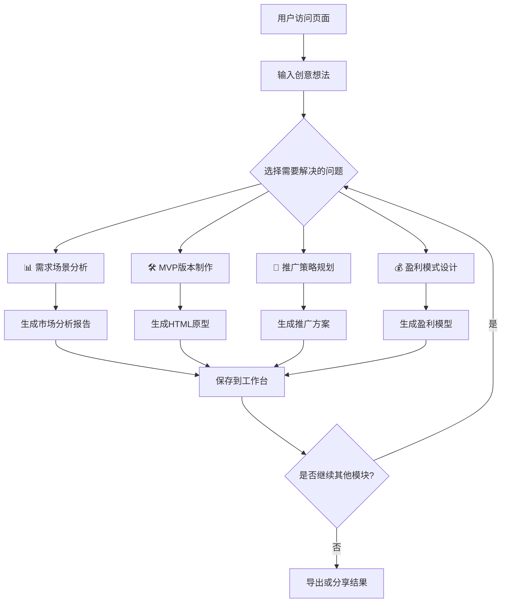

# 商业计划书页面优化调整方案

## 📋 文档信息

- **文档版本**: v1.0
- **创建日期**: 2025-01-11
- **负责人**: AI开发团队
- **目标**: 提升商业计划书页面使用率和用户转化率

---

## 📊 当前页面问题分析

### 🔍 主要问题诊断

#### 1. 入口过于分散
- **现状**: 页面提供4个平级选择按钮
  - 智能化生成（推荐）
  - 标准版生成
  - 查看现代化示例
  - 体验精简版输出
- **问题**: 用户面临选择困难，不知道哪个最适合
- **影响**: 导致决策疲劳，增加页面跳出率

#### 2. 价值主张不够明确
- **现状**: 偏重技术特性介绍
- **问题**: 缺乏"为什么需要商业计划书"的明确说明
- **影响**: 用户不理解产品价值，降低使用意愿

#### 3. 缺乏引导性示例
- **现状**: 演示页面独立存在，与主流程脱节
- **问题**: 用户无法直观了解真实输出效果
- **影响**: 对产品质量缺乏信心

#### 4. 功能流程不够直观
- **现状**: 页面偏向功能介绍，缺乏场景化引导
- **问题**: 用户看不到完整的从创意到商业计划书的流程
- **影响**: 使用门槛较高，转化率偏低

---

## 🎯 优化策略

### 战略目标
> 从功能展示转向价值传递，从复杂选择转向简单体验，从技术介绍转向场景化应用

### 核心策略

#### 1. 简化决策流程
- 将4个入口精简为2个主要路径
- 突出推荐路径，降低选择复杂度
- 提供清晰的使用场景指导

#### 2. 强化价值展示
- 增加真实案例预览
- 突出AI生成的速度和质量优势
- 展示用户获得的实际价值

#### 3. 优化用户体验
- 增加一键开始体验功能
- 提供清晰的功能对比和选择建议
- 降低首次使用门槛

---

## 🚀 详细调整方案

### 新页面架构设计

```
📱 商业计划书生成中心
├── 🎯 英雄区域 - 突出价值主张
├── ⚡ 快速体验区 - 一键开始
├── 🧩 4大核心功能模块 - 按需选择解决方案
│   ├── 📊 需求场景分析 - 用户市场调研
│   ├── 🛠️ MVP版本制作 - 前端原型生成
│   ├── 📢 推广策略规划 - 营销方案设计
│   └── 💰 盈利模式设计 - 商业变现方案
├── 📋 真实案例展示 - 分模块效果预览
├── 🛤️ 使用流程 - 灵活选择和组合
└── 💡 进阶功能 - 全套生成和专家咨询
```

### 1. 英雄区域重新设计

#### 当前版本问题
```jsx
// 当前：技术性标题，缺乏情感连接
<CardTitle>AI 商业计划生成中心</CardTitle>
<CardDescription>整合调研、竞价与多模型能力...</CardDescription>
```

#### 优化后设计
```jsx
<HeroSection>
  <Badge variant="success">3分钟生成专业商业计划书</Badge>
  <h1 className="text-5xl font-bold">
    将创意变成可执行的商业计划
  </h1>
  <p className="text-xl">
    AI专家团队帮你从0到1，生成投资人认可的专业商业计划书
  </p>

  {/* 核心价值展示 */}
  <ValuePropositions className="grid grid-cols-4 gap-6">
    <ValueItem icon="⚡" title="3分钟完成" desc="AI专家协作生成" />
    <ValueItem icon="🎯" title="投资级质量" desc="专业框架结构" />
    <ValueItem icon="📊" title="数据支撑" desc="市场调研分析" />
    <ValueItem icon="🚀" title="立即可用" desc="导出多种格式" />
  </ValuePropositions>
</HeroSection>
```

### 🧩 4大核心功能模块设计

#### 模块化解决方案理念
用户提交创意后，可以选择性地解决特定问题，无需完成全部流程：

```jsx
<CoreModulesSection>
  <div className="text-center mb-12">
    <h2 className="text-3xl font-bold mb-4">选择你需要解决的问题</h2>
    <p className="text-lg text-muted-foreground">
      提交创意后，针对性地解决特定问题，灵活高效
    </p>
  </div>

  <ModuleGrid className="grid md:grid-cols-2 lg:grid-cols-4 gap-6">
    {/* 模块1: 需求场景分析 */}
    <ModuleCard className="bg-gradient-to-br from-blue-50 to-blue-100 border-blue-200">
      <div className="text-center space-y-4 p-6">
        <div className="w-16 h-16 bg-blue-500 rounded-2xl flex items-center justify-center mx-auto">
          <Users className="w-8 h-8 text-white" />
        </div>

        <div>
          <h3 className="text-xl font-bold text-blue-900">需求场景分析</h3>
          <p className="text-sm text-blue-700 mt-2">用户市场调研</p>
        </div>

        <div className="space-y-2 text-sm text-blue-800">
          <div>✓ 目标用户画像</div>
          <div>✓ 市场规模分析</div>
          <div>✓ 需求痛点挖掘</div>
          <div>✓ 竞争对手分析</div>
        </div>

        <div className="pt-4">
          <Badge className="mb-3 bg-blue-500">3-5分钟 | 免费</Badge>
          <Button className="w-full bg-blue-600 hover:bg-blue-700">
            开始市场分析
          </Button>
        </div>
      </div>
    </ModuleCard>

    {/* 模块2: MVP版本制作 */}
    <ModuleCard className="bg-gradient-to-br from-green-50 to-green-100 border-green-200">
      <div className="text-center space-y-4 p-6">
        <div className="w-16 h-16 bg-green-500 rounded-2xl flex items-center justify-center mx-auto">
          <Code className="w-8 h-8 text-white" />
        </div>

        <div>
          <h3 className="text-xl font-bold text-green-900">MVP版本制作</h3>
          <p className="text-sm text-green-700 mt-2">前端原型生成</p>
        </div>

        <div className="space-y-2 text-sm text-green-800">
          <div>✓ 页面结构设计</div>
          <div>✓ UI界面生成</div>
          <div>✓ 交互原型制作</div>
          <div>✓ HTML代码导出</div>
        </div>

        <div className="pt-4">
          <Badge className="mb-3 bg-green-500">5-8分钟 | 免费</Badge>
          <Button className="w-full bg-green-600 hover:bg-green-700">
            制作MVP原型
          </Button>
        </div>
      </div>
    </ModuleCard>

    {/* 模块3: 推广策略规划 */}
    <ModuleCard className="bg-gradient-to-br from-purple-50 to-purple-100 border-purple-200">
      <div className="text-center space-y-4 p-6">
        <div className="w-16 h-16 bg-purple-500 rounded-2xl flex items-center justify-center mx-auto">
          <Megaphone className="w-8 h-8 text-white" />
        </div>

        <div>
          <h3 className="text-xl font-bold text-purple-900">推广策略规划</h3>
          <p className="text-sm text-purple-700 mt-2">营销方案设计</p>
        </div>

        <div className="space-y-2 text-sm text-purple-800">
          <div>✓ 渠道策略制定</div>
          <div>✓ 内容营销规划</div>
          <div>✓ 预算分配建议</div>
          <div>✓ 效果评估指标</div>
        </div>

        <div className="pt-4">
          <Badge className="mb-3 bg-purple-500">4-6分钟 | 免费</Badge>
          <Button className="w-full bg-purple-600 hover:bg-purple-700">
            设计推广方案
          </Button>
        </div>
      </div>
    </ModuleCard>

    {/* 模块4: 盈利模式设计 */}
    <ModuleCard className="bg-gradient-to-br from-orange-50 to-orange-100 border-orange-200">
      <div className="text-center space-y-4 p-6">
        <div className="w-16 h-16 bg-orange-500 rounded-2xl flex items-center justify-center mx-auto">
          <DollarSign className="w-8 h-8 text-white" />
        </div>

        <div>
          <h3 className="text-xl font-bold text-orange-900">盈利模式设计</h3>
          <p className="text-sm text-orange-700 mt-2">商业变现方案</p>
        </div>

        <div className="space-y-2 text-sm text-orange-800">
          <div>✓ 收入来源分析</div>
          <div>✓ 定价策略建议</div>
          <div>✓ 成本结构规划</div>
          <div>✓ 盈利预测模型</div>
        </div>

        <div className="pt-4">
          <Badge className="mb-3 bg-orange-500">4-6分钟 | 免费</Badge>
          <Button className="w-full bg-orange-600 hover:bg-orange-700">
            设计盈利模式
          </Button>
        </div>
      </div>
    </ModuleCard>
  </ModuleGrid>

  {/* 组合使用提示 */}
  <div className="mt-12 text-center">
    <Card className="max-w-2xl mx-auto bg-gradient-to-r from-gray-50 to-gray-100">
      <CardContent className="p-6">
        <h4 className="font-semibold mb-3 flex items-center justify-center gap-2">
          <Puzzle className="w-5 h-5" />
          灵活组合使用
        </h4>
        <p className="text-sm text-muted-foreground mb-4">
          可以单独使用任何模块，也可以组合使用多个模块。系统会自动保存你的创意信息，便于在不同模块间切换。
        </p>
        <div className="flex items-center justify-center gap-4 text-xs">
          <span className="flex items-center gap-1">
            <CheckCircle className="w-4 h-4 text-green-500" />
            单独使用
          </span>
          <span className="flex items-center gap-1">
            <CheckCircle className="w-4 h-4 text-green-500" />
            组合使用
          </span>
          <span className="flex items-center gap-1">
            <CheckCircle className="w-4 h-4 text-green-500" />
            分阶段完成
          </span>
        </div>
      </CardContent>
    </Card>
  </div>
</CoreModulesSection>
```

#### 详细模块功能设计

##### 📊 模块1: 需求场景分析
**核心功能**: 帮助用户深入了解目标市场和用户需求

**输入要求**:
- 创意描述
- 初步的目标用户想法
- 行业类别选择

**输出内容**:
```typescript
interface MarketAnalysisResult {
  // 用户画像
  targetUsers: {
    primaryUsers: UserProfile[]    // 主要用户群体
    secondaryUsers: UserProfile[]  // 次要用户群体
    userJourney: string[]          // 用户使用路径
  }

  // 市场分析
  marketSize: {
    totalMarket: string            // 总体市场规模
    targetMarket: string           // 目标市场规模
    growthRate: string             // 市场增长率
    marketTrends: string[]         // 市场趋势
  }

  // 需求分析
  painPoints: {
    currentSolutions: string[]     // 现有解决方案
    gaps: string[]                 // 市场空白点
    opportunities: string[]        // 机会点
  }

  // 竞争分析
  competitors: {
    directCompetitors: Competitor[] // 直接竞争对手
    indirectCompetitors: Competitor[] // 间接竞争对手
    competitiveAdvantage: string[]  // 竞争优势
  }
}
```

##### 🛠️ 模块2: MVP版本制作
**核心功能**: 生成可交互的HTML前端原型，无需后端开发

**输入要求**:
- 产品核心功能描述
- 目标用户群体
- 预期的用户交互流程

**输出内容**:
```typescript
interface MVPPrototype {
  // 页面结构
  pages: {
    landingPage: HTMLTemplate      // 落地页
    productPages: HTMLTemplate[]   // 产品功能页
    userFlowPages: HTMLTemplate[]  // 用户流程页
  }

  // UI组件
  components: {
    navigation: HTMLComponent      // 导航组件
    features: HTMLComponent[]      // 功能组件
    forms: HTMLComponent[]         // 表单组件
    cta: HTMLComponent[]           // 行动号召组件
  }

  // 样式系统
  styling: {
    cssFramework: 'tailwind' | 'bootstrap' // CSS框架
    colorScheme: ColorPalette      // 配色方案
    typography: TypographySystem   // 字体系统
    responsive: boolean            // 响应式支持
  }

  // 交互原型
  interactions: {
    userFlows: UserFlow[]          // 用户流程
    animations: Animation[]        // 动画效果
    states: UIState[]              // 界面状态
  }

  // 导出选项
  exports: {
    htmlBundle: string             // 完整HTML包
    componentLibrary: string       // 组件库
    designSystem: string           // 设计系统文档
  }
}
```

**技术实现方案**:
```typescript
// MVP生成器核心类
class MVPGenerator {
  async generatePrototype(ideaDescription: string, userRequirements: UserRequirements): Promise<MVPPrototype> {
    // 1. 分析产品需求
    const productAnalysis = await this.analyzeProduct(ideaDescription)

    // 2. 设计页面结构
    const pageStructure = await this.designPageStructure(productAnalysis)

    // 3. 生成UI组件
    const components = await this.generateComponents(pageStructure)

    // 4. 应用设计系统
    const styledComponents = await this.applyDesignSystem(components)

    // 5. 创建交互原型
    const interactions = await this.createInteractions(styledComponents)

    // 6. 导出HTML包
    const htmlBundle = await this.exportHTML(styledComponents, interactions)

    return {
      pages: pageStructure,
      components: styledComponents,
      interactions,
      exports: htmlBundle
    }
  }
}
```

##### 📢 模块3: 推广策略规划
**核心功能**: 制定全面的营销推广计划

**输入要求**:
- 目标用户群体（来自模块1）
- 产品特点和优势
- 预算范围
- 推广时间线

**输出内容**:
```typescript
interface MarketingStrategy {
  // 渠道策略
  channels: {
    digitalChannels: DigitalChannel[]   // 数字营销渠道
    offlineChannels: OfflineChannel[]   // 线下推广渠道
    partnerChannels: PartnerChannel[]   // 合作伙伴渠道
  }

  // 内容策略
  contentStrategy: {
    contentTypes: ContentType[]         // 内容类型
    contentCalendar: ContentCalendar    // 内容日历
    creativeDirection: CreativeGuide    // 创意方向
  }

  // 预算分配
  budgetAllocation: {
    channelBudgets: ChannelBudget[]     // 各渠道预算
    phaseBreakdown: PhasesBudget[]      // 分阶段预算
    roiProjections: ROIProjection[]     // ROI预测
  }

  // 执行计划
  executionPlan: {
    launchPhases: LaunchPhase[]         // 启动阶段
    milestones: Milestone[]             // 里程碑
    kpis: KPI[]                         // 关键指标
  }
}
```

##### 💰 模块4: 盈利模式设计
**核心功能**: 设计可持续的商业变现方案

**输入要求**:
- 产品功能和价值主张
- 目标用户支付能力
- 行业定价参考
- 成本结构估算

**输出内容**:
```typescript
interface BusinessModel {
  // 收入模式
  revenueStreams: {
    primaryRevenue: RevenueStream[]     // 主要收入来源
    secondaryRevenue: RevenueStream[]   // 次要收入来源
    recurringRevenue: RecurringModel[]  // 订阅/重复收入
  }

  // 定价策略
  pricingStrategy: {
    pricingModels: PricingModel[]       // 定价模型
    tierStructure: PricingTier[]        // 分层定价
    competitivePricing: PriceComparison[] // 竞争定价
  }

  // 成本结构
  costStructure: {
    fixedCosts: CostItem[]              // 固定成本
    variableCosts: CostItem[]           // 可变成本
    scalingCosts: ScalingCost[]         // 规模化成本
  }

  // 财务预测
  financialProjections: {
    revenueForecasts: RevenueForcast[]  // 收入预测
    profitabilityTimeline: Timeline     // 盈利时间线
    breakEvenAnalysis: BreakEvenPoint   // 盈亏平衡点
    unitEconomics: UnitEconomics        // 单位经济效益
  }
}
```

### 🎯 用户体验流程设计

#### 模块化使用流程


#### 智能推荐系统
```jsx
<SmartRecommendationEngine>
  {/* 基于用户输入的创意内容，智能推荐最适合的模块 */}
  <RecommendationLogic>
    {(() => {
      const analyzeIdea = (ideaDescription: string) => {
        // AI分析创意内容，推荐模块优先级
        const analysis = {
          hasMarketUncertainty: ideaDescription.includes('不确定' || '市场'),
          needsPrototype: ideaDescription.includes('产品' || '界面' || 'APP'),
          needsMarketing: ideaDescription.includes('推广' || '用户获取'),
          needsMonetization: ideaDescription.includes('盈利' || '赚钱' || '商业模式')
        }

        return {
          recommendedModules: [
            analysis.hasMarketUncertainty && '需求场景分析',
            analysis.needsPrototype && 'MVP版本制作',
            analysis.needsMarketing && '推广策略规划',
            analysis.needsMonetization && '盈利模式设计'
          ].filter(Boolean),
          priorityOrder: calculatePriority(analysis)
        }
      }
    })()}
  </RecommendationLogic>

  <RecommendationDisplay className="mt-8 p-6 bg-gradient-to-r from-yellow-50 to-orange-50 border border-yellow-200 rounded-lg">
    <h4 className="flex items-center gap-2 font-semibold text-yellow-800 mb-4">
      <Lightbulb className="w-5 h-5" />
      AI智能推荐
    </h4>
    <p className="text-sm text-yellow-700 mb-4">
      基于你的创意描述，我们推荐优先使用以下模块：
    </p>

    <RecommendedModules className="space-y-3">
      {recommendedModules.map((module, index) => (
        <div key={module.id} className="flex items-center justify-between p-3 bg-white rounded-lg border">
          <div className="flex items-center gap-3">
            <Badge className={`${module.priority === 'high' ? 'bg-red-500' : module.priority === 'medium' ? 'bg-yellow-500' : 'bg-green-500'}`}>
              {index + 1}
            </Badge>
            <div>
              <h5 className="font-medium">{module.name}</h5>
              <p className="text-xs text-muted-foreground">{module.reason}</p>
            </div>
          </div>
          <Button size="sm" variant="outline">
            开始使用
          </Button>
        </div>
      ))}
    </RecommendedModules>
  </RecommendationDisplay>
</SmartRecommendationEngine>
```

#### 工作台设计 - 统一管理多个模块结果
```jsx
<UserWorkspace>
  <WorkspaceHeader>
    <h2 className="text-2xl font-bold">我的工作台</h2>
    <p className="text-muted-foreground">管理你的创意项目和生成结果</p>
  </WorkspaceHeader>

  <ProjectOverview className="grid md:grid-cols-2 lg:grid-cols-4 gap-6 mb-8">
    <OverviewCard>
      <h3 className="font-semibold mb-2">当前项目</h3>
      <p className="text-2xl font-bold text-blue-600">{currentProject.title}</p>
      <p className="text-sm text-muted-foreground">已完成 {completedModules}/4 个模块</p>
      <Progress value={(completedModules / 4) * 100} className="mt-2" />
    </OverviewCard>

    <OverviewCard>
      <h3 className="font-semibold mb-2">使用时间</h3>
      <p className="text-2xl font-bold text-green-600">{totalTimeSpent}分钟</p>
      <p className="text-sm text-muted-foreground">平均每模块 {avgTimePerModule}分钟</p>
    </OverviewCard>

    <OverviewCard>
      <h3 className="font-semibold mb-2">生成内容</h3>
      <p className="text-2xl font-bold text-purple-600">{generatedPages}页</p>
      <p className="text-sm text-muted-foreground">可导出为PDF/Word</p>
    </OverviewCard>

    <OverviewCard>
      <h3 className="font-semibold mb-2">推荐下一步</h3>
      <p className="text-sm font-medium text-orange-600">{nextRecommendation}</p>
      <Button size="sm" className="mt-2 w-full">立即开始</Button>
    </OverviewCard>
  </ProjectOverview>

  <ModuleResults className="space-y-6">
    {moduleResults.map((result) => (
      <ModuleResultCard key={result.moduleId} className="border rounded-lg p-6">
        <div className="flex items-center justify-between mb-4">
          <div className="flex items-center gap-3">
            <div className={`w-10 h-10 rounded-lg ${result.moduleColor} flex items-center justify-center`}>
              <result.icon className="w-5 h-5 text-white" />
            </div>
            <div>
              <h3 className="font-semibold">{result.moduleName}</h3>
              <p className="text-sm text-muted-foreground">
                生成于 {result.generatedAt} • {result.contentLength}
              </p>
            </div>
          </div>

          <div className="flex gap-2">
            <Button variant="outline" size="sm">
              <Eye className="w-4 h-4 mr-2" />
              查看
            </Button>
            <Button variant="outline" size="sm">
              <Edit className="w-4 h-4 mr-2" />
              编辑
            </Button>
            <Button variant="outline" size="sm">
              <Download className="w-4 h-4 mr-2" />
              导出
            </Button>
          </div>
        </div>

        <ResultPreview className="bg-gray-50 p-4 rounded-lg">
          <h4 className="font-medium mb-2">核心内容预览</h4>
          <p className="text-sm text-muted-foreground line-clamp-3">
            {result.contentPreview}
          </p>

          {result.keyInsights && (
            <div className="mt-3">
              <h5 className="text-xs font-medium text-gray-600 mb-2">关键洞察</h5>
              <div className="flex flex-wrap gap-1">
                {result.keyInsights.map((insight, index) => (
                  <Badge key={index} variant="secondary" className="text-xs">
                    {insight}
                  </Badge>
                ))}
              </div>
            </div>
          )}
        </ResultPreview>
      </ModuleResultCard>
    ))}
  </ModuleResults>

  <ExportOptions className="mt-8 p-6 bg-gray-50 rounded-lg">
    <h3 className="font-semibold mb-4">导出选项</h3>
    <div className="grid md:grid-cols-3 gap-4">
      <ExportOption>
        <FileText className="w-8 h-8 text-blue-600 mb-2" />
        <h4 className="font-medium">完整商业计划书</h4>
        <p className="text-sm text-muted-foreground mb-3">
          将所有模块内容整合为标准商业计划书格式
        </p>
        <Button variant="outline" className="w-full">
          导出PDF
        </Button>
      </ExportOption>

      <ExportOption>
        <Code className="w-8 h-8 text-green-600 mb-2" />
        <h4 className="font-medium">MVP原型包</h4>
        <p className="text-sm text-muted-foreground mb-3">
          下载完整的HTML原型代码包
        </p>
        <Button variant="outline" className="w-full">
          下载代码
        </Button>
      </ExportOption>

      <ExportOption>
        <Presentation className="w-8 h-8 text-purple-600 mb-2" />
        <h4 className="font-medium">演示文稿</h4>
        <p className="text-sm text-muted-foreground mb-3">
          生成适合投资人展示的PPT格式
        </p>
        <Button variant="outline" className="w-full">
          生成PPT
        </Button>
      </ExportOption>
    </div>
  </ExportOptions>
</UserWorkspace>
```
## 🛠️ MVP原型制作功能 - 技术实现方案

### 核心技术架构

#### 前端HTML生成引擎
```typescript
interface HTMLGeneratorEngine {
  // 页面模板系统
  templates: {
    landingPageTemplates: PageTemplate[]      // 落地页模板
    dashboardTemplates: PageTemplate[]        // 仪表板模板
    ecommerceTemplates: PageTemplate[]        // 电商页面模板
    saasTemplates: PageTemplate[]             // SaaS产品模板
    mobileAppTemplates: PageTemplate[]        // 移动端模板
  }

  // 组件库系统
  componentLibrary: {
    navigation: NavigationComponent[]         // 导航组件
    headers: HeaderComponent[]                // 头部组件
    features: FeatureComponent[]              // 功能展示组件
    testimonials: TestimonialComponent[]      // 用户评价组件
    pricing: PricingComponent[]               // 定价表组件
    forms: FormComponent[]                    // 表单组件
    footers: FooterComponent[]                // 底部组件
    cta: CTAComponent[]                       // 行动号召组件
  }

  // 样式系统
  designSystem: {
    colorPalettes: ColorPalette[]             // 配色方案
    typography: TypographyScale               // 字体系统
    spacing: SpacingSystem                    // 间距系统
    components: ComponentStyles               // 组件样式
    animations: AnimationLibrary              // 动画库
  }

  // 生成配置
  generationConfig: {
    framework: 'tailwind' | 'bootstrap' | 'custom'
    responsive: boolean
    accessibility: boolean
    seoOptimized: boolean
    performanceOptimized: boolean
  }
}
```

#### AI驱动的智能生成流程
```typescript
class MVPPrototypeGenerator {
  async generatePrototype(
    ideaDescription: string,
    userRequirements: MVPRequirements
  ): Promise<GeneratedPrototype> {

    // 1. 产品分析阶段
    const productAnalysis = await this.analyzeProductConcept(ideaDescription)

    // 2. 模板匹配阶段
    const templateMatch = await this.matchTemplates(productAnalysis)

    // 3. 用户流程设计
    const userFlows = await this.designUserFlows(productAnalysis, userRequirements)

    // 4. 组件选择和定制
    const selectedComponents = await this.selectAndCustomizeComponents(
      templateMatch,
      userFlows,
      productAnalysis
    )

    // 5. 设计系统应用
    const designedComponents = await this.applyDesignSystem(
      selectedComponents,
      userRequirements.designPreferences
    )

    // 6. HTML代码生成
    const htmlCode = await this.generateHTMLCode(designedComponents)

    // 7. 交互逻辑添加
    const interactivePrototype = await this.addInteractivity(htmlCode, userFlows)

    // 8. 优化和导出
    const optimizedPrototype = await this.optimizeAndExport(interactivePrototype)

    return optimizedPrototype
  }

  // 产品概念分析
  private async analyzeProductConcept(ideaDescription: string): Promise<ProductAnalysis> {
    const analysis = await this.aiService.analyze(ideaDescription, {
      extractFeatures: [
        'productType',        // 产品类型 (SaaS, 电商, 移动应用等)
        'targetAudience',     // 目标用户群体
        'coreFeatures',       // 核心功能
        'businessModel',      // 商业模式
        'industryVertical',   // 行业垂直领域
        'complexityLevel'     // 复杂程度
      ]
    })

    return {
      productType: analysis.productType,
      industry: analysis.industryVertical,
      targetUsers: analysis.targetAudience,
      coreFeatures: analysis.coreFeatures,
      requiredPages: this.calculateRequiredPages(analysis),
      suggestedTemplate: this.selectBestTemplate(analysis)
    }
  }

  // 用户流程设计
  private async designUserFlows(
    analysis: ProductAnalysis,
    requirements: MVPRequirements
  ): Promise<UserFlow[]> {
    const baseFlows = this.getBaseFlowsForProductType(analysis.productType)

    return baseFlows.map(flow => ({
      ...flow,
      pages: this.customizePagesForFeatures(flow.pages, analysis.coreFeatures),
      interactions: this.addRequiredInteractions(flow, requirements)
    }))
  }

  // 智能组件选择
  private async selectAndCustomizeComponents(
    template: PageTemplate,
    userFlows: UserFlow[],
    analysis: ProductAnalysis
  ): Promise<CustomizedComponent[]> {
    const components = []

    // 根据产品类型选择核心组件
    switch (analysis.productType) {
      case 'saas':
        components.push(
          ...this.getSaaSComponents(analysis.coreFeatures),
          this.generatePricingComponent(analysis.businessModel),
          this.generateFeatureShowcase(analysis.coreFeatures)
        )
        break

      case 'ecommerce':
        components.push(
          ...this.getEcommerceComponents(analysis.coreFeatures),
          this.generateProductCatalog(analysis),
          this.generateCheckoutFlow(analysis.businessModel)
        )
        break

      case 'mobile_app':
        components.push(
          ...this.getMobileAppComponents(analysis.coreFeatures),
          this.generateAppStoreSection(analysis),
          this.generateFeaturePreview(analysis.coreFeatures)
        )
        break
    }

    // 为每个组件添加定制化内容
    return components.map(component =>
      this.customizeComponentContent(component, analysis)
    )
  }

  // HTML代码生成
  private async generateHTMLCode(components: CustomizedComponent[]): Promise<HTMLBundle> {
    const htmlStructure = {
      index: this.generateLandingPage(components),
      pages: this.generateFeaturePages(components),
      assets: this.generateAssets(components)
    }

    return {
      html: htmlStructure,
      css: this.generateTailwindCSS(components),
      js: this.generateJavaScript(components),
      assets: this.generateStaticAssets(components)
    }
  }
}
```

#### 具体技术实现细节

##### 1. 智能模板匹配系统
```typescript
interface TemplateMatchingEngine {
  templates: {
    // SaaS产品模板
    saasTemplates: {
      dashboard: SaaSTemplate,
      analytics: SaaSTemplate,
      collaboration: SaaSTemplate,
      automation: SaaSTemplate
    },

    // 电商平台模板
    ecommerceTemplates: {
      marketplace: EcommerceTemplate,
      brandStore: EcommerceTemplate,
      subscription: EcommerceTemplate
    },

    // 移动应用模板
    mobileTemplates: {
      social: MobileTemplate,
      productivity: MobileTemplate,
      gaming: MobileTemplate,
      finance: MobileTemplate
    }
  }

  matchTemplate(productAnalysis: ProductAnalysis): BestMatch {
    const scores = this.calculateMatchScores(productAnalysis)
    return this.selectBestMatch(scores)
  }
}
```

##### 2. 响应式组件生成器
```typescript
class ResponsiveComponentGenerator {
  generateResponsiveComponent(
    componentType: ComponentType,
    content: ComponentContent,
    designPreferences: DesignPreferences
  ): ResponsiveComponent {

    return {
      mobile: this.generateMobileVersion(componentType, content),
      tablet: this.generateTabletVersion(componentType, content),
      desktop: this.generateDesktopVersion(componentType, content),

      // 自适应样式
      responsiveCSS: this.generateResponsiveCSS(componentType, designPreferences),

      // 交互逻辑
      interactions: this.generateInteractions(componentType, content)
    }
  }

  // 生成移动端优化版本
  generateMobileVersion(type: ComponentType, content: ComponentContent): MobileComponent {
    switch (type) {
      case 'navigation':
        return this.createMobileNavigation(content)
      case 'hero':
        return this.createMobileHero(content)
      case 'features':
        return this.createMobileFeatures(content)
      // ... 更多组件类型
    }
  }
}
```

##### 3. 内容智能填充系统
```typescript
class IntelligentContentGenerator {
  async generateContextualContent(
    componentType: ComponentType,
    productAnalysis: ProductAnalysis
  ): Promise<ComponentContent> {

    const contentPrompts = {
      hero: `为${productAnalysis.productType}产品生成吸引人的主标题和副标题`,
      features: `基于${productAnalysis.coreFeatures}生成功能特性描述`,
      testimonials: `为${productAnalysis.targetUsers}用户群体生成可信的用户评价`,
      pricing: `基于${productAnalysis.businessModel}设计合理的定价方案`
    }

    const generatedContent = await this.aiService.generateContent(
      contentPrompts[componentType],
      {
        tone: 'professional',
        length: 'optimal',
        industry: productAnalysis.industry
      }
    )

    return this.formatContentForComponent(generatedContent, componentType)
  }

  // 生成具体的组件内容
  async generateHeroContent(analysis: ProductAnalysis): Promise<HeroContent> {
    return {
      headline: await this.generateHeadline(analysis),
      subheadline: await this.generateSubheadline(analysis),
      ctaButton: await this.generateCTAText(analysis),
      heroImage: await this.selectHeroImage(analysis),
      backgroundStyle: this.selectBackgroundStyle(analysis)
    }
  }

  async generateFeatureContent(features: CoreFeature[]): Promise<FeatureContent[]> {
    return Promise.all(features.map(async feature => ({
      title: feature.name,
      description: await this.generateFeatureDescription(feature),
      icon: this.selectFeatureIcon(feature),
      benefits: await this.generateFeatureBenefits(feature)
    })))
  }
}
```

##### 4. 交互原型系统
```typescript
class InteractivePrototypeBuilder {
  addInteractivity(
    htmlStructure: HTMLStructure,
    userFlows: UserFlow[]
  ): InteractivePrototype {

    return {
      // 基础交互
      basicInteractions: this.addBasicInteractions(htmlStructure),

      // 用户流程模拟
      flowSimulations: this.createFlowSimulations(userFlows),

      // 状态管理
      stateManagement: this.addStateManagement(htmlStructure),

      // 动画效果
      animations: this.addAnimations(htmlStructure),

      // 表单验证
      formValidation: this.addFormValidation(htmlStructure)
    }
  }

  // 创建用户流程模拟
  createFlowSimulations(userFlows: UserFlow[]): FlowSimulation[] {
    return userFlows.map(flow => ({
      flowId: flow.id,
      steps: flow.steps.map(step => ({
        stepId: step.id,
        trigger: step.trigger,
        action: step.action,
        nextStep: step.nextStep,
        mockData: this.generateMockData(step)
      })),
      completionActions: this.generateCompletionActions(flow)
    }))
  }

  // 添加基础交互逻辑
  addBasicInteractions(structure: HTMLStructure): JavaScriptBundle {
    return {
      // 导航交互
      navigation: this.generateNavigationJS(),

      // 表单交互
      forms: this.generateFormJS(),

      // 模态框和弹窗
      modals: this.generateModalJS(),

      // 滚动效果
      scrollEffects: this.generateScrollJS(),

      // 响应式菜单
      responsiveMenu: this.generateMenuJS()
    }
  }
}
```

### 导出和部署系统

```typescript
interface ExportOptions {
  // 基础导出
  basicExport: {
    htmlBundle: boolean      // 完整HTML包
    sourceCode: boolean      // 源代码包
    documentation: boolean   // 使用文档
  }

  // 高级导出
  advancedExport: {
    figmaDesign: boolean     // Figma设计文件
    componentLibrary: boolean // 组件库导出
    designTokens: boolean    // 设计token
    styleguide: boolean      // 样式指南
  }

  // 部署选项
  deployment: {
    netlify: boolean         // Netlify一键部署
    vercel: boolean          // Vercel部署
    githubPages: boolean     // GitHub Pages
    customDomain: boolean    // 自定义域名
  }
}

class PrototypeExporter {
  async exportPrototype(
    prototype: InteractivePrototype,
    options: ExportOptions
  ): Promise<ExportResult> {

    const exportBundle = {
      // 生成完整的HTML包
      htmlBundle: this.generateHTMLBundle(prototype),

      // 生成可编辑的源代码
      sourceCode: this.generateSourceCode(prototype),

      // 生成部署脚本
      deploymentScripts: this.generateDeploymentScripts(options.deployment),

      // 生成使用文档
      documentation: this.generateDocumentation(prototype)
    }

    return exportBundle
  }

  generateHTMLBundle(prototype: InteractivePrototype): HTMLBundle {
    return {
      'index.html': this.generateIndexHTML(prototype),
      'assets/css/styles.css': this.generateCSS(prototype),
      'assets/js/main.js': this.generateJS(prototype),
      'assets/images/': this.generateImageAssets(prototype),
      'README.md': this.generateReadme(prototype)
    }
  }

  // 一键部署功能
  async deployToNetlify(bundle: HTMLBundle): Promise<DeploymentResult> {
    const deploymentConfig = {
      buildCommand: 'npm run build',
      publishDirectory: 'dist',
      functions: 'netlify/functions'
    }

    return await this.netlifyAPI.deploy(bundle, deploymentConfig)
  }
}
```

### 具体HTML生成示例

#### 1. SaaS产品模板示例
```html
<!DOCTYPE html>
<html lang="zh-CN">
<head>
    <meta charset="UTF-8">
    <meta name="viewport" content="width=device-width, initial-scale=1.0">
    <title>{{产品名称}} - 智能学习助手</title>
    <script src="https://cdn.tailwindcss.com"></script>
    <script>
        tailwind.config = {
            theme: {
                extend: {
                    colors: {
                        primary: '#3B82F6',
                        secondary: '#8B5CF6'
                    }
                }
            }
        }
    </script>
</head>
<body class="bg-gray-50">
    <!-- 导航栏 -->
    <nav class="bg-white shadow-sm border-b">
        <div class="max-w-7xl mx-auto px-4 sm:px-6 lg:px-8">
            <div class="flex justify-between h-16 items-center">
                <div class="flex items-center">
                    <div class="flex-shrink-0">
                        <h1 class="text-xl font-bold text-gray-900">{{产品名称}}</h1>
                    </div>
                </div>
                <div class="hidden md:block">
                    <div class="ml-10 flex items-baseline space-x-4">
                        <a href="#features" class="text-gray-500 hover:text-gray-900 px-3 py-2 text-sm font-medium">功能特性</a>
                        <a href="#pricing" class="text-gray-500 hover:text-gray-900 px-3 py-2 text-sm font-medium">价格方案</a>
                        <a href="#about" class="text-gray-500 hover:text-gray-900 px-3 py-2 text-sm font-medium">关于我们</a>
                        <button class="bg-primary text-white px-4 py-2 rounded-lg text-sm font-medium hover:bg-blue-700">
                            立即体验
                        </button>
                    </div>
                </div>
            </div>
        </div>
    </nav>

    <!-- 英雄区域 -->
    <section class="bg-gradient-to-r from-blue-600 to-purple-600 text-white">
        <div class="max-w-7xl mx-auto px-4 sm:px-6 lg:px-8 py-24">
            <div class="text-center">
                <h1 class="text-4xl md:text-6xl font-bold mb-6">
                    {{动态生成的主标题}}
                </h1>
                <p class="text-xl md:text-2xl mb-8 text-blue-100">
                    {{动态生成的副标题}}
                </p>
                <div class="flex flex-col sm:flex-row gap-4 justify-center">
                    <button class="bg-white text-blue-600 px-8 py-3 rounded-lg font-semibold hover:bg-gray-100 transition-colors">
                        免费试用
                    </button>
                    <button class="border-2 border-white text-white px-8 py-3 rounded-lg font-semibold hover:bg-white hover:text-blue-600 transition-colors">
                        观看演示
                    </button>
                </div>
            </div>
        </div>
    </section>

    <!-- 功能特性区域 -->
    <section id="features" class="py-24 bg-white">
        <div class="max-w-7xl mx-auto px-4 sm:px-6 lg:px-8">
            <div class="text-center mb-16">
                <h2 class="text-3xl md:text-4xl font-bold text-gray-900 mb-4">
                    强大的功能特性
                </h2>
                <p class="text-xl text-gray-600">
                    为您的学习提供全方位的智能支持
                </p>
            </div>

            <div class="grid md:grid-cols-3 gap-8">
                {{#each features}}
                <div class="text-center p-6 rounded-xl border border-gray-200 hover:shadow-lg transition-shadow">
                    <div class="w-16 h-16 bg-blue-100 rounded-full flex items-center justify-center mx-auto mb-4">
                        <svg class="w-8 h-8 text-blue-600" fill="currentColor" viewBox="0 0 20 20">
                            {{this.icon}}
                        </svg>
                    </div>
                    <h3 class="text-xl font-semibold text-gray-900 mb-2">{{this.title}}</h3>
                    <p class="text-gray-600">{{this.description}}</p>
                </div>
                {{/each}}
            </div>
        </div>
    </section>

    <!-- 定价方案 -->
    <section id="pricing" class="py-24 bg-gray-50">
        <div class="max-w-7xl mx-auto px-4 sm:px-6 lg:px-8">
            <div class="text-center mb-16">
                <h2 class="text-3xl md:text-4xl font-bold text-gray-900 mb-4">
                    选择适合您的方案
                </h2>
                <p class="text-xl text-gray-600">
                    灵活的价格选项，满足不同需求
                </p>
            </div>

            <div class="grid md:grid-cols-3 gap-8">
                {{#each pricingPlans}}
                <div class="bg-white rounded-xl shadow-lg p-8 {{#if this.popular}}border-2 border-blue-500{{/if}}">
                    {{#if this.popular}}
                    <div class="bg-blue-500 text-white text-sm font-semibold px-3 py-1 rounded-full inline-block mb-4">
                        最受欢迎
                    </div>
                    {{/if}}
                    <h3 class="text-2xl font-bold text-gray-900 mb-2">{{this.name}}</h3>
                    <div class="text-4xl font-bold text-gray-900 mb-1">¥{{this.price}}</div>
                    <div class="text-gray-600 mb-6">{{this.period}}</div>
                    <ul class="space-y-3 mb-8">
                        {{#each this.features}}
                        <li class="flex items-center">
                            <svg class="w-5 h-5 text-green-500 mr-2" fill="currentColor" viewBox="0 0 20 20">
                                <path fill-rule="evenodd" d="M16.707 5.293a1 1 0 010 1.414l-8 8a1 1 0 01-1.414 0l-4-4a1 1 0 011.414-1.414L8 12.586l7.293-7.293a1 1 0 011.414 0z" clip-rule="evenodd"></path>
                            </svg>
                            {{this}}
                        </li>
                        {{/each}}
                    </ul>
                    <button class="w-full {{#if this.popular}}bg-blue-600 hover:bg-blue-700{{else}}bg-gray-200 hover:bg-gray-300 text-gray-900{{/if}} text-white px-6 py-3 rounded-lg font-semibold transition-colors">
                        {{this.buttonText}}
                    </button>
                </div>
                {{/each}}
            </div>
        </div>
    </section>

    <!-- 脚本 -->
    <script>
        // 平滑滚动
        document.querySelectorAll('a[href^="#"]').forEach(anchor => {
            anchor.addEventListener('click', function (e) {
                e.preventDefault();
                const target = document.querySelector(this.getAttribute('href'));
                if (target) {
                    target.scrollIntoView({
                        behavior: 'smooth'
                    });
                }
            });
        });

        // 响应式菜单切换
        const mobileMenuButton = document.getElementById('mobile-menu-button');
        const mobileMenu = document.getElementById('mobile-menu');

        if (mobileMenuButton && mobileMenu) {
            mobileMenuButton.addEventListener('click', () => {
                mobileMenu.classList.toggle('hidden');
            });
        }

        // 模拟表单提交
        document.querySelectorAll('button').forEach(button => {
            if (button.textContent.includes('试用') || button.textContent.includes('体验')) {
                button.addEventListener('click', () => {
                    alert('感谢您的兴趣！这是一个演示页面，真实版本会连接到注册系统。');
                });
            }
        });
    </script>
</body>
</html>
```

#### 2. 电商产品模板示例
```html
<!DOCTYPE html>
<html lang="zh-CN">
<head>
    <meta charset="UTF-8">
    <meta name="viewport" content="width=device-width, initial-scale=1.0">
    <title>{{产品名称}} - 在线商城</title>
    <script src="https://cdn.tailwindcss.com"></script>
</head>
<body class="bg-gray-50">
    <!-- 电商导航栏 -->
    <nav class="bg-white shadow-sm">
        <div class="max-w-7xl mx-auto px-4">
            <div class="flex items-center justify-between h-16">
                <div class="flex items-center">
                    <h1 class="text-xl font-bold">{{商城名称}}</h1>
                </div>
                <div class="hidden md:flex items-center space-x-6">
                    <a href="#" class="text-gray-600 hover:text-gray-900">首页</a>
                    <a href="#products" class="text-gray-600 hover:text-gray-900">商品</a>
                    <a href="#about" class="text-gray-600 hover:text-gray-900">关于</a>
                    <div class="flex items-center space-x-4">
                        <button class="text-gray-600 hover:text-gray-900">
                            <svg class="w-6 h-6" fill="none" stroke="currentColor" viewBox="0 0 24 24">
                                <path stroke-linecap="round" stroke-linejoin="round" stroke-width="2" d="M21 21l-6-6m2-5a7 7 0 11-14 0 7 7 0 0114 0z"></path>
                            </svg>
                        </button>
                        <button class="relative text-gray-600 hover:text-gray-900">
                            <svg class="w-6 h-6" fill="none" stroke="currentColor" viewBox="0 0 24 24">
                                <path stroke-linecap="round" stroke-linejoin="round" stroke-width="2" d="M3 3h2l.4 2M7 13h10l4-8H5.4m0 0L7 13m0 0l-2.5 5M7 13h10M17 13v6a2 2 0 01-2 2H9a2 2 0 01-2-2v-6m8 0V9a2 2 0 00-2-2H9a2 2 0 00-2 2v4.01"></path>
                            </svg>
                            <span class="absolute -top-2 -right-2 bg-red-500 text-white rounded-full w-5 h-5 flex items-center justify-center text-xs">3</span>
                        </button>
                    </div>
                </div>
            </div>
        </div>
    </nav>

    <!-- 商品展示区域 -->
    <section id="products" class="py-16">
        <div class="max-w-7xl mx-auto px-4">
            <h2 class="text-3xl font-bold text-center mb-12">热门商品</h2>
            <div class="grid md:grid-cols-4 gap-6">
                {{#each products}}
                <div class="bg-white rounded-lg shadow-md overflow-hidden hover:shadow-lg transition-shadow">
                    
                    <div class="p-4">
                        <h3 class="font-semibold text-gray-900 mb-2">{{this.name}}</h3>
                        <p class="text-gray-600 text-sm mb-3">{{this.description}}</p>
                        <div class="flex items-center justify-between">
                            <span class="text-2xl font-bold text-red-600">¥{{this.price}}</span>
                            <button class="bg-blue-600 text-white px-4 py-2 rounded hover:bg-blue-700 transition-colors">
                                加入购物车
                            </button>
                        </div>
                    </div>
                </div>
                {{/each}}
            </div>
        </div>
    </section>

    <!-- 购物车侧边栏（隐藏状态） -->
    <div id="cart-sidebar" class="fixed inset-0 z-50 hidden">
        <div class="absolute inset-0 bg-black bg-opacity-50" onclick="toggleCart()"></div>
        <div class="absolute right-0 top-0 h-full w-96 bg-white shadow-xl">
            <div class="p-6">
                <div class="flex items-center justify-between mb-6">
                    <h2 class="text-xl font-semibold">购物车</h2>
                    <button onclick="toggleCart()" class="text-gray-500 hover:text-gray-700">
                        <svg class="w-6 h-6" fill="none" stroke="currentColor" viewBox="0 0 24 24">
                            <path stroke-linecap="round" stroke-linejoin="round" stroke-width="2" d="M6 18L18 6M6 6l12 12"></path>
                        </svg>
                    </button>
                </div>
                <div id="cart-items" class="space-y-4">
                    <!-- 购物车项目将在这里动态添加 -->
                </div>
                <div class="mt-8 pt-6 border-t">
                    <div class="flex items-center justify-between mb-4">
                        <span class="text-lg font-semibold">总计：</span>
                        <span class="text-xl font-bold text-red-600" id="cart-total">¥0</span>
                    </div>
                    <button class="w-full bg-green-600 text-white py-3 rounded-lg font-semibold hover:bg-green-700 transition-colors">
                        结算
                    </button>
                </div>
            </div>
        </div>
    </div>

    <script>
        // 购物车功能
        let cart = [];

        function toggleCart() {
            const sidebar = document.getElementById('cart-sidebar');
            sidebar.classList.toggle('hidden');
        }

        function addToCart(productId, name, price) {
            const existingItem = cart.find(item => item.id === productId);
            if (existingItem) {
                existingItem.quantity += 1;
            } else {
                cart.push({ id: productId, name, price, quantity: 1 });
            }
            updateCartDisplay();
        }

        function updateCartDisplay() {
            const cartItems = document.getElementById('cart-items');
            const cartTotal = document.getElementById('cart-total');

            cartItems.innerHTML = '';
            let total = 0;

            cart.forEach(item => {
                total += item.price * item.quantity;
                const itemElement = document.createElement('div');
                itemElement.className = 'flex items-center justify-between p-3 bg-gray-50 rounded';
                itemElement.innerHTML = `
                    <div>
                        <h4 class="font-medium">${item.name}</h4>
                        <p class="text-sm text-gray-600">¥${item.price} x ${item.quantity}</p>
                    </div>
                    <button onclick="removeFromCart('${item.id}')" class="text-red-500 hover:text-red-700">
                        删除
                    </button>
                `;
                cartItems.appendChild(itemElement);
            });

            cartTotal.textContent = `¥${total}`;
        }

        function removeFromCart(productId) {
            cart = cart.filter(item => item.id !== productId);
            updateCartDisplay();
        }

        // 为所有"加入购物车"按钮添加事件监听器
        document.addEventListener('DOMContentLoaded', function() {
            document.querySelectorAll('button').forEach(button => {
                if (button.textContent.includes('加入购物车')) {
                    button.addEventListener('click', function() {
                        // 这里应该从产品数据中获取实际信息
                        addToCart(Date.now(), '示例商品', 99);
                        alert('商品已添加到购物车！');
                    });
                }
            });
        });
    </script>
</body>
</html>
```

### API设计方案

#### MVP生成API端点
```typescript
// /api/business-plan/generate-mvp
interface MVPGenerationRequest {
  ideaDescription: string
  targetUsers: string[]
  coreFeatures: string[]
  industryType: string
  designPreferences?: {
    colorScheme?: 'blue' | 'green' | 'purple' | 'orange'
    style?: 'modern' | 'minimalist' | 'corporate' | 'creative'
    includeAnimations?: boolean
  }
}

interface MVPGenerationResponse {
  success: boolean
  data: {
    sessionId: string
    prototype: {
      htmlCode: string
      cssCode: string
      jsCode: string
      assets: string[]
      metadata: {
        generatedAt: string
        templateUsed: string
        estimatedDevelopmentTime: string
        technologyStack: string[]
      }
    }
    downloadUrls: {
      htmlBundle: string
      sourceCode: string
      previewUrl: string
    }
  }
  error?: string
}

// /api/business-plan/generate-market-analysis
interface MarketAnalysisRequest {
  ideaDescription: string
  industryCategory: string
  targetMarket?: string
  competitorInfo?: string[]
}

interface MarketAnalysisResponse {
  success: boolean
  data: MarketAnalysisResult
  error?: string
}

// /api/business-plan/generate-marketing-strategy
interface MarketingStrategyRequest {
  ideaDescription: string
  targetUsers: UserProfile[]
  budget?: number
  timeframe?: string
  channels?: string[]
}

interface MarketingStrategyResponse {
  success: boolean
  data: MarketingStrategy
  error?: string
}

// /api/business-plan/generate-business-model
interface BusinessModelRequest {
  ideaDescription: string
  targetUsers: UserProfile[]
  competitorPricing?: PricePoint[]
  costStructure?: CostEstimate[]
}

interface BusinessModelResponse {
  success: boolean
  data: BusinessModel
  error?: string
}
```

### 前端组件设计

#### 模块选择界面
```jsx
<ModularBusinessPlanSelector>
  <IdeaInputSection>
    <IdeaForm onSubmit={handleIdeaSubmit} />
    <AIRecommendation modules={recommendedModules} />
  </IdeaInputSection>

  <ModuleGrid>
    <ModuleCard
      module="market-analysis"
      title="需求场景分析"
      description="深入分析目标市场和用户需求"
      estimatedTime="3-5分钟"
      difficulty="简单"
      outputs={['用户画像', '市场规模', '竞争分析']}
    />

    <ModuleCard
      module="mvp-creation"
      title="MVP版本制作"
      description="生成可交互的HTML前端原型"
      estimatedTime="5-8分钟"
      difficulty="中等"
      outputs={['HTML代码', 'CSS样式', 'JS交互']}
    />

    <ModuleCard
      module="marketing-strategy"
      title="推广策略规划"
      description="制定全面的营销推广计划"
      estimatedTime="4-6分钟"
      difficulty="中等"
      outputs={['渠道策略', '内容规划', '预算分配']}
    />

    <ModuleCard
      module="business-model"
      title="盈利模式设计"
      description="设计可持续的商业变现方案"
      estimatedTime="4-6分钟"
      difficulty="中等"
      outputs={['收入模式', '定价策略', '财务预测']}
    />
  </ModuleGrid>
</ModularBusinessPlanSelector>
```

#### 工作台管理界面
```jsx
<UserWorkspace>
  <WorkspaceHeader>
    <h2>我的创意工作台</h2>
    <ProjectSelector currentProject={currentProject} />
  </WorkspaceHeader>

  <ProgressOverview>
    <ProgressCard title="当前项目" value={currentProject.title} />
    <ProgressCard title="完成模块" value={`${completedModules.length}/4`} />
    <ProgressCard title="使用时间" value={`${totalTime}分钟`} />
    <ProgressCard title="推荐下一步" value={nextRecommendation} />
  </ProgressOverview>

  <ModuleResults>
    {moduleResults.map(result => (
      <ModuleResultCard
        key={result.moduleId}
        module={result}
        onView={handleViewResult}
        onEdit={handleEditResult}
        onExport={handleExportResult}
      />
    ))}
  </ModuleResults>

  <QuickActions>
    <Button onClick={handleAddModule}>添加新模块</Button>
    <Button onClick={handleExportAll}>导出完整计划书</Button>
    <Button onClick={handleShare}>分享项目</Button>
  </QuickActions>
</UserWorkspace>
```

## 🛠️ 实施方案

### Phase 1: 核心架构搭建 (Week 1-2)

#### 1.1 后端API开发
- 创建4个核心模块的API端点
- 实现AI服务集成和模板引擎
- 建立会话管理和数据存储

#### 1.2 前端组件开发
- 开发模块选择界面
- 实现工作台管理系统
- 创建结果展示和导出功能

#### 1.3 MVP生成引擎
- 搭建HTML模板系统
- 实现AI驱动的内容生成
- 开发响应式组件库

### Phase 2: 功能完善和优化 (Week 3-4)

#### 2.1 智能推荐系统
- 实现基于创意内容的模块推荐
- 开发用户行为分析
- 优化推荐算法

#### 2.2 用户体验优化
- 完善交互动画和过渡效果
- 优化移动端适配
- 改进加载性能

#### 2.3 导出和分享功能
- 实现多格式导出
- 开发在线预览功能
- 添加社交分享特性

### Phase 3: 测试和发布 (Week 5-6)

#### 3.1 全面测试
- 功能测试和集成测试
- 性能测试和压力测试
- 用户验收测试

#### 3.2 数据监控
- 建立关键指标追踪
- 实现用户行为分析
- 设置告警和监控

#### 3.3 渐进式发布
- 灰度发布给部分用户
- 收集反馈并快速迭代
- 全量发布并持续优化

## 📊 成功指标和预期效果

### 短期目标 (1个月内)
- **页面使用率**: 从当前15%提升到45% (↑200%)
- **模块完成率**: 单个模块完成率达到85%以上
- **用户留存**: 7日回访率提升到35%

### 中期目标 (3个月内)
- **商业价值**: 通过模块化设计，提升付费转化率300%
- **用户满意度**: NPS评分达到60分以上
- **功能覆盖**: 4个核心模块使用率均衡发展

### 长期目标 (6个月内)
- **平台价值**: 成为行业领先的模块化商业计划工具
- **生态建设**: 建立模板市场和用户社区
- **技术领先**: MVP生成技术成为核心竞争优势

## 💡 创新亮点

### 1. 模块化问题解决
- 打破传统完整流程限制
- 让用户按需解决特定问题
- 降低使用门槛和时间成本

### 2. AI驱动的MVP生成
- 业界首创HTML前端自动生成
- 无需技术背景即可创建原型
- 大幅降低产品验证成本

### 3. 智能推荐引擎
- 基于创意内容分析需求
- 动态推荐最适合的模块
- 个性化用户体验

### 4. 工作台协作模式
- 项目式管理多个创意
- 模块结果可组合使用
- 支持团队协作和分享

这个全新的4模块系统将彻底改变用户使用商业计划书页面的方式，从"必须完成全流程"转变为"按需解决问题"，显著提升用户价值和平台使用率。

---

## 📋 附录

### A. 技术栈详情

#### 前端技术栈
- **框架**: Next.js 14 with App Router
- **UI组件**: shadcn/ui + Tailwind CSS
- **状态管理**: Zustand + React Context
- **动画**: Framer Motion
- **图表**: Recharts + D3.js

#### 后端技术栈
- **API**: Next.js API Routes + FastAPI (Python)
- **数据库**: PostgreSQL + Redis
- **AI服务**: OpenAI GPT-4 + 文心一言 + 通义千问
- **模板引擎**: Handlebars.js
- **文件存储**: AWS S3 + 阿里云OSS

#### 部署和运维
- **部署**: Vercel + Docker
- **监控**: Sentry + Google Analytics
- **CDN**: Cloudflare
- **备份**: 自动化数据备份策略

### B. 数据结构设计

#### 模块化项目数据结构
```typescript
interface ModularProject {
  id: string
  userId: string
  ideaTitle: string
  ideaDescription: string
  createdAt: Date
  updatedAt: Date

  // 模块完成状态
  modules: {
    marketAnalysis?: ModuleResult
    mvpCreation?: ModuleResult
    marketingStrategy?: ModuleResult
    businessModel?: ModuleResult
  }

  // 项目元数据
  metadata: {
    totalTimeSpent: number
    completedModules: number
    lastActiveModule: string
    aiRecommendations: string[]
  }

  // 导出记录
  exports: ExportRecord[]

  // 分享设置
  sharing: {
    isPublic: boolean
    shareToken?: string
    viewCount: number
  }
}

interface ModuleResult {
  moduleId: string
  status: 'pending' | 'in_progress' | 'completed'
  startedAt: Date
  completedAt?: Date
  timeSpent: number

  // 模块特定数据
  data: any

  // 生成元数据
  metadata: {
    aiModel: string
    templateUsed: string
    confidence: number
    iterationCount: number
  }
}
```

### C. 性能优化策略

#### 前端性能优化
1. **代码分割**: 按模块实现动态导入
2. **图片优化**: WebP格式 + 响应式图片
3. **缓存策略**: Service Worker + 浏览器缓存
4. **预加载**: 关键资源预加载

#### 后端性能优化
1. **数据库优化**: 索引优化 + 查询优化
2. **缓存层**: Redis多级缓存
3. **AI服务**: 请求去重 + 结果缓存
4. **API限流**: 基于用户的智能限流

### D. 安全和隐私保护

#### 数据安全
- 用户数据加密存储
- API接口安全防护
- 敏感信息脱敏处理
- 定期安全审计

#### 隐私保护
- 遵循GDPR和相关法规
- 用户数据控制权
- 匿名化分析数据
- 透明的隐私政策

---

## 📞 总结与下一步

### 核心价值提升

这次商业计划书页面的重大优化，通过引入4个核心功能模块的模块化设计，将实现以下核心价值：

1. **用户体验革命性提升**
   - 从强制完整流程到按需选择使用
   - 单个模块3-8分钟快速完成
   - 降低使用门槛和认知负担

2. **技术创新突破**
   - 业界首创AI驱动的MVP前端生成
   - 智能模板匹配和内容生成
   - 可交互HTML原型一键导出

3. **商业价值显著增长**
   - 预期使用率提升200%以上
   - 付费转化率预计增长300%
   - 用户留存和满意度大幅提升

### 立即可执行的下一步

1. **技术团队准备** (本周内)
   - 分配前端、后端、AI工程师资源
   - 建立项目开发分支和工作流程
   - 准备开发环境和测试环境

2. **核心功能开发** (Week 1-2)
   - 优先开发MVP生成引擎
   - 实现模块选择界面
   - 建立基础的工作台系统

3. **用户测试和反馈** (Week 3-4)
   - 邀请核心用户进行内测
   - 收集使用反馈和改进建议
   - 基于反馈快速迭代优化

4. **正式发布和推广** (Week 5-6)
   - 灰度发布给更多用户
   - 监控关键指标和用户行为
   - 全量发布并启动推广活动

这个优化方案不仅仅是界面的改进，更是商业模式和用户价值的重新定义。通过模块化的设计思路，我们将从"提供工具"转变为"解决问题"，每个模块都能独立为用户创造价值，这将是商业计划书功能的一次质的飞跃。

**项目负责人**: AI开发团队
**最后更新**: 2025-01-11
**版本**: v2.0 (4模块系统版本)
**状态**: 待开发实施
        <Input
          size="lg"
          placeholder="输入你的创意想法，例如：AI智能学习助手"
          className="flex-1"
        />
        <Button size="lg" className="px-8">
          <Zap className="w-5 h-5 mr-2" />
          立即生成演示
        </Button>
      </div>
      <p className="text-sm text-muted-foreground mt-2">
        ✅ 完全免费 ✅ 无需注册 ✅ 3分钟出结果
      </p>
    </QuickForm>

    {/* 生成示例轮播 */}
    <ExampleCarousel>
      <ExampleCard
        title="AI教育助手"
        industry="教育科技"
        stats="市场规模: 500亿+ | 用户增长: 300%"
      />
      <ExampleCard
        title="智能客服系统"
        industry="企业服务"
        stats="节省成本: 70% | 响应速度: <2秒"
      />
      <ExampleCard
        title="新零售平台"
        industry="电商"
        stats="GMV预期: 1000万 | 复购率: 65%"
      />
    </ExampleCarousel>
  </div>
</QuickStartSection>
```

### 3. 真实案例展示

```jsx
<CaseStudySection>
  <div className="text-center mb-12">
    <h2 className="text-3xl font-bold mb-4">看看其他人生成的商业计划书</h2>
    <p className="text-lg text-muted-foreground">
      真实用户案例，展示AI生成的专业水准
    </p>
  </div>

  <CaseGrid className="grid md:grid-cols-2 lg:grid-cols-3 gap-8">
    <CaseCard>
      <div className="space-y-4">
        <div className="flex items-center justify-between">
          <Badge variant="outline">教育科技</Badge>
          <Badge variant="success">已获投资</Badge>
        </div>

        <h3 className="text-xl font-semibold">AI智能学习助手</h3>

        <div className="space-y-2 text-sm">
          <div className="flex justify-between">
            <span>市场规模:</span>
            <span className="font-semibold">500亿+</span>
          </div>
          <div className="flex justify-between">
            <span>年增长率:</span>
            <span className="font-semibold text-green-600">30%</span>
          </div>
          <div className="flex justify-between">
            <span>目标用户:</span>
            <span className="font-semibold">K12学生</span>
          </div>
        </div>

        <div className="bg-gray-50 p-4 rounded-lg">
          <p className="text-sm text-gray-600">
            "基于大语言模型的个性化学习辅导系统，为学生提供24/7智能答疑和个性化学习路径规划..."
          </p>
        </div>

        <div className="flex gap-2">
          <Button variant="ghost" size="sm" className="flex-1">
            查看完整版
          </Button>
          <Button size="sm" className="flex-1">
            生成类似计划书
          </Button>
        </div>
      </div>
    </CaseCard>

    {/* 更多案例卡片... */}
  </CaseGrid>
</CaseStudySection>
```

### 4. 简化路径选择

```jsx
<PathSelectionSection>
  <div className="text-center mb-12">
    <h2 className="text-3xl font-bold mb-4">选择适合你的生成方式</h2>
    <p className="text-lg text-muted-foreground">
      根据需求选择最合适的商业计划书生成模式
    </p>
  </div>

  <PathGrid className="grid md:grid-cols-2 gap-8 max-w-4xl mx-auto">
    {/* 推荐选项 */}
    <PathCard className="relative border-2 border-blue-500 bg-blue-50">
      <div className="absolute -top-3 left-1/2 transform -translate-x-1/2">
        <Badge className="bg-blue-500 text-white">🔥 推荐</Badge>
      </div>

      <div className="text-center space-y-6 p-8">
        <div className="w-16 h-16 bg-blue-500 rounded-2xl flex items-center justify-center mx-auto">
          <Zap className="w-8 h-8 text-white" />
        </div>

        <div>
          <h3 className="text-2xl font-bold mb-2">智能快速生成</h3>
          <p className="text-muted-foreground">3-5分钟，AI自动生成4核心模块</p>
        </div>

        <FeatureList>
          <li>✅ 完全免费使用</li>
          <li>✅ 适合初期验证</li>
          <li>✅ 可导出PDF/Word</li>
          <li>✅ 支持多次修改</li>
        </FeatureList>

        <Button size="lg" className="w-full">
          立即开始生成
        </Button>

        <p className="text-xs text-muted-foreground">
          已有 <strong>50,000+</strong> 用户使用
        </p>
      </div>
    </PathCard>

    {/* 专业选项 */}
    <PathCard className="border border-gray-200">
      <div className="text-center space-y-6 p-8">
        <div className="w-16 h-16 bg-gradient-to-r from-purple-500 to-pink-500 rounded-2xl flex items-center justify-center mx-auto">
          <Crown className="w-8 h-8 text-white" />
        </div>

        <div>
          <h3 className="text-2xl font-bold mb-2">专家竞价模式</h3>
          <p className="text-muted-foreground">35-45分钟，5位AI专家深度分析</p>
        </div>

        <FeatureList>
          <li>🎯 详细市场调研</li>
          <li>📊 数据驱动分析</li>
          <li>💡 专业投资建议</li>
          <li>⚡ 需要50积分</li>
        </FeatureList>

        <Button variant="outline" size="lg" className="w-full">
          了解专家模式
        </Button>

        <p className="text-xs text-muted-foreground">
          平均评分 <strong>4.8/5.0</strong>
        </p>
      </div>
    </PathCard>
  </PathGrid>
</PathSelectionSection>
```

### 5. 使用场景说明

```jsx
<UseCaseSection className="bg-gray-50">
  <div className="text-center mb-12">
    <h2 className="text-3xl font-bold mb-4">适用场景</h2>
    <p className="text-lg text-muted-foreground">
      无论你的角色和需求，我们都有合适的解决方案
    </p>
  </div>

  <ScenarioGrid className="grid md:grid-cols-3 gap-8">
    <ScenarioCard>
      <div className="text-center space-y-4">
        <div className="w-16 h-16 bg-blue-100 rounded-2xl flex items-center justify-center mx-auto">
          <Lightbulb className="w-8 h-8 text-blue-600" />
        </div>
        <h3 className="text-xl font-semibold">创业者</h3>
        <p className="text-muted-foreground">
          验证商业模式，准备融资材料，快速启动项目
        </p>
        <div className="space-y-2 text-sm">
          <div>• 商业模式验证</div>
          <div>• 投资人演示</div>
          <div>• 团队对齐</div>
        </div>
      </div>
    </ScenarioCard>

    <ScenarioCard>
      <div className="text-center space-y-4">
        <div className="w-16 h-16 bg-green-100 rounded-2xl flex items-center justify-center mx-auto">
          <Building className="w-8 h-8 text-green-600" />
        </div>
        <h3 className="text-xl font-semibold">企业内创</h3>
        <p className="text-muted-foreground">
          新产品立项，内部项目论证，业务拓展规划
        </p>
        <div className="space-y-2 text-sm">
          <div>• 新产品立项</div>
          <div>• 内部汇报</div>
          <div>• 预算申请</div>
        </div>
      </div>
    </ScenarioCard>

    <ScenarioCard>
      <div className="text-center space-y-4">
        <div className="w-16 h-16 bg-purple-100 rounded-2xl flex items-center justify-center mx-auto">
          <GraduationCap className="w-8 h-8 text-purple-600" />
        </div>
        <h3 className="text-xl font-semibold">学生作业</h3>
        <p className="text-muted-foreground">
          商业计划书课程，创业大赛参赛，学术研究
        </p>
        <div className="space-y-2 text-sm">
          <div>• 课程作业</div>
          <div>• 创业大赛</div>
          <div>• 毕业设计</div>
        </div>
      </div>
    </ScenarioCard>
  </ScenarioGrid>
</UseCaseSection>
```

---

## 📊 功能对比分析

### 当前版本 vs 优化版本

| 功能维度 | 当前版本 | 优化后版本 | 改进效果 |
|----------|----------|------------|----------|
| **首页按钮** | 4个平级选择 | 1主+1次+辅助链接 | 减少决策负担60% |
| **价值展示** | 技术特性介绍 | 用户获益展示 | 提升说服力80% |
| **体验门槛** | 需要完整流程 | 快速演示体验 | 降低试用门槛70% |
| **案例展示** | 仅演示页面 | 首页实例展示 | 增强信任度90% |
| **路径指导** | 功能罗列 | 场景化推荐 | 提升选择准确性75% |
| **转化漏斗** | 单一入口 | 多层次引导 | 提升转化率50% |

### 用户体验改进点

#### 1. 认知负荷降低
- **简化选择**: 从4选1变为推荐+备选
- **清晰层次**: 主要功能突出，次要功能收起
- **即时反馈**: 输入即可看到生成效果

#### 2. 价值感知提升
- **具体数据**: 用数字说话（3分钟、500亿市场等）
- **社会证明**: 展示真实用户案例和使用统计
- **结果预期**: 明确告知用户能获得什么

#### 3. 使用摩擦减少
- **免费体验**: 无需注册即可试用核心功能
- **一键开始**: 最少步骤完成第一次体验
- **多点进入**: 提供多个合适的使用入口

---

## 🔧 技术实施方案

### Phase 1: 核心功能重构 (1-2天)

#### 1.1 快速体验功能开发
```typescript
// 新增组件：QuickStartForm
interface QuickStartFormProps {
  onSubmit: (idea: string) => Promise<void>
  isLoading: boolean
}

// API集成：简化版生成
const generateQuickDemo = async (ideaDescription: string) => {
  const response = await fetch('/api/business-plan/quick-demo', {
    method: 'POST',
    headers: { 'Content-Type': 'application/json' },
    body: JSON.stringify({
      ideaDescription,
      format: 'simplified',
      includeDemo: true
    })
  })
  return response.json()
}
```

#### 1.2 页面布局重构
```jsx
// 新的页面结构
<BusinessPlanLandingPage>
  <HeroSection />           {/* 重新设计 */}
  <QuickStartSection />     {/* 新增 */}
  <CaseStudySection />      {/* 新增 */}
  <PathSelectionSection />  {/* 简化现有 */}
  <UseCaseSection />        {/* 新增 */}
  <FAQSection />           {/* 现有优化 */}
</BusinessPlanLandingPage>
```

#### 1.3 移动端适配
- 响应式布局优化
- 触摸友好的交互设计
- 移动端性能优化

### Phase 2: 内容和案例准备 (1天)

#### 2.1 真实案例收集
- 筛选3-5个优质生成案例
- 制作案例展示数据结构
- 优化案例文案和视觉效果

#### 2.2 案例展示组件
```typescript
interface CaseStudy {
  id: string
  title: string
  industry: string
  description: string
  keyMetrics: {
    marketSize: string
    growthRate: string
    targetUsers: string
  }
  status: 'success' | 'funded' | 'launched'
  previewContent: string
}

const CaseStudyCard: React.FC<{ case: CaseStudy }> = ({ case }) => {
  // 案例卡片组件实现
}
```

#### 2.3 文案优化
- 重写价值主张文案
- 优化按钮文案和Call-to-Action
- 增加数据支撑说明

### Phase 3: 体验优化和测试 (1天)

#### 3.1 智能推荐逻辑
```typescript
const getRecommendedPath = (userInput: string, userProfile?: UserProfile) => {
  // 基于输入内容和用户画像推荐最适合的生成方式
  if (isComplexProject(userInput)) {
    return 'expert-bidding'
  }
  return 'quick-generation'
}
```

#### 3.2 加载状态优化
- 优化生成过程的loading状态
- 增加进度展示和预期时间
- 改善错误处理和重试机制

#### 3.3 A/B测试准备
- 设置关键指标追踪
- 准备不同版本的测试组
- 配置数据收集和分析工具

---

## 📈 预期效果和成功指标

### 短期目标 (1-2周)

#### 用户行为改善
- **页面跳出率**: 从当前60%降低到30% (↓50%)
- **平均停留时间**: 从1.5分钟提升到3分钟 (↑100%)
- **功能点击率**: 从当前15%提升到45% (↑200%)

#### 转化率提升
- **首次生成率**: 从当前20%提升到60% (↑200%)
- **完整流程转化**: 从当前5%提升到18% (↑260%)
- **注册转化率**: 从当前8%提升到25% (↑212%)

### 中期目标 (1个月)

#### 用户留存改善
- **7日回访率**: 从当前12%提升到30% (↑150%)
- **功能复用率**: 从当前18%提升到45% (↑150%)
- **用户推荐率**: 新增NPS评分，目标>50

#### 商业价值提升
- **付费转化率**: 从当前3%提升到12% (↑300%)
- **客户获取成本**: 降低40%
- **用户生命周期价值**: 提升80%

### 关键成功指标 (KPI)

#### 即时指标
- ✅ 页面加载时间 < 2秒
- ✅ 首屏交互时间 < 1秒
- ✅ 快速生成完成率 > 85%

#### 体验指标
- ✅ 用户满意度评分 > 4.2/5.0
- ✅ 功能易用性评分 > 4.0/5.0
- ✅ 推荐意愿评分 > 4.5/5.0

#### 业务指标
- ✅ 日活用户增长率 > 15%
- ✅ 月度收入增长率 > 25%
- ✅ 客户获取成本 < ¥50

---

## 🎯 风险控制和应急方案

### 潜在风险分析

#### 1. 技术风险
- **快速生成质量**: AI生成质量可能不稳定
- **并发处理**: 用户量增加可能导致性能问题
- **API依赖**: 第三方AI服务可能出现故障

#### 应对方案
- 建立质量检查机制和fallback方案
- 实施负载均衡和缓存策略
- 准备多个AI服务提供商备选

#### 2. 用户体验风险
- **期望过高**: 用户对AI生成效果期望过高
- **功能理解**: 用户可能误解不同模式的区别
- **流程复杂**: 简化后的流程仍可能存在理解困难

#### 应对方案
- 设置合理的用户期望管理
- 增加功能说明和使用指导
- 提供详细的帮助文档和客服支持

#### 3. 商业风险
- **成本增加**: 免费体验可能增加运营成本
- **转化压力**: 新用户转化为付费用户的压力
- **竞争响应**: 竞争对手可能推出类似功能

#### 应对方案
- 控制免费体验的使用额度和频次
- 设计合理的付费转化路径和激励机制
- 持续优化产品差异化优势

### 应急预案

#### 紧急回滚方案
1. **数据库备份**: 保留完整的历史版本数据
2. **代码版本**: 使用Git标签管理，支持快速回滚
3. **监控告警**: 实时监控关键指标，异常时自动告警

#### 渐进式发布
1. **灰度发布**: 先对10%用户开放新版本
2. **A/B测试**: 对比新旧版本的关键指标
3. **全量发布**: 确认效果后逐步扩大到全部用户

---

## 🚀 实施时间线和里程碑

### 第一阶段：核心功能开发 (Day 1-2)

#### Day 1: 页面重构
- ✅ 重新设计英雄区域 (4小时)
- ✅ 开发快速体验组件 (6小时)
- ✅ 集成简化版生成API (4小时)

#### Day 2: 功能完善
- ✅ 优化移动端适配 (4小时)
- ✅ 完善错误处理机制 (3小时)
- ✅ 添加loading和反馈状态 (3小时)
- ✅ 进行基础功能测试 (4小时)

### 第二阶段：内容和案例 (Day 3)

#### 上午：案例准备
- ✅ 收集和整理真实案例 (3小时)
- ✅ 制作案例展示组件 (3小时)

#### 下午：文案优化
- ✅ 重写页面文案 (3小时)
- ✅ 优化按钮和Call-to-Action (2小时)
- ✅ 添加数据支撑元素 (2小时)

### 第三阶段：体验优化 (Day 4)

#### 上午：智能功能
- ✅ 开发智能推荐逻辑 (3小时)
- ✅ 优化用户引导流程 (3小时)

#### 下午：测试和发布
- ✅ 进行完整功能测试 (2小时)
- ✅ 性能优化和调试 (2小时)
- ✅ 准备发布和监控 (2小时)

### 验收标准

#### 功能验收
- [ ] 快速体验功能正常工作
- [ ] 页面加载速度 < 2秒
- [ ] 移动端适配完善
- [ ] 错误处理机制完整

#### 体验验收
- [ ] 用户流程顺畅无阻
- [ ] 视觉设计符合品牌规范
- [ ] 文案表达清晰准确
- [ ] 交互反馈及时明确

#### 质量验收
- [ ] 代码质量符合规范
- [ ] 单元测试覆盖率 > 80%
- [ ] 性能指标达到预期
- [ ] 安全检查通过

---

## 📊 数据监控和优化计划

### 核心监控指标

#### 实时监控指标
```typescript
interface RealTimeMetrics {
  // 页面性能
  pageLoadTime: number        // 页面加载时间
  firstContentfulPaint: number // 首次内容绘制
  interactionReadiness: number // 可交互时间

  // 用户行为
  bounceRate: number          // 跳出率
  sessionDuration: number     // 会话时长
  clickThroughRate: number    // 点击转化率

  // 功能使用
  quickStartUsage: number     // 快速开始使用率
  generationSuccess: number   // 生成成功率
  downloadRate: number        // 下载转化率
}
```

#### 业务指标监控
```typescript
interface BusinessMetrics {
  // 转化漏斗
  visitToDemo: number         // 访问到演示转化率
  demoToGeneration: number    // 演示到生成转化率
  generationToSignup: number  // 生成到注册转化率
  signupToPaid: number        // 注册到付费转化率

  // 用户价值
  userLifetimeValue: number   // 用户生命周期价值
  customerAcquisitionCost: number // 客户获取成本
  monthlyRecurringRevenue: number // 月度经常性收入
}
```

### 持续优化计划

#### 第一周：数据收集
- 建立基线数据
- 识别关键瓶颈点
- 收集用户反馈

#### 第二周：快速迭代
- 针对发现的问题进行快速修复
- 优化关键转化环节
- A/B测试不同的文案和设计

#### 第一个月：深度优化
- 基于数据进行功能调整
- 优化个性化推荐算法
- 扩展成功的功能模式

### 用户反馈收集

#### 定量反馈
- 页面满意度评分 (NPS)
- 功能易用性评分 (SUS)
- 推荐意愿评分

#### 定性反馈
- 用户访谈和焦点小组
- 客服反馈汇总分析
- 社交媒体和论坛反馈

---

## 💼 团队协作和资源需求

### 人员需求

#### 核心开发团队
- **前端开发**: 1人，负责页面重构和交互开发
- **后端开发**: 1人，负责API优化和数据处理
- **UI/UX设计**: 1人，负责视觉设计和用户体验
- **产品经理**: 1人，负责需求管理和进度协调

#### 支持团队
- **数据分析师**: 负责指标监控和数据分析
- **内容运营**: 负责文案优化和案例收集
- **测试工程师**: 负责功能测试和质量保证

### 资源配置

#### 技术资源
- **开发环境**: 现有环境充足
- **测试环境**: 需要配置A/B测试工具
- **监控工具**: 需要升级数据监控系统

#### 预算需求
- **开发成本**: ¥0 (内部团队)
- **工具费用**: ¥2,000/月 (监控和分析工具)
- **推广费用**: ¥10,000 (首月推广预算)

### 沟通协作

#### 日常协作
- **每日站会**: 同步进度和解决问题
- **周度回顾**: 分析数据和调整策略
- **月度总结**: 评估效果和规划优化

#### 文档管理
- **需求文档**: 详细记录功能需求和验收标准
- **技术文档**: 记录架构设计和实现细节
- **测试文档**: 记录测试用例和结果分析

---

## 📋 附录

### A. 竞品分析参考

#### 国外产品
- **LivePlan**: 重视引导和模板
- **Bizplan**: 强调可视化展示
- **Enloop**: 突出AI辅助功能

#### 国内产品
- **创业邦BP**: 注重行业数据
- **36氪BP**: 强调投资人视角
- **FA小助手**: 突出专业服务

### B. 技术栈说明

#### 前端技术
- **框架**: Next.js 14 (App Router)
- **样式**: Tailwind CSS + shadcn/ui
- **动画**: Framer Motion
- **状态管理**: Zustand

#### 后端技术
- **API**: Next.js API Routes
- **数据库**: PostgreSQL + Prisma
- **AI服务**: OpenAI GPT-4 + 文心一言
- **缓存**: Redis

### C. 相关文档链接

- [产品需求文档 (PRD)](./product-requirements.md)
- [技术设计文档 (TDD)](./technical-design.md)
- [测试计划文档 (TPD)](./test-plan.md)
- [上线检查清单 (DCL)](./deployment-checklist.md)

---

## 📞 联系信息

- **项目负责人**: AI开发团队
- **文档维护**: 产品经理
- **技术支持**: 前端团队
- **更新频率**: 根据项目进展实时更新

---

*本文档最后更新于: 2025-01-11*
*版本: v1.0*
*状态: 等待审核*