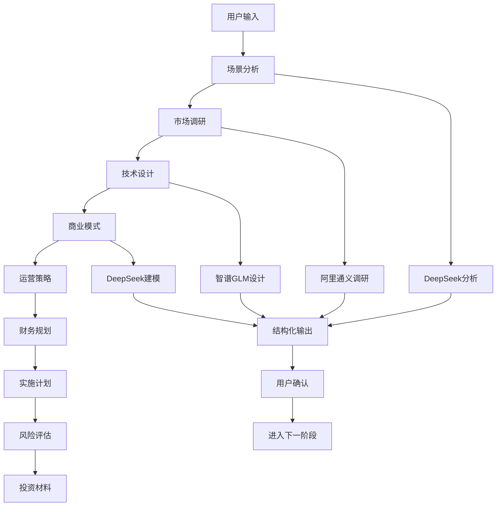

# 商业计划生成系统设计文档

## 📋 系统概述

### 核心价值
- **多AI模型协同**：DeepSeek、阿里通义千问、智谱GLM等模型分工协作
- **阶段化生成**：9个专业阶段，每个阶段单页展示，重点突出
- **用户参与式**：用户在每个阶段进行计划制定，确保正反馈
- **智能化定制**：根据用户需求个性化生成商业计划书

### 技术架构
- **前端**：Next.js 13+ App Router + React + TypeScript
- **AI服务**：多模型API集成，智能编排
- **状态管理**：Zustand + 实时进度跟踪
- **用户体验**：Framer Motion动画 + 响应式设计

## 🎯 页面设计原则

### 单页设计策略
每个阶段采用**单页展示**，确保重点突出：

```typescript
interface StagePage {
  // 1. 阶段标题和描述 (顶部20%)
  header: {
    title: string
    description: string
    estimatedTime: string
  }
  
  // 2. 进度指示器 (顶部10%)
  progress: {
    current: number
    total: number
    percentage: number
  }
  
  // 3. 核心内容区域 (中间60%)
  content: {
    deliverables: string[]
    aiProvider: string
    status: 'pending' | 'in_progress' | 'completed'
  }
  
  // 4. 用户交互区域 (底部10%)
  actions: {
    confirm: () => void
    revise: () => void
    next: () => void
  }
}
```

### 视觉设计特点
- **信息层次**：标题 → 进度 → 内容 → 操作
- **视觉焦点**：卡片布局、进度条、状态图标
- **响应式**：适配桌面、平板、手机
- **无障碍**：支持键盘导航、屏幕阅读器

## 🎮 用户交互与正反馈机制

### 用户参与流程

#### 1. 需求收集阶段 (可选)
```typescript
const UserRequirements = {
  // 商业关注重点
  businessFocus: [
    '市场机会分析', '竞争优势构建', 
    '盈利模式设计', '技术创新亮点'
  ],
  
  // 目标受众
  targetAudience: [
    '风险投资人', '天使投资人',
    '战略合作伙伴', '内部团队'
  ],
  
  // 时间优先级
  timelinePriority: [
    '立即启动(3-6个月)', '中期发展(1-2年)',
    '长期愿景(3-5年)'
  ]
}
```

#### 2. 正反馈机制设计

**即时反馈**：
- ✅ 选择完成立即显示"已选择X项"
- 🎯 进度条实时更新
- 💡 智能提示"您的选择将影响XX阶段"

**AI分析反馈**：
```typescript
const AnalysisResult = {
  understanding: {
    coreInterests: string[]
    userProfile: string
    experienceLevel: '初级' | '中级' | '高级'
  },
  ideaFit: {
    matchScore: number // 0-1
    strengths: string[]
    challenges: string[]
    recommendations: string[]
  },
  customizedOutline: {
    sections: Array<{
      stageId: string
      title: string
      priority: 'high' | 'medium' | 'low'
      estimatedPages: number
    }>
  }
}
```

**阶段完成奖励**：
- 🏆 阶段徽章系统
- 📊 完成度统计
- 🎉 动画庆祝效果
- 📈 整体进度可视化

## 🤖 AI提示词与生成机制

### 阶段1：创意落地场景分析 (DeepSeek)

#### 提示词结构
```
请分析以下创意想法，提取核心概念和商业价值：

创意标题：{ideaTitle}
创意描述：{ideaDescription}
分类：{category}

请从以下角度进行分析：
1. 核心问题识别
2. 目标用户群体
3. 解决方案概述
4. 创新点分析
5. 市场需求评估

输出格式：结构化JSON
```

#### 信息获取机制
- **输入数据**：用户填写的创意信息
- **知识库**：DeepSeek训练数据 + 实时网络搜索
- **分析维度**：问题-解决方案匹配度、市场潜力、技术可行性
- **输出格式**：结构化JSON，便于后续阶段使用

### 阶段2：市场现状与需求验证 (阿里通义千问)

#### 提示词结构
```
基于以下创意概念，进行深度市场调研：

创意概念：{conceptAnalysis}

请提供：
1. 市场规模分析（TAM/SAM/SOM）
2. 竞品调研（至少5个直接/间接竞品）
3. 用户画像分析
4. 市场趋势预测
5. 进入壁垒分析
6. 商业机会评估

请引用真实数据和报告来源。
```

#### 信息获取机制
- **数据源**：阿里云数据服务 + 公开市场数据
- **竞品分析**：自动爬取竞品信息、用户评价
- **市场数据**：TAM/SAM/SOM计算、增长率预测
- **验证方法**：交叉验证多个数据源

### 阶段3：MVP产品定义与设计 (智谱GLM)

#### 提示词结构
```
为以下项目设计完整技术方案：

项目概述：{conceptAnalysis}
市场需求：{marketAnalysis}

请提供：
1. 系统架构图（用Mermaid语法）
2. 技术栈选择与理由
3. 数据库设计
4. API接口设计
5. 安全方案
6. 性能优化策略
7. 部署方案
8. 开发时间估算

重点考虑中国本土化部署和合规要求。
```

#### 信息获取机制
- **技术知识**：智谱GLM的技术架构知识
- **最佳实践**：行业标准技术方案
- **本土化**：中国云服务、合规要求
- **可视化**：自动生成Mermaid架构图

### 阶段4：商业模式设计 (DeepSeek)

#### 提示词结构
```
基于前期分析，设计可持续的商业模式：

技术方案：{techArchitecture}
市场分析：{marketAnalysis}

请设计：
1. 商业模式画布（9个模块）
2. 收入流设计（至少3种）
3. 成本结构分析
4. 定价策略
5. 客户获取策略
6. 合作伙伴网络
7. 核心竞争优势
8. 可扩展性分析

特别关注中国市场特色。
```

#### 信息获取机制
- **商业模式库**：成功案例模式分析
- **中国市场**：本土化商业模式
- **财务建模**：收入成本结构设计
- **竞争分析**：差异化优势识别

## 🔄 完整生成流程

### 9个核心阶段

1. **创意落地场景分析** (DeepSeek, 8-12分钟)
   - 具体应用场景、用户痛点分析、解决方案描述

2. **市场现状与需求验证** (阿里通义千问, 10-15分钟)
   - 真实市场规模、竞品调研、用户需求验证

3. **MVP产品定义与设计** (智谱GLM, 8-12分钟)
   - 产品核心功能、MVP设计方案、技术可行性分析

4. **商业模式与盈利路径** (DeepSeek, 10-15分钟)
   - 商业模式画布、收入来源分析、定价策略

5. **运营策略与执行计划** (阿里通义千问, 12-18分钟)
   - 运营推广策略、用户获取方案、团队组建计划

6. **财务规划与投资分析** (阿里通义千问, 15-20分钟)
   - 启动资金需求、3年财务预测、投资回报预期

7. **实施路线图与里程碑** (智谱GLM, 8-12分钟)
   - 6个月行动计划、关键里程碑设置、资源配置方案

8. **风险评估与合规分析** (智谱GLM, 6-10分钟)
   - 核心风险识别、法律合规要求、知识产权保护

9. **投资展示与融资材料** (DeepSeek, 8-12分钟)
   - 投资者Pitch Deck、商业计划书摘要、关键数据指标

### 数据流转机制



## 🎯 质量控制机制

### 多模型验证
- **交叉验证**：不同AI模型验证同一内容
- **一致性检查**：确保各阶段输出逻辑一致
- **质量评分**：每个阶段都有质量评分机制

### 用户参与控制
- **阶段确认**：每个阶段都需要用户确认
- **实时调整**：支持中途调整和重新生成
- **反馈收集**：收集用户反馈优化后续生成

### 错误处理
- **容错机制**：单个模型失败时使用备用模型
- **重试机制**：支持重新生成特定阶段
- **降级策略**：确保系统稳定运行

## 📊 输出与交付

### 多种格式支持
- **PDF格式**：专业商业计划书
- **Word格式**：可编辑文档
- **Markdown格式**：结构化文本
- **HTML格式**：在线展示

### 分享与协作
- **在线分享**：支持链接分享
- **团队协作**：多人协作编辑
- **版本管理**：版本历史记录

## 🚀 技术实现亮点

### 分布式AI服务
- **智能路由**：根据任务类型选择最适合的AI模型
- **负载均衡**：自动分配请求到不同服务商
- **故障转移**：主服务失败时自动切换到备用服务

### 实时状态同步
- **WebSocket**：实时更新生成进度
- **状态管理**：Zustand管理复杂状态
- **缓存机制**：避免重复计算，提高效率

### 用户体验优化
- **动画效果**：Framer Motion提供流畅动画
- **响应式设计**：适配各种设备
- **无障碍支持**：支持键盘导航和屏幕阅读器

## 📈 系统优势

1. **专业性**：多AI模型协同，覆盖商业计划各个方面
2. **个性化**：根据用户需求定制生成内容
3. **高效性**：自动化生成，大幅提升效率
4. **可扩展**：模块化设计，易于添加新功能
5. **用户友好**：直观的界面设计和流畅的交互体验

## 🔮 未来发展方向

1. **AI模型优化**：持续优化提示词和模型选择
2. **功能扩展**：添加更多行业模板和案例
3. **协作增强**：支持团队协作和版本控制
4. **数据分析**：提供更深入的市场数据分析
5. **国际化**：支持多语言和不同地区的商业环境

---

*本文档详细描述了商业计划生成系统的设计理念、技术实现和用户体验，为系统的开发和优化提供了全面的指导。*
