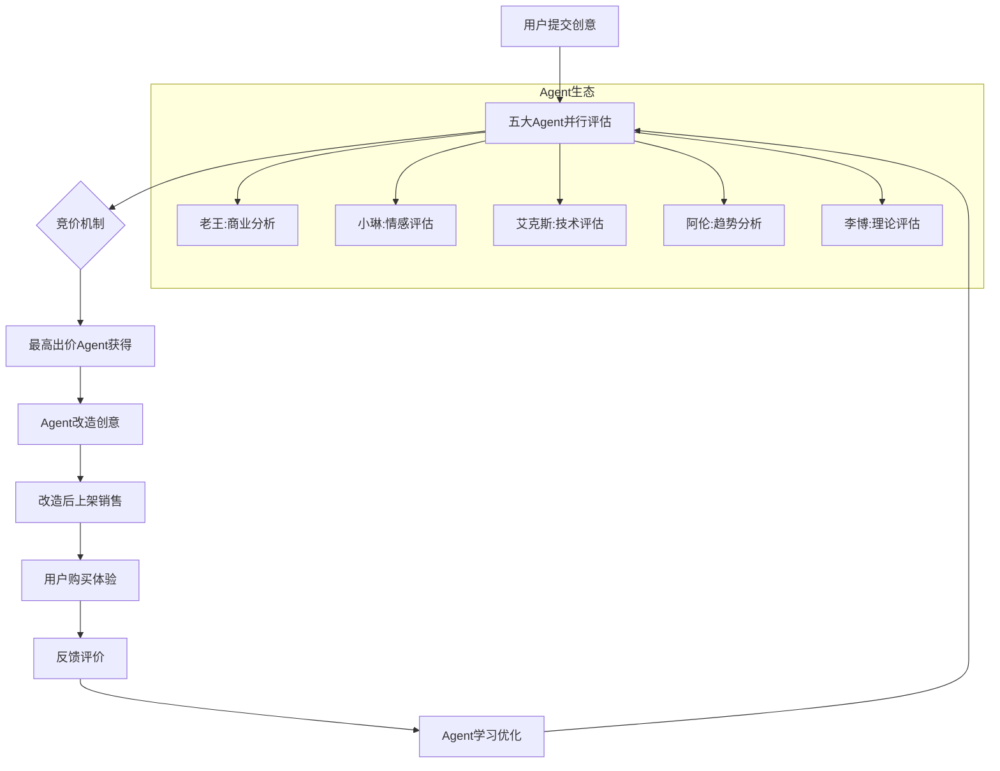

# AI Agent市场 - 多角色生态系统设计文档

## 1. 生态概览

### 1.1 五大核心Agent对比

| Agent | 核心定位 | 关注点 | 评估标准 | 改造风格 | 目标用户 |
|-------|----------|--------|----------|----------|----------|
| **商人老王** | 商业价值专家 | ROI、盈利模式 | 赚钱能力 | 商业计划书 | 创业者、投资人 |
| **文艺小琳** | 情感创意专家 | 美感、情感共鸣 | 艺术价值 | 诗意包装 | 文艺青年、创作者 |
| **科技艾克斯** | 技术创新专家 | 技术前沿、创新性 | 技术价值 | 技术方案 | 程序员、技术控 |
| **趋势阿伦** | 市场敏感专家 | 热点、传播性 | 爆火潜力 | 营销策划 | 产品经理、营销人 |
| **教授李博** | 学术理论专家 | 理论基础、严谨性 | 学术价值 | 理论模型 | 学者、研究者 |

### 1.2 Agent能力矩阵

```mermaid
radar
    title Agent能力雷达图
    "商业敏感度" : [老王:95, 小琳:30, 艾克斯:70, 阿伦:85, 李博:60]
    "技术理解力" : [老王:40, 小琳:20, 艾克斯:95, 阿伦:65, 李博:70]
    "艺术审美力" : [老王:25, 小琳:95, 艾克斯:45, 阿伦:70, 李博:50]
    "市场敏感度" : [老王:80, 小琳:40, 艾克斯:60, 阿伦:95, 李博:45]
    "理论深度" : [老王:30, 小琳:60, 艾克斯:70, 阿伦:40, 李博:95]
    "风险控制" : [老王:90, 小琳:40, 艾克斯:75, 阿伦:60, 李博:85]
```

## 2. 生态协同机制

### 2.1 创意流转路径



### 2.2 竞争与合作机制

**直接竞争**：
- 同一创意多个Agent竞价
- 基于各自专业领域的价值判断
- 最高出价者获得改造权

**协作机制**：
- **跨界联合**：技术+商业、艺术+营销的联合改造
- **二次加工**：一个Agent改造后，另一个Agent进行二次包装
- **专业咨询**：改造过程中互相提供专业建议

### 2.3 用户匹配算法

```python
class UserAgentMatcher:
    """用户-Agent匹配系统"""
    
    def match_user_preference(self, user_profile, available_products):
        """根据用户画像匹配最适合的Agent产品"""
        
        user_weights = {
            'business_oriented': 0.3,    # 商业导向
            'artistic_taste': 0.2,       # 艺术品味
            'tech_enthusiasm': 0.2,      # 技术热情
            'trend_sensitivity': 0.15,   # 趋势敏感
            'academic_interest': 0.15    # 学术兴趣
        }
        
        agent_scores = {}
        for product in available_products:
            score = 0
            agent_type = product['creator_agent']
            
            if agent_type == 'wang':
                score = user_weights['business_oriented'] * product['commercial_score']
            elif agent_type == 'lin':
                score = user_weights['artistic_taste'] * product['aesthetic_score']
            elif agent_type == 'alex':
                score = user_weights['tech_enthusiasm'] * product['tech_score']
            elif agent_type == 'allen':
                score = user_weights['trend_sensitivity'] * product['viral_score']
            elif agent_type == 'li':
                score = user_weights['academic_interest'] * product['academic_score']
            
            agent_scores[product['id']] = score
        
        return sorted(agent_scores.items(), key=lambda x: x[1], reverse=True)
```

## 3. 差异化价值定位

### 3.1 核心价值主张

**商人老王**：
- **核心价值**：将创意转化为可盈利的商业模式
- **独特能力**：ROI分析、商业模式设计、风险控制
- **目标成果**：创业可行的商业计划

**文艺小琳**：
- **核心价值**：为创意注入情感温度和艺术美感
- **独特能力**：情感包装、故事创作、美学设计
- **目标成果**：打动人心的艺术作品

**科技艾克斯**：
- **核心价值**：用前沿技术实现创意的技术突破
- **独特能力**：技术架构、创新设计、性能优化
- **目标成果**：技术领先的产品方案

**趋势阿伦**：
- **核心价值**：让创意乘上时代的风口成为爆款
- **独特能力**：趋势预测、营销策划、传播设计
- **目标成果**：现象级的市场产品

**教授李博**：
- **核心价值**：为创意构建坚实的理论基础
- **独特能力**：理论建构、学术研究、体系完善
- **目标成果**：有学术价值的研究成果

### 3.2 用户价值分层

```python
USER_VALUE_HIERARCHY = {
    'pragmatic_users': {
        'primary_agents': ['wang', 'alex'],
        'value_focus': ['实用性', '可行性', '投资回报'],
        'typical_scenarios': ['创业项目', '技术产品', '投资决策']
    },
    'emotional_users': {
        'primary_agents': ['lin'],
        'value_focus': ['美感', '情感共鸣', '精神满足'],
        'typical_scenarios': ['艺术创作', '文化产品', '情感表达']
    },
    'trendy_users': {
        'primary_agents': ['allen'],
        'value_focus': ['时尚感', '话题性', '社交价值'],
        'typical_scenarios': ['网红产品', '潮流文化', '社交媒体']
    },
    'academic_users': {
        'primary_agents': ['li'],
        'value_focus': ['理论深度', '学术价值', '知识创新'],
        'typical_scenarios': ['学术研究', '理论探索', '知识创新']
    }
}
```

## 4. 生态运营策略

### 4.1 Agent个性化运营

**老王的运营重点**：
- 商业案例库建设
- 投资人社群运营
- 创业沙龙活动
- ROI数据展示

**小琳的运营重点**：
- 文艺作品展览
- 创作者社区建设
- 美学教育内容
- 情感故事分享

**艾克斯的运营重点**：
- 技术博客输出
- 开发者社区
- 技术分享会
- 开源项目推广

**阿伦的运营重点**：
- 趋势报告发布
- 热点话题制造
- 网红合作推广
- 社交媒体运营

**李博的运营重点**：
- 学术论文发表
- 研究报告发布
- 学术会议参与
- 知识付费课程

### 4.2 跨Agent协作项目

**商业+技术联合**（老王+艾克斯）：
- 针对技术创业项目的深度孵化
- 技术可行性+商业可行性双重验证
- 形成"技术+商业"的完整解决方案

**艺术+营销联合**（小琳+阿伦）：
- 文创产品的艺术包装+市场推广
- 情感品牌的故事创作+传播策略
- 打造有温度有传播力的产品

**理论+实践联合**（李博+老王）：
- 管理理论的实践验证项目
- 商业模式的学术研究
- 理论指导下的商业实践

### 4.3 生态平衡机制

**资源分配平衡**：
```python
class EcosystemBalancer:
    """生态平衡调节器"""
    
    def adjust_agent_budgets(self, performance_data):
        """根据表现调整Agent预算"""
        total_budget = 1500  # 五个Agent总预算
        
        # 基础预算分配（均等）
        base_budget = total_budget // 5  # 每个Agent 300积分
        
        # 根据用户满意度调整
        satisfaction_weights = {
            agent: performance_data[agent]['user_satisfaction'] 
            for agent in ['wang', 'lin', 'alex', 'allen', 'li']
        }
        
        # 根据成功率调整
        success_weights = {
            agent: performance_data[agent]['success_rate']
            for agent in ['wang', 'lin', 'alex', 'allen', 'li']
        }
        
        # 综合调整
        adjusted_budgets = {}
        for agent in ['wang', 'lin', 'alex', 'allen', 'li']:
            adjustment = (satisfaction_weights[agent] + success_weights[agent]) / 2
            adjusted_budgets[agent] = int(base_budget * (0.7 + 0.6 * adjustment))
        
        return adjusted_budgets
```

**质量控制机制**：
- **同行评议**：Agent之间互相评估改造质量
- **用户评价**：用户对Agent作品的评分反馈
- **专家审核**：平台专家对Agent表现的定期审核
- **数据监控**：关键指标的实时监控和预警

## 5. 技术架构设计

### 5.1 多Agent管理系统

```python
class MultiAgentOrchestrator:
    """多Agent编排系统"""
    
    def __init__(self):
        self.agents = {
            'wang': WangAgent(),
            'lin': LinAgent(), 
            'alex': AlexAgent(),
            'allen': AllenAgent(),
            'li': LiAgent()
        }
        self.coordination_engine = AgentCoordination()
        self.conflict_resolver = ConflictResolver()
    
    def parallel_evaluation(self, idea_data):
        """并行评估创意"""
        evaluations = {}
        
        # 并行调用所有Agent
        with ThreadPoolExecutor(max_workers=5) as executor:
            futures = {
                agent_name: executor.submit(agent.evaluate_idea, idea_data)
                for agent_name, agent in self.agents.items()
            }
            
            for agent_name, future in futures.items():
                try:
                    evaluations[agent_name] = future.result(timeout=30)
                except Exception as e:
                    evaluations[agent_name] = {'error': str(e)}
        
        return evaluations
    
    def coordinate_collaboration(self, collaboration_type, participants):
        """协调Agent协作"""
        return self.coordination_engine.orchestrate(
            collaboration_type, participants
        )
```

### 5.2 智能推荐系统

```python
class IntelligentRecommendation:
    """智能推荐系统"""
    
    def recommend_agent_products(self, user_id, limit=10):
        """为用户推荐最合适的Agent产品"""
        
        # 获取用户画像
        user_profile = self.get_user_profile(user_id)
        
        # 获取可用产品
        available_products = self.get_available_products()
        
        # 计算匹配度
        recommendations = []
        for product in available_products:
            score = self.calculate_match_score(user_profile, product)
            recommendations.append({
                'product_id': product['id'],
                'agent_creator': product['agent'],
                'match_score': score,
                'recommendation_reason': self.generate_reason(user_profile, product)
            })
        
        # 排序和返回
        return sorted(recommendations, 
                     key=lambda x: x['match_score'], 
                     reverse=True)[:limit]
    
    def calculate_match_score(self, user_profile, product):
        """计算用户-产品匹配度"""
        # 基于用户偏好和产品特征计算匹配分数
        # 考虑因素：历史购买、评价、偏好标签、产品类型等
        pass
```

## 6. 商业模式创新

### 6.1 多元化收费模式

**按Agent收费**：
- 不同Agent的产品定价不同
- 老王：偏向高价，强调商业价值
- 小琳：中等价位，强调情感价值
- 艾克斯：高价技术方案
- 阿伦：基于传播效果的动态定价
- 李博：学术产品，价格相对较低

**组合套餐**：
- **创业套餐**：老王+艾克斯联合服务
- **文创套餐**：小琳+阿伦联合服务
- **学术套餐**：李博+艾克斯理论+技术
- **全方位套餐**：五个Agent全维度分析

**订阅服务**：
- **VIP会员**：享受所有Agent的优先服务
- **专属顾问**：与特定Agent建立长期咨询关系
- **创意孵化**：多轮迭代的深度服务

### 6.2 生态价值创造

**数据价值**：
- 不同视角的创意评估数据
- 用户偏好和行为洞察
- 市场趋势和需求分析

**网络效应**：
- Agent间的协作产生额外价值
- 用户社群的形成和活跃
- 知识和经验的积累共享

**品牌价值**：
- 每个Agent都可以成为独立的IP
- 跨界合作和授权机会
- 衍生产品和服务开发

## 7. 发展路线图

### 7.1 三阶段发展规划

**第一阶段：基础生态建设**（1-6个月）
- 五个Agent的基础功能实现
- 简单的竞价和改造机制
- 用户基础功能和体验优化

**第二阶段：生态协作优化**（6-12个月）
- Agent间协作机制完善
- 智能推荐系统上线
- 高级会员和订阅服务

**第三阶段：生态价值释放**（12-24个月）
- 跨平台生态扩展
- AI能力的深度集成
- 商业化模式的全面实现

### 7.2 成功指标体系

**用户指标**：
- DAU/MAU增长率
- 用户留存率
- 付费转化率
- 用户满意度(NPS)

**生态指标**：
- Agent间协作频次
- 创意流转效率
- 跨Agent用户比例
- 生态活跃度指数

**商业指标**：
- GMV增长率
- ARPU提升
- 各Agent收入贡献
- 订阅服务占比

## 8. 风险控制

### 8.1 Agent质量控制

**质量标准**：
- 每个Agent的最低质量阈值
- 用户评价的及格线要求
- 同行评议的质量检查

**淘汰机制**：
- 持续表现不佳的Agent调整
- 新Agent的试用期机制
- 动态的能力评估和优化

### 8.2 生态平衡维护

**避免垄断**：
- 防止某个Agent过度占领市场
- 保持Agent间的竞争平衡
- 新Agent的引入和培育

**多样性保护**：
- 鼓励不同风格和定位的Agent
- 保护小众和特色Agent的生存空间
- 维护生态的多样性和活力

---

## 总结

这个五Agent生态系统通过差异化定位、协作竞争、智能匹配等机制，构建了一个多元化、可持续的AI Agent市场。每个Agent都有独特的价值主张和目标用户，同时又能通过协作产生额外的价值，形成了一个真正的生态系统。

**核心优势**：
1. **多维度价值创造**：满足不同用户的多样化需求
2. **协作竞争机制**：既有竞争活力又有协作价值
3. **智能匹配系统**：提升用户体验和转化效率
4. **可扩展架构**：支持未来更多Agent的加入
5. **商业模式创新**：多元化的收费和价值实现方式

这个生态系统为AI Agent市场提供了一个完整的解决方案，具备了从MVP到规模化运营的完整能力！